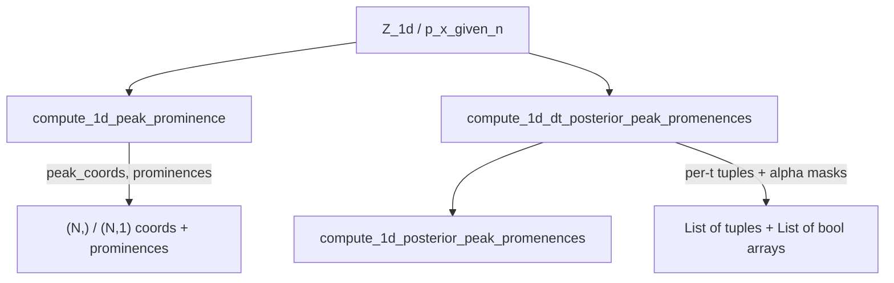

# Implement simplified 1D peak prominence path

## Approach

Mirror the existing high-efficiency 2D stack in [`peak_prominence2d.py`](h:/TEMP/Spike3DEnv_ExploreUpgrade/Spike3DWorkEnv/pyPhoPlaceCellAnalysis/src/pyphoplacecellanalysis/External/peak_prominence2d.py) (lines ~2054–2214), but use **SciPy 1D prominence** (`scipy.signal.find_peaks` + `peak_prominences`) as the correct discrete 1D definition — not a port of contour/`getProminence`, and not morphological reconstruction (that stays 2D).

Place new methods in a new section immediately after the 2D high-efficiency block (before the commented compatibility section ~2218).

## API (mirror 2D contracts)

### 1. `PeakPromenence.compute_1d_peak_prominence(Z_1d)`

- Input: 1D array `(n_xbins,)`; raise if `ndim != 1`
- Detect local maxima via `find_peaks(Z_1d)` (no min prominence filter — same “all local max” spirit as 2D)
- Compute prominences with `peak_prominences(Z_1d, peaks)`
- Return:
  - `peak_coords`: `(N, 1)` int array (same `argwhere`-style layout as 2D’s `(N, 2)`)
  - `prominences`: `(N,)` float

### 2. `PeakPromenence.compute_1d_dt_posterior_peak_promenences(a_p_x_given_n, alpha=0.9, ...)`

- Input shape: `(n_xbins, n_tbins)` — standard 1D posterior convention
- Same `alpha` scalar/list, `memory_warn_bytes` / `memory_strict` pattern as 2D (estimate `n_x * n_t * n_alpha` bools)
- Per time bin `t`:
  - Call core (or inline equivalent) on `Z_1d = a_p_x_given_n[:, t]`
  - Append `(peak_coords, prominences, peak_heights)` — heights from `Z_1d[peak_coords[:, 0]]`
  - Dominant peak = `argmax(peak_heights)`
  - For each alpha: 1D connected mask of bins with `Z >= alpha * height` containing the dominant peak (`ndimage.binary_propagation` with 1D structure), written into preallocated `(n_xbins, n_tbins)` bool arrays
- Return: `(epoch_promenence_tuples, epoch_masks)` where masks are `List[NDArray]` each shape `(n_xbins, n_tbins)`

### 3. `PeakPromenence.compute_1d_posterior_peak_promenences(p_x_given_n_list, alpha=0.9)`

- Same multi-epoch wrapper as `compute_posterior_peak_promenences`, calling the 1D dt function
- Return: `(all_epochs_all_t_bins_epoch_t_bin_idx_tuple_list, all_epochs_promenence_tuples_dict, all_epochs_masks)`

## Imports / style

- Import `find_peaks`, `peak_prominences` inside the methods or at module top next to existing scipy imports (minimal: add to existing scipy import block if present; otherwise local import like other optional-heavy paths)
- Keep single-line `def` signatures when ≤ 400 chars; two blank lines between classmethods; `## END for ...` on new loops
- Tag with `@function_attributes` mirroring the 2D high-efficiency tags (`high-efficiency`, `rewrite`, creation date today)

## Tests

Extend [`tests/test_peak_prominence2d.py`](h:/TEMP/Spike3DEnv_ExploreUpgrade/Spike3DWorkEnv/pyPhoPlaceCellAnalysis/tests/test_peak_prominence2d.py) with a parallel class:

- Synthetic 1D curve with known peaks (e.g. two Gaussians) — assert peak indices and prominences match SciPy reference
- `compute_1d_dt_...`: shapes `(n_x, n_t)`, mask list length = `len(alpha)`, empty-peak time bins return empty arrays
- Memory warn / strict smoke tests analogous to 2D

## Out of scope

- Contour / `getProminence` / `SlabResult` / pipeline `PeakProminence2D` wiring
- `reliability.py` 1D in-field masks
- Changing existing 2D APIs
