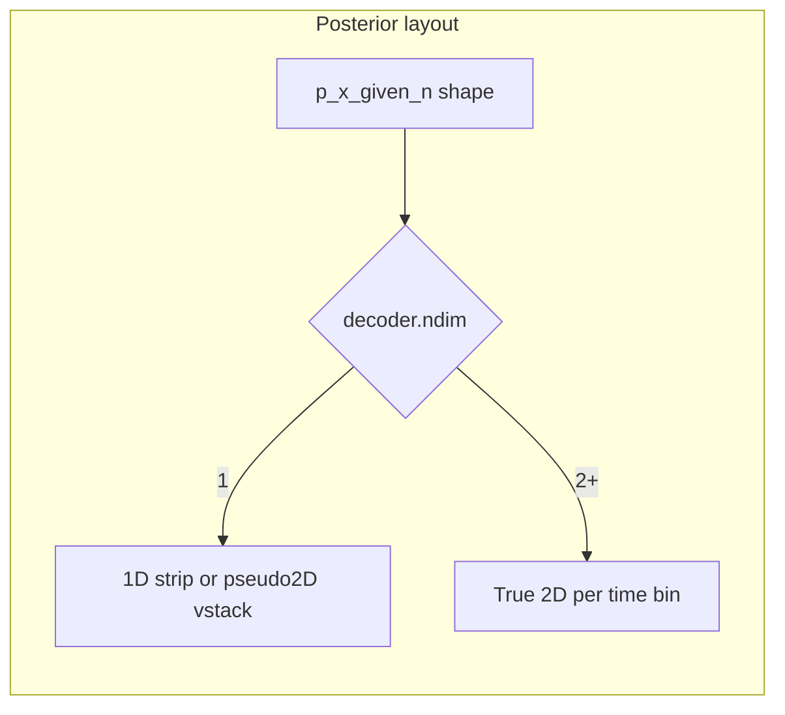

# True 2D posteriors for BinByBinDecodingDebugger

## Context

- `[BasePositionDecoder.decode](h:/TEMP/Spike3DEnv_ExploreUpgrade/Spike3DWorkEnv/pyPhoPlaceCellAnalysis/src/pyphoplacecellanalysis/Analysis/Decoder/reconstruction.py)` yields `p_x_given_n` with shape `(*original_position_data_shape, n_time)`. For 2D placefields, `original_position_data_shape` is `(nx, ny)`, so posteriors are `**(nx, ny, n_time)**` (see reshape at lines 2528–2529).
- **Pseudo-2D** (directional multi-decoder) uses a **1D** decoder (`a_decoder.ndim == 1`) and `p_x_given_n` shape `**(n_x_bins, n_models, n_time)`** — same rank-3 array, different meaning.
- `[sliced_to_current_window](h:/TEMP/Spike3DEnv_ExploreUpgrade/Spike3DWorkEnv/pyPhoPlaceCellAnalysis/src/pyphoplacecellanalysis/GUI/PyQtPlot/Widgets/ContainerBased/BinByBinDecodingDebugger.py)` already slices the time axis correctly for rank-3 arrays (`[:, :, active_window_slice_idxs]`).
- **Bug / gap:** `[_perform_build_time_binned_decoder_debug_plots](h:/TEMP/Spike3DEnv_ExploreUpgrade/Spike3DWorkEnv/pyPhoPlaceCellAnalysis/src/pyphoplacecellanalysis/GUI/PyQtPlot/Widgets/ContainerBased/BinByBinDecodingDebugger.py)` (lines 521–526) assumes **any** `ndim > 2` is pseudo-2D and unpacks `(n_pos_bins, n_decoders, n_t_bins)`, then vstacks along the decoder axis. That is **wrong for `(nx, ny, T)`** and will mis-draw or error.

## Design decisions

1. **Disambiguation rule (preserve current behavior):**
  - `p_x_given_n.ndim == 2` → **1D spatial × time** (unchanged).
  - `p_x_given_n.ndim == 3` and `**a_decoder.ndim == 1`** → **pseudo-2D**: keep existing `vstack` over the middle axis.
  - `p_x_given_n.ndim == 3` and `**a_decoder.ndim >= 2`** → **true 2D spatial**: do **not** vstack; visualize each time slice as a `**(nx, ny)`** image.
2. **Row-1 posterior UI for true 2D:** Replace the single spanning posterior plot (`row=1, colspan=n_epoch_time_bins`) with `**n_epoch_time_bins` plots** on row 1 (`row=1, col=t`), each showing `**p_x_given_n[:, :, t]`** using `[_helper_simply_plot_posterior_in_pyqtgraph_plotitem](h:/TEMP/Spike3DEnv_ExploreUpgrade/Spike3DWorkEnv/pyPhoPlaceCellAnalysis/src/pyphoplacecellanalysis/GUI/PyQtPlot/Widgets/ContainerBased/BinByBinDecodingDebugger.py)` with `**xbin_edges=a_decoder.xbin`**, `**ybin_edges=a_decoder.ybin`** (same helper as today; it already takes both edges). This gives **literal 2D position** per column, aligned with the existing per-column layout for templates on row 2.
3. **Updates:** Mirror the same branching in `[perform_update_time_binned_decoder_debug_plots](h:/TEMP/Spike3DEnv_ExploreUpgrade/Spike3DWorkEnv/pyPhoPlaceCellAnalysis/src/pyphoplacecellanalysis/GUI/PyQtPlot/Widgets/ContainerBased/BinByBinDecodingDebugger.py)`: row 1 is either one spanning plot (current) or `n` per-column plots (2D). Use the same `getItem(row=1, col=...)` convention as the build path.
4. **Template row (row 2) axis ranges:** Today `plot.setRange(xRange=(a_decoder.xbin[0], a_decoder.xbin[-1]), ...)` assumes 1D position along `xbin`. For `**a_decoder.ndim >= 2`**, set `**xRange`** to `**(0, nx * ny)**` or `**(0, float(a_decoder.flat_position_size))**` so flattened tuning rows match the next item.
5. `**TemplateDebugger` (minimal, required for row 2):** `[visualize_heatmap_pyqtgraph](h:/TEMP/Spike3DEnv_ExploreUpgrade/Spike3DWorkEnv/pyPhoPlaceCellAnalysis/src/pyphoplacecellanalysis/Pho2D/matplotlib/visualize_heatmap.py)` only documents 2D `data`; `pg.ImageItem` needs a **2D** `sorted_pf_tuning_curves` stack. Today `_subfn_rebuild_sort_idxs` uses `pdf_normalized_tuning_curves[indices, :]`, which yields `**(n, nx, ny)`** for 2D maps — **invalid** for `ImageItem`. In `[TemplateDebugger._subfn_rebuild_sort_idxs](h:/TEMP/Spike3DEnv_ExploreUpgrade/Spike3DWorkEnv/pyPhoPlaceCellAnalysis/src/pyphoplacecellanalysis/GUI/PyQtPlot/Widgets/ContainerBased/TemplateDebugger.py)`, after sorting, **if `decoder.ndim >= 2` and `sorted_pf_tuning_curves.ndim == 3`**, reshape `**(n_cells, nx, ny) → (n_cells, nx * ny)**` with `**reshape(n_cells, -1, order="C")**` (consistent with `decode` / occupancy ravel order), and set `**active_pfs_img_extents**` to `**[0, 0, float(nx * ny), float(n_cells)]**` (same `[x, y, w, h]` convention as the 1D branch). Peak overlay lines already coerce 2D CoM to a scalar in one branch; acceptable v1; optional later improvement is mapping CoM to a flat index.

## Files to touch

| File                                                                                                                                                                                                | Change                                                                                                                                                                                                                                                              |
| --------------------------------------------------------------------------------------------------------------------------------------------------------------------------------------------------- | ------------------------------------------------------------------------------------------------------------------------------------------------------------------------------------------------------------------------------------------------------------------- |
| `[BinByBinDecodingDebugger.py](h:/TEMP/Spike3DEnv_ExploreUpgrade/Spike3DWorkEnv/pyPhoPlaceCellAnalysis/src/pyphoplacecellanalysis/GUI/PyQtPlot/Widgets/ContainerBased/BinByBinDecodingDebugger.py)` | Add small helper e.g. `_is_true_spatial_2d_decoder(a_decoder)` and `_flatten_posterior_for_strip(...)` only if you keep a fallback strip; primary path: branch build + update for per-column 2D maps; fix row-2 `setRange` for 2D; ensure `perform_update` matches. |
| `[TemplateDebugger.py](h:/TEMP/Spike3DEnv_ExploreUpgrade/Spike3DWorkEnv/pyPhoPlaceCellAnalysis/src/pyphoplacecellanalysis/GUI/PyQtPlot/Widgets/ContainerBased/TemplateDebugger.py)`                 | Flatten `sorted_pf_tuning_curves` + `img_extents` when `decoder.ndim >= 2` as above.                                                                                                                                                                                |

## Testing / validation

- **1D:** Existing notebook / lap pipeline — row 1 still one spanning strip, pseudo-2D directional still vstacks.
- **2D:** `a_decoder` from `pf2D`, `p_x_given_n` `(nx, ny, T)` with small `T` — row 1 shows `n` maze-aligned heatmaps; row 2 templates render without shape errors; update callback refreshes both rows.

## Out of scope (unless you want them next)

- Fixing typos in `plot_attached_BinByBinDecodingDebugger` (`_single` vs `single_continuous_result`).
- 4D posteriors or per-column **3D** visualization.
- Perfect peak lines for 2D CoM (flat-index projection).

