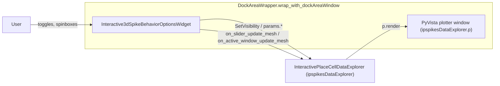

## Files

- New widget: `pyPhoPlaceCellAnalysis/src/pyphoplacecellanalysis/GUI/Qt/Widgets/Interactive3dSpikeBehaviorOptionsWidget/Interactive3dSpikeBehaviorOptionsWidget.py`
- Wire-up: [`pyPhoPlaceCellAnalysis/src/pyphoplacecellanalysis/General/Pipeline/Stages/DisplayFunctions/Interactive3dDisplayFunctions.py`](pyPhoPlaceCellAnalysis/src/pyphoplacecellanalysis/General/Pipeline/Stages/DisplayFunctions/Interactive3dDisplayFunctions.py) (function `_display_3d_interactive_spike_and_behavior_browser` at lines 99-149 only)

No edits to `InteractivePlaceCellDataExplorer.py`; the widget drives it through its existing public API.

## Architecture



## 1. New widget class `Interactive3dSpikeBehaviorOptionsWidget`

Plain `QtWidgets.QWidget` with a `QFormLayout`. Holds a (non-owning) reference `self.explorer` to the `InteractivePlaceCellDataExplorer`. Controls (all wired with `valueChanged` / `toggled` signals):

- Spike visibility group:
  - `chkHistoricalSpikes` -> writes `explorer.params.enable_historical_spikes`, calls `explorer.spikes_main_historical.SetVisibility(...)` and `explorer.p.render()` for instant feedback.
  - `chkRecentSpikes` -> same pattern with `params.enable_recent_spikes` and `explorer.spikes_main_recent_only`.
- Trajectory group:
  - `chkTrajectoryTrail` -> `explorer.animal_location_trail.SetVisibility(...)`.
  - `chkCurrentPosition` -> `explorer.animal_current_location_point.SetVisibility(...)`.
  - `spnTrailDuration` (QDoubleSpinBox, 0.5-120.0 s, default = `params.recent_spikes_window.duration_seconds`).
  - `spnTrailMinSize` / `spnTrailMaxSize` (defaults from current `params.active_trail_size_values[0]` / `[-1]`, currently `1.2 -> 0.4`).
  - `spnTrailMinOpacity` / `spnTrailMaxOpacity` (defaults from current `params.active_trail_opacity_values`, currently `0.0 -> 0.6`).
- Historical group:
  - `spnHistoricalDuration` (default = `params.longer_spikes_window.duration_seconds`).
- `btnRefresh` -> calls `_rebuild_at_current_slider()`.

Single helper used by every duration/range change:

```python
def _rebuild_at_current_slider(self):
    sw = self.explorer.active_timestamp_slider_wrapper
    if sw is None:
        t_start, t_stop = self.explorer.active_timestamp_slider_curr_start_stop_times
        self.explorer.on_active_window_update_mesh(t_start, t_stop, enable_position_mesh_updates=True, render=True)
    else:
        self.explorer.on_slider_update_mesh(self.explorer.active_timestamp_slider_curr_index)
```

Trail-duration handler rebuilds `params.recent_spikes_window`, regenerates `params.active_trail_opacity_values` / `params.active_trail_size_values` (using `np.linspace` between the spinbox-sourced min/max over `recent_spikes_window.duration_num_frames`), regenerates `params.pre_computed_window_sample_indicies`, then calls `_rebuild_at_current_slider()`. Historical-duration handler rebuilds only `params.longer_spikes_window` and calls the helper.

A class-level `sigOptionsChanged = QtCore.Signal(dict)` is emitted after every change for downstream listeners; it is optional and not required for real-time updates.

The widget includes a `classmethod build_for_explorer(cls, explorer) -> Interactive3dSpikeBehaviorOptionsWidget` that constructs and returns it.

## 2. Wiring in `_display_3d_interactive_spike_and_behavior_browser`

Minimal additions immediately after the existing `ConnectionControlsMenuMixin.try_add_connections_menu(...)` block, gated on interactive mode:

```python
optionsWidget = None
root_dockAreaWindow = None
if (not active_config.video_output_config.active_is_video_output_mode) and kwargs.get('show_options_widget', True):
    from pyphoplacecellanalysis.GUI.Qt.Widgets.Interactive3dSpikeBehaviorOptionsWidget.Interactive3dSpikeBehaviorOptionsWidget import Interactive3dSpikeBehaviorOptionsWidget
    from pyphoplacecellanalysis.GUI.PyQtPlot.Widgets.DockAreaWrapper import DockAreaWrapper
    optionsWidget = Interactive3dSpikeBehaviorOptionsWidget.build_for_explorer(ipspikesDataExplorer)
    optionsWidget.show()
    ipspikesDataExplorer.ui['optionsWidget'] = optionsWidget
    active_root_main_widget = ipspikesDataExplorer.p.window()
    root_dockAreaWindow, _app = DockAreaWrapper.wrap_with_dockAreaWindow(active_root_main_widget, optionsWidget, title=ipspikesDataExplorer.data_explorer_name)
    ipspikesDataExplorer.ui['root_dockAreaWindow'] = root_dockAreaWindow
```

Return dict expanded (existing keys preserved):

```python
return {'ipspikesDataExplorer': ipspikesDataExplorer, 'plotter': pActiveInteractivePlaceSpikesPlotter, 'optionsWidget': optionsWidget, 'root_dockAreaWindow': root_dockAreaWindow}
```

## Notes / non-goals

- No changes to `InteractivePlaceCellDataExplorer`; the widget operates entirely through existing public API (`params`, plot accessors, `on_slider_update_mesh`, `on_active_window_update_mesh`).
- Video-output mode (`active_is_video_output_mode=True`) skips creating the widget and dock window, mirroring the existing skip logic for slider/menu setup.
- Resetting the slider range when `recent_spikes_window` changes is handled implicitly through `params.pre_computed_window_sample_indicies` regeneration; if the slider's `[0, num_time_points-1]` upper bound moves, we leave it unchanged for this iteration (out of scope) and document the limitation in a comment near the trail-duration handler.