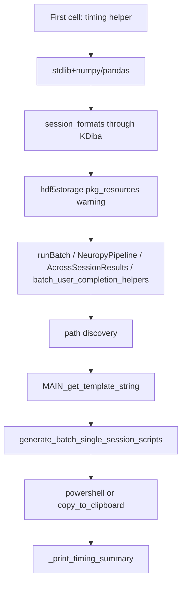

# Add timing traces to ProcessBatchOutputs script

## Goal

Pinpoint where Linux spends >5 minutes by printing elapsed seconds after each major phase. Given your observation that execution pauses **after** the `hdf5storage` `pkg_resources` warning (triggered when `KDibaOldDataSessionFormat` pulls in `neuropy.utils.load_exported`), import timing must be **split into sub-blocks** — not one lumped "imports" timer.

## Approach

Add a small timing helper at the top of the first cell, then call `_time_checkpoint(label)` between import groups and runtime steps. Each checkpoint prints delta-since-last-checkpoint; a final summary lists all segments sorted by duration.

### Timing helper (top of first `# %%` cell, after stdlib imports)

Add near line 6–8:

```python
import time
_t0: float = time.perf_counter()
_timing_log: List[tuple] = []

def _time_checkpoint(label: str) -> None:
    global _t0
    elapsed = time.perf_counter() - _t0
    _timing_log.append((label, elapsed))
    print(f'[TIMING] {label}: {elapsed:.2f}s')
    _t0 = time.perf_counter()

def _print_timing_summary() -> None:
    total = sum(e for _, e in _timing_log)
    print(f'\n[TIMING SUMMARY] total={total:.2f}s across {len(_timing_log)} checkpoints:')
    for label, elapsed in sorted(_timing_log, key=lambda x: -x[1]):
        pct = 100.0 * elapsed / total if total else 0.0
        print(f'  {elapsed:7.2f}s ({pct:5.1f}%)  {label}')
```

Use `List[tuple]` to avoid adding `Tuple` to typing imports (already imported).

### Import sub-blocks (first cell, lines 23–72)

Insert `_time_checkpoint(...)` calls **between import groups**, aligned with the suspected slow chain:

| Checkpoint label | After imports |
|---|---|
| `stdlib+numpy/pandas/tables` | line 18 (`attrs`) |
| `path_helpers+IPython` | line 27 |
| `session_formats:Base+Bapun+KDiba` | line 33 — **last line before post-hdf5storage pause** |
| `session_formats:Rachel+Hiro` | line 35 |
| `neuropy:IdentifyingContext+Epoch` | line 40 |
| `pyphoplacecellanalysis:Loading+runBatch+NeuropyPipeline` | line 47 |
| `pyphoplacecellanalysis:runBatch+AcrossSessionResults` | line 51 |
| `pyphoplacecellanalysis:pythonScriptTemplating+metadata` | line 61 |
| `batch_user_completion_helpers` | line 72 |

This directly answers: "which import after KDiba/hdf5storage is slow?"

### Runtime checkpoints (later cells)

| Checkpoint label | Location |
|---|---|
| `paths:scripts_output_path` | after line 89 |
| `paths:collected_outputs_path` | after line 94 |
| `build_concrete_session_folders` | wrap line 191 |
| `MAIN_get_template_string` | wrap line 209 |
| `active_phase.get_run_configuration` | wrap line 211 |
| `generate_batch_single_session_scripts` | wrap lines 426–442 |
| `build_windows_powershell_run_script` | wrap line 476 (Windows branch) |
| `copy_to_clipboard:run` | wrap line 509 (Linux branch) |
| `copy_to_clipboard:figs` | wrap line 517 (Linux branch) |

Pattern for wrapped calls:

```python
_time_checkpoint('build_concrete_session_folders START')
good_session_concrete_folders = ConcreteSessionFolder.build_concrete_session_folders(...)
_time_checkpoint('build_concrete_session_folders')
```

### Final summary

Call `_print_timing_summary()` at the very end of the last executable cell (after the Linux/Windows sbatch/powershell block, ~line 517), so one run produces a ranked breakdown.

## File changed

- [ProcessBatchOutputs_qclus1246789_Only.ipy](h:\TEMP\Spike3DEnv_ExploreUpgrade\Spike3DWorkEnv\Spike3D\ProcessBatchOutputs_qclus1246789_Only.ipy) only — minimal edits, no library changes.

## Expected output (example)

```
[TIMING] session_formats:Base+Bapun+KDiba: 0.45s
[TIMING] pyphoplacecellanalysis:Loading+runBatch+NeuropyPipeline: 187.32s   <-- likely culprit on Linux
...
[TIMING SUMMARY] total=312.50s across 18 checkpoints:
  187.32s ( 59.9%)  pyphoplacecellanalysis:Loading+runBatch+NeuropyPipeline
   82.14s ( 26.3%)  batch_user_completion_helpers
    ...
```

## Notes

- Checkpoints are print-only; no behavior change to batch logic.
- If run cell-by-cell in Jupyter/VS Code, `_timing_log` accumulates across cells in the same kernel (desired).
- Re-running the import cell resets `_t0` and clears nothing automatically — acceptable for diagnostic use; optionally reset `_timing_log = []` at helper definition if you want per-cell isolation (not required for initial diagnosis).


