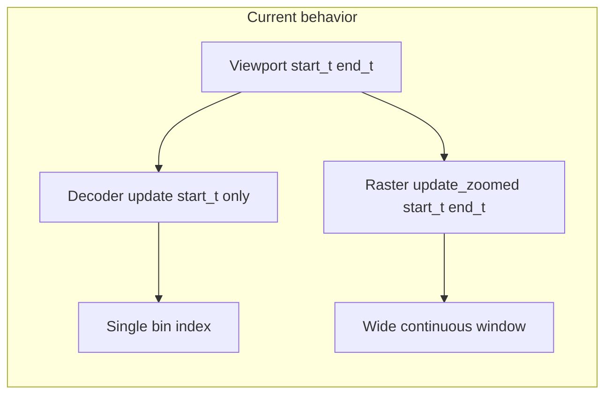

# Align decoding-window spikes with posterior time bins

## Root cause

`[TimeSynchronizedPositionDecoderPlotter.on_window_changed](h:\TEMP\Spike3DEnv_ExploreUpgrade\Spike3DWorkEnv\pyPhoPlaceCellAnalysis\src\pyphoplacecellanalysis\Pho2D\PyQtPlots\TimeSynchronizedPlotters\TimeSynchronizedPositionDecoderPlotter.py)` receives `(start_t, end_t)` but calls `**update(start_t)` only** (line ~379). `[update](h:\TEMP\Spike3DEnv_ExploreUpgrade\Spike3DWorkEnv\pyPhoPlaceCellAnalysis\src\pyphoplacecellanalysis\Pho2D\PyQtPlots\TimeSynchronizedPlotters\TimeSynchronizedPositionDecoderPlotter.py)` picks **one** index with:

```403:406:h:\TEMP\Spike3DEnv_ExploreUpgrade\Spike3DWorkEnv\pyPhoPlaceCellAnalysis\src\pyphoplacecellanalysis\Pho2D\PyQtPlots\TimeSynchronizedPlotters\TimeSynchronizedPositionDecoderPlotter.py
    def update(self, t, defer_render=False):
        # Finds the nearest previous decoded position for the time t:
        self.last_window_index = np.searchsorted(self.time_window_centers, t, side='left')
        self.last_window_time = self.time_window_centers[self.last_window_index]
```

So the posterior is always the frame at `**last_window_index**`, independent of `end_t` and independent of how wide you set the Spike2DRaster window.

The decoding-row raster (and main controller) drive `[Spike2DRaster.update_zoomed_plot(min_t, max_t)](h:\TEMP\Spike3DEnv_ExploreUpgrade\Spike3DWorkEnv\pyPhoPlaceCellAnalysis\src\pyphoplacecellanalysis\GUI\PyQtPlot\Widgets\SpikeRasterWidgets\Spike2DRaster.py)`, which uses the **full** `[start_t, end_t]` from `window_scrolled`. That is why you see ~16 s of spikes while the title shows a single decoded center near `t_start`.




## Goal: spikes in the decoding row = spikes in the **same decoded bin** as the posterior

**Recommended approach (bin-snapped decoding row):** When the driver scrolls, compute **the same bin index** the plotter uses from `start_t` (same `searchsorted(..., side='left')` and **same index clamping** as the plotter should use—see note below), resolve **that bin’s time interval** `(t_left, t_right)`, and call `window_sync_raster.update_zoomed_plot(t_left, t_right)` instead of `(start_t, end_t)`.

- **Where to implement:** Prefer a small helper in `[PendingNotebookCode.py](h:\TEMP\Spike3DEnv_ExploreUpgrade\Spike3DWorkEnv\pyPhoPlaceCellAnalysis\src\pyphoplacecellanalysis\SpecificResults\PendingNotebookCode.py)` used by the **custom `SignalProxy` slot** for `decoding_window_spikes` only (keep the main controller and decoder connections unchanged).
- **Reference decoder for bin edges:** Use **one** reference plotter’s `active_one_step_decoder` (e.g. first `included_filter_name` / first docked plotter). Bapun directional mode assumes a **shared** `time_window_centers` axis across contexts; if that ever diverges, you would need an explicit policy (e.g. per-row rasters or a single canonical `time_bin_container`).

**Resolving `(t_left, t_right)`:**

1. If `active_one_step_decoder` has `**time_bin_container`** (real `pf2D_Decoder` / `SingleEpochDecodedResult`-backed decoders), use `left_edges[i]` and `right_edges[i]` (or equivalent `edges` pairs) for bin `i`.
2. If only `**time_window_centers`** exists (`[DummyOneStepDecoder](h:\TEMP\Spike3DEnv_ExploreUpgrade\Spike3DWorkEnv\pyPhoPlaceCellAnalysis\src\pyphoplacecellanalysis\SpecificResults\PendingNotebookCode.py)` path), approximate interval:
  - e.g. midpoint between neighbors for interior bins, or uniform half-width from median `diff(centers)` (document assumption: evenly spaced centers).

**Optional API flag:** e.g. `decoding_window_raster_mode: Literal['viewport', 'decoded_bin'] = 'decoded_bin'` so you can revert to the current wide viewport if desired.

**Hardening (worth doing in same pass):** `searchsorted` can return `len(centers)`; clamp `last_window_index` to `[0, len(centers)-1]` in `**TimeSynchronizedPositionDecoderPlotter.update`** so posteriors and the new helper never index out of range.

## Alternative (if you want the heatmap to “fill” the scroll window)

Extend the plotter so posteriors reflect **all bins overlapping** `[start_t, end_t]` (mean / sum of normalized maps, or other aggregation). Then keeping `update_zoomed_plot(start_t, end_t)` is consistent. This is a **larger behavioral change** and requires a clear aggregation rule; it answers “posterior should react to window size,” not “spikes restricted to one bin.”

## Files to touch

- `[PendingNotebookCode.py](h:\TEMP\Spike3DEnv_ExploreUpgrade\Spike3DWorkEnv\pyPhoPlaceCellAnalysis\src\pyphoplacecellanalysis\SpecificResults\PendingNotebookCode.py)`: helper `decoded_bin_time_interval_for_scroll_start(ref_decoder, start_t)`, custom proxy slot for `window_sync_raster`, optional `decoding_window_raster_mode` param.
- `[TimeSynchronizedPositionDecoderPlotter.py](h:\TEMP\Spike3DEnv_ExploreUpgrade\Spike3DWorkEnv\pyPhoPlaceCellAnalysis\src\pyphoplacecellanalysis\Pho2D\PyQtPlots\TimeSynchronizedPlotters\TimeSynchronizedPositionDecoderPlotter.py)`: clamp `last_window_index` after `searchsorted` (minimal fix, keeps posteriors and helper in sync).

## Verification

- Scroll and resize the main raster window: decoding-row x-range should match **decoded bin width** (e.g. ~60 ms for 60 ms bins), not the full controller width.
- Posterior title index / `t` should remain the bin selected from `t_start`; spike times in the strip should fall within that bin’s `[t_left, t_right]` (allowing float boundaries).

