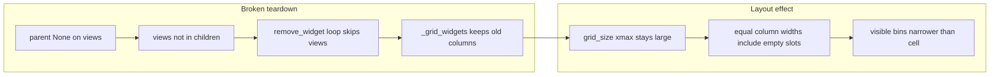

# Fix time-bin grid vs spike raster horizontal alignment

## Root cause

In `[predictive_decoding_central_view.py](h:\TEMP\Spike3DEnv_ExploreUpgrade\Spike3DWorkEnv\pyPhoPlaceCellAnalysis\src\pyphoplacecellanalysis\Pho2D\vispy\predictive_decoding_central_view.py)`, when the number of bins changes (`len(time_bin_views) != n_bins_to_show`), the rebuild block does:

1. `view.parent = None` for each entry in `time_bin_views` (lines 282–284).
2. `for child in list(time_bin_grid.children): time_bin_grid.remove_widget(child)` (lines 286–287).

After step 1, the bin `ViewBox` instances are **no longer** in `time_bin_grid.children` (only border/mesh internals remain). `**remove_widget` is therefore never called for those views.**

VisPy’s `[Grid.remove_widget](h:\TEMP\Spike3DEnv_ExploreUpgrade\Spike3DWorkEnv\vispy\vispy\scene\widgets\grid.py)` only removes entries from `_grid_widgets`; it does not detach the node. Conversely, setting `parent = None` does **not** remove the widget from `_grid_widgets`.

So after navigating from an epoch with many bins (e.g. 12) to one with fewer (e.g. 4), the grid still behaves as if **all old columns** exist: `grid_size` stays wide, and weak stretch constraints spread width equally across every column slot (`[_add_stretch_constraints](h:\TEMP\Spike3DEnv_ExploreUpgrade\Spike3DWorkEnv\vispy\vispy\scene\widgets\grid.py)` plus `None`-cell handling). The four **new** views only occupy four of those slots, so their combined width is `4 / n_phantom_columns` of the center cell—exactly the “narrow band of bins + black gap” in your screenshots.

The spike raster is a **single** `ViewBox` on the parent grid (`[predicitive_decoding_vispy.py](h:\TEMP\Spike3DEnv_ExploreUpgrade\Spike3DWorkEnv\pyPhoPlaceCellAnalysis\src\pyphoplacecellanalysis\Pho2D\vispy\predicitive_decoding_vispy.py)` ~~363–364) with `PanZoomCamera(aspect=None)` and a full-epoch `rect` in `[vispy_raster.py](h:\TEMP\Spike3DEnv_ExploreUpgrade\Spike3DWorkEnv\pyPhoPlaceCellAnalysis\src\pyphoplacecellanalysis\Pho2D\vispy\vispy_raster.py)` (~~226–233), so it always uses the **entire** center column width.

## Fix (minimal)

In `render_central_view`, when rebuilding time-bin views:

1. For each `view` in `time_bin_views`, call `**time_bin_grid.remove_widget(view)` first**, then `**view.parent = None`** (detach from scene). Order matters.
2. Clear `time_bin_views`, then add the new `n_bins_to_show` views as today.
3. Optionally drop or narrow the `for child in list(time_bin_grid.children): remove_widget(child)` loop—it does not remove bin views after they are detached; it only no-ops on non-grid children. You can keep it as a no-op safety net or remove it for clarity.

No change is required to `[predicitive_decoding_vispy.py](h:\TEMP\Spike3DEnv_ExploreUpgrade\Spike3DWorkEnv\pyPhoPlaceCellAnalysis\src\pyphoplacecellanalysis\Pho2D\vispy\predicitive_decoding_vispy.py)` single-epoch layout (same parent column for `time_bin_grid` and `time_bin_raster`) once the inner grid’s column count is correct.

## Optional hardening

- **Mismatch guard**: If `len(time_bin_views) != n_bins_to_show` **or** the number of layout-registered children does not match (e.g. compare `len(time_bin_grid._grid_widgets)` to expected, if you prefer not to rely on private API, track “last n_bins” on the widget), force the same teardown path.
- **Camera**: Time-bin sub-views use `PanZoomCamera(aspect=1)` (~292) while the raster uses `aspect=None`. That affects letterboxing **inside** each cell, not the phantom-column bug; you can switch bins to `aspect=None` for consistency with the raster row if you want cells to fill rectangles without vertical/horizontal padding (tradeoff: env maps may look slightly non-square in wide cells).

## Verification

- Run the viewer, switch from an epoch with `max_time_bins_to_show` (or 12) bins to one with 4 bins: the four bin panels should span the same horizontal extent as the raster below.
- Repeat toggling epochs with different `p_x_given_n.shape[2]` to ensure no width regression.

