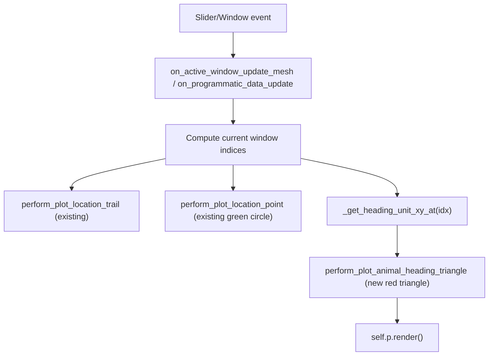

## Goal

Render a small red, clearly acute triangle centered at the animal's current `(x, y)` position, with its tip pointing in the animal's smoothed heading direction (`velocity_{x,y}_smooth`). The marker must update on every slider/window step in lockstep with the existing `animal_current_location_point` circle.

## Design decisions (from your answers)

- Heading source: `position.velocity_x_smooth` / `velocity_y_smooth`, computed once from `compute_higher_order_derivatives()` + `compute_smoothed_position_info(N=15)`. Same approach used by `adding_approx_head_dir_columns` in [neuropy/core/position.py](h:/TEMP/Spike3DEnv_ExploreUpgrade/Spike3DWorkEnv/NeuroPy/neuropy/core/position.py:355).
- Augment the existing green circle (do not replace it).
- Reuse the existing `name='...'` actor pattern (same as `animal_current_location_point`) so subsequent `add_mesh` calls overwrite the prior actor in place.

## Files & edits

### 1. `pyphoplacecellanalysis/GUI/PyVista/InteractivePlotter/Mixins/InteractivePlotterMixins.py`

Add a new method to `InteractivePyvistaPlotter_PointAndPathPlottingMixin` (right after `perform_plot_location_point`, modeled after it). Two-blank-line separation, single-line signature.

Key snippet (concept):

```python
def perform_plot_animal_heading_triangle(self, plot_name, curr_animal_point, heading_unit_xy, length: float = 1.5, base_width: float = 0.9, render: bool = True, **kwargs):
    """Render a small red acute triangle centered at curr_animal_point pointing along heading_unit_xy=(hx,hy). Updates the existing actor when reused."""
    cx, cy, cz = curr_animal_point
    hx, hy = heading_unit_xy
    # perpendicular (normal) in xy-plane:
    nx, ny = -hy, hx
    tip = [cx + 0.7 * length * hx, cy + 0.7 * length * hy, cz]
    base_l = [cx - 0.3 * length * hx + 0.5 * base_width * nx, cy - 0.3 * length * hy + 0.5 * base_width * ny, cz]
    base_r = [cx - 0.3 * length * hx - 0.5 * base_width * nx, cy - 0.3 * length * hy - 0.5 * base_width * ny, cz]
    points = np.asarray([tip, base_l, base_r], dtype=float)
    triangle_pdata = pv.PolyData(points, faces=np.asarray([3, 0, 1, 2]))
    self.plots_data[plot_name] = {'triangle_pdata': triangle_pdata, 'heading_unit_xy': heading_unit_xy}
    self.plots[plot_name] = self.p.add_mesh(triangle_pdata, name=plot_name, render=render, **({'color': 'red', 'ambient': 0.7, 'opacity': 0.95, 'show_edges': True, 'edge_color': 'red', 'line_width': 2.0, 'show_scalar_bar': False, 'reset_camera': False, 'lighting': False} | kwargs))
    return self.plots[plot_name], self.plots_data[plot_name]
```

Geometry details: tip is `+0.7L` along heading; base corners are `-0.3L` along heading and `±0.5W` along the perpendicular. With `L=1.5`, `W=0.9` the apex angle is `~33 deg` (clearly acute), the triangle is centered on the animal point, and it is comparable in size to (but slightly smaller than) the existing green location circle (~radius 2).

### 2. `pyphoplacecellanalysis/GUI/PyVista/InteractivePlotter/InteractivePlaceCellDataExplorer.py`

Three minimal edits:

a. In `_setup_variables` (around line 64), cache smoothed velocity arrays once:

```python
pos_df = self.active_session.position.compute_higher_order_derivatives()
pos_df = self.active_session.position.compute_smoothed_position_info(N=15)
self.vx_smooth = pos_df['velocity_x_smooth'].to_numpy()
self.vy_smooth = pos_df['velocity_y_smooth'].to_numpy()
self._last_heading_unit_xy = (1.0, 0.0)
```

b. Add a small helper `_get_heading_unit_xy_at(self, idx)` that returns a unit `(hx, hy)` from `self.vx_smooth[idx]`/`self.vy_smooth[idx]`, falling back to `self._last_heading_unit_xy` when speed `< 1e-6` or values are NaN (start of recording / animal stationary). Updates `_last_heading_unit_xy` on success so the triangle holds its last-known orientation when the animal pauses.

c. Add a property mirror for symmetry:

```python
@property
def animal_heading_triangle(self):
    return self.plots.get('animal_heading_triangle', None)
```

d. Wire the call into the existing update sites that already place `animal_current_location_point`:

- In [`on_active_window_update_mesh`](h:/TEMP/Spike3DEnv_ExploreUpgrade/Spike3DWorkEnv/pyPhoPlaceCellAnalysis/src/pyphoplacecellanalysis/GUI/PyVista/InteractivePlotter/InteractivePlaceCellDataExplorer.py:249) at line 341, immediately after the existing `perform_plot_location_point('animal_current_location_point', ...)` call.
- In [`on_programmatic_data_update`](h:/TEMP/Spike3DEnv_ExploreUpgrade/Spike3DWorkEnv/pyPhoPlaceCellAnalysis/src/pyphoplacecellanalysis/GUI/PyVista/InteractivePlotter/InteractivePlaceCellDataExplorer.py:166) at line 210, immediately after the `animal_current_location_point` plot.
- In the legacy fallback branch of [`on_slider_update_mesh`](h:/TEMP/Spike3DEnv_ExploreUpgrade/Spike3DWorkEnv/pyPhoPlaceCellAnalysis/src/pyphoplacecellanalysis/GUI/PyVista/InteractivePlotter/InteractivePlaceCellDataExplorer.py:354) at line 384.

Each call site looks like:

```python
heading_unit_xy = self._get_heading_unit_xy_at(active_included_all_window_position_indicies[-1])
self.perform_plot_animal_heading_triangle('animal_heading_triangle', curr_animal_point, heading_unit_xy, render=False)
```

### 3. `pyphoplacecellanalysis/General/Pipeline/Stages/DisplayFunctions/Interactive3dDisplayFunctions.py`

No edits required. The display function already constructs the explorer and the new triangle is driven by the same slider/window updates as the existing animal location point.

## Update flow



## Edge cases handled

- Stationary animal / NaN smoothed velocity: fall back to last known heading; initial fallback is `(1, 0)`.
- `add_mesh(name='animal_heading_triangle', ...)` overwrites the previous actor each frame (same idempotent pattern used everywhere else in the explorer).
- `render=False` on the triangle add — the existing trailing `self.p.render()` in the update functions is preserved and handles the single composite redraw.
- Aligned with workspace style rules: single-line signatures, single-line method calls, two blank lines between methods, minimal edits to existing files.

## Out of scope

- No options-widget toggle for the triangle in this pass (can be added later via `Interactive3dSpikeBehaviorOptionsWidget` if you want it user-controllable).
- No changes to `_display_3d_interactive_spike_and_behavior_browser`.
