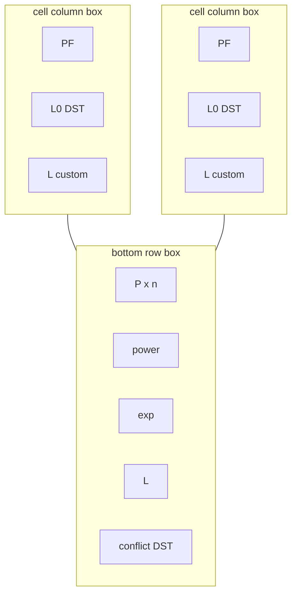

# Axis grouping boxes for Bayesian 2D eqn debugger

## Goal

In [`PendingNotebookCode.py`](h:\TEMP\Spike3DEnv_ExploreUpgrade\Spike3DWorkEnv\pyPhoPlaceCellAnalysis\src\pyphoplacecellanalysis\SpecificResults\PendingNotebookCode.py) `InteractiveBayesian2DEquationDebugger`, draw visual group frames around:

1. **Per-cell columns**: all panels for cell `i` (`PF` + optional DST `L0`/`E` + custom `L`)
2. **Bottom factor row**: `decoded_posterior`, `term0`, `term1`, `joint_likelihood`, and DST `conflict_K` when present

## Approach

Use **figure-coordinate `FancyBboxPatch`** artists (not nested mosaic / subplot spanning). Positions come from `ax.get_position()` union of each axis group; patches are added with `fig.add_artist(...)` so they survive `redraw()`’s `ax.cla()` calls.

Style (concrete choice):
- Subtle rounded outline, **no fill** (or near-transparent fill only if needed for visibility)
- Per-cell boxes: edge color from that cell’s slider/cmap color (`cell_cmaps[i]` at ~0.75)
- Bottom-row box: neutral mid-gray edge
- Small pad (~0.006–0.01 figure fraction) so boxes clear titles/labels but do not collide with neighboring cell boxes given `wspace=0.25`

## Implementation

All edits stay in `InteractiveBayesian2DEquationDebugger` in [`PendingNotebookCode.py`](h:\TEMP\Spike3DEnv_ExploreUpgrade\Spike3DWorkEnv\pyPhoPlaceCellAnalysis\src\pyphoplacecellanalysis\SpecificResults\PendingNotebookCode.py):

1. **Import** `FancyBboxPatch` next to the existing matplotlib widgets import (or use `matplotlib.patches` locally in the helper).

2. **Add field** `group_boxes: List[Any] = field(default=Factory(list))` near other UI state.

3. **Add classmethod helper** `_add_axes_group_box(cls, fig, axes, *, pad=..., edgecolor=..., linewidth=..., zorder=-1)` that:
   - Filters `None` axes
   - Unions `Bbox` from `ax.get_position()`
   - Expands by `pad`
   - Creates `FancyBboxPatch(..., boxstyle='round,pad=0.004', facecolor='none', transform=fig.transFigure, clip_on=False)`
   - `fig.add_artist(patch)` and returns it

4. **Call from `buildUI`** after `ax_cell_pf` / `ax_cell_L` / `ax_cell_E` / factor axes are assigned (and after mosaic exists so positions are valid):
   - For each cell `i`: axes = `[ax_cell_pf[i], ax_cell_L[i]]` plus `ax_cell_E[i]` when DST
   - Bottom group: `[ax_post, ax_pow, ax_exp, ax_L]` plus `ax_conflict_K` when not `None`
   - Store artists on `self.group_boxes` and in `fig._bayes_eqn_ui['group_boxes']`

5. **Do not** recreate boxes inside `redraw()` — figure artists persist across axis clears.

## Out of scope

- No layout / mosaic restructuring
- No labels/titles on the group boxes
- No changes to slider/control widgets
