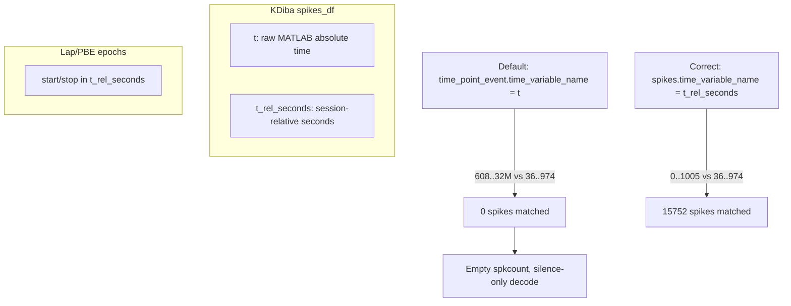

# Bapun-Compat Time Column Bug Audit

## Root pattern (what to hunt for)



**Silent failure signature:** `(temp_epoch_id != -1).sum() == 0` or `sum(spkcount) == 0`, with no exception, because wrong timestamps are still valid numbers in a valid column.

**Timeline of the refactor:**
- **2025-01-15:** `TimePointEventAccessor` extracted from `SpikesAccessor` ([time_slicing.py](h:\TEMP\Spike3DEnv_ExploreUpgrade\Spike3DWorkEnv\NeuroPy\neuropy\utils\mixins\time_slicing.py) lines 174–409) — hardcodes `__time_variable_name = 't'`
- **2025-09-23+:** `_compute_spike_arbitrary_provided_epoch_ids` switched default to `time_point_event.time_variable_name` (now reverted with TODO at line 751)
- **Bapun format:** canonical time is `'t_seconds'` ([BapunDataSessionFormat.py](h:\TEMP\Spike3DEnv_ExploreUpgrade\Spike3DWorkEnv\NeuroPy\neuropy\core\session\Formats\Specific\BapunDataSessionFormat.py) line 222)
- **KDiba format:** canonical time is `'t_rel_seconds'`, but exported `.mat` loads **all three** columns (`t`, `t_seconds`, `t_rel_seconds`) without aliasing

---

## Findings by severity

### Critical — same bug class as laps decode (fix first)

| Location | Issue | KDiba risk |
|---|---|---|
| [time_slicing.py:266–267, 497–498](h:\TEMP\Spike3DEnv_ExploreUpgrade\Spike3DWorkEnv\NeuroPy\neuropy\utils\mixins\time_slicing.py) | `TimePointEventAccessor.adding_epochs_identity_column`: when `override is None`, sets `override = self.time_variable_name` (`'t'`) and passes it explicitly into `add_epochs_id_identity`, **overriding** the fixed `_compute_spike` default | Any caller using `.time_point_event.adding_epochs_identity_column(...)` on spikes without override |
| [reconstruction.py:2858](h:\TEMP\Spike3DEnv_ExploreUpgrade\Spike3DWorkEnv\pyPhoPlaceCellAnalysis\src\pyphoplacecellanalysis\Analysis\Decoder\reconstruction.py) | `add_epochs_id_identity(...)` with no override — **safe only after** NeuroPy `_compute` fix is loaded; belt-and-suspenders: pass `spikes_df.spikes.time_variable_name` | Main batch decode path |
| [SpikeRasters.py:1319](h:\TEMP\Spike3DEnv_ExploreUpgrade\Spike3DWorkEnv\pyPhoPlaceCellAnalysis\src\pyphoplacecellanalysis\General\Pipeline\Stages\DisplayFunctions\SpikeRasters.py) | Same pattern in `_prepare_spikes_df_from_filter_epochs` | Replay raster filtering; same silent zero-spike filter |

**Your partial fix** ([time_slicing.py:748–753](h:\TEMP\Spike3DEnv_ExploreUpgrade\Spike3DWorkEnv\NeuroPy\neuropy\utils\mixins\time_slicing.py)) restores `_compute_spike_arbitrary_provided_epoch_ids` primary default to `spikes.time_variable_name`. **Does not fix** paths that pass `override_time_variable_name='t'` from the accessor.

---

### High — wrong spike source or hardcoded Bapun time column

| Location | Issue |
|---|---|
| [DirectionalPlacefieldGlobalComputationFunctions.py:7697, 7712](h:\TEMP\Spike3DEnv_ExploreUpgrade\Spike3DWorkEnv\pyPhoPlaceCellAnalysis\src\pyphoplacecellanalysis\General\Pipeline\Stages\ComputationFunctions\MultiContextComputationFunctions\DirectionalPlacefieldGlobalComputationFunctions.py) | `_compute_lap_and_ripple_epochs_decoding_for_decoder` uses `sess.spikes_df` instead of `get_proper_global_spikes_df(...)` — wrong neuron set / epoch context vs filtered global laps |
| [DefaultComputationFunctions.py:702](h:\TEMP\Spike3DEnv_ExploreUpgrade\Spike3DWorkEnv\pyPhoPlaceCellAnalysis\src\pyphoplacecellanalysis\General\Pipeline\Stages\ComputationFunctions\DefaultComputationFunctions.py) | Generic `decode_specific_epochs(computation_result.sess.spikes_df, ...)` |
| [DirectionalPlacefieldGlobalComputationFunctions.py:3829–3830](h:\TEMP\Spike3DEnv_ExploreUpgrade\Spike3DWorkEnv\pyPhoPlaceCellAnalysis\src\pyphoplacecellanalysis\General\Pipeline\Stages\ComputationFunctions\MultiContextComputationFunctions\DirectionalPlacefieldGlobalComputationFunctions.py) | Ripple correlation spike prep: `adding_epochs_identity_column` without override; commented hint `# override_time_variable_name='t_seconds'`; line 3842 then hard-selects `t_rel_seconds` — inconsistent if assignment used wrong column |
| [time_slicing.py:871](h:\TEMP\Spike3DEnv_ExploreUpgrade\Spike3DWorkEnv\NeuroPy\neuropy\utils\mixins\time_slicing.py) | `add_PBE_identity` hardcodes `override_time_variable_name='t_seconds'` — correct for Bapun, **breaks KDiba PBE assignment** if PBE epochs are in `t_rel_seconds` |

---

### Medium — format-specific assumptions / latent footguns

| Location | Issue |
|---|---|
| [time_slicing.py:174 + 405](h:\TEMP\Spike3DEnv_ExploreUpgrade\Spike3DWorkEnv\NeuroPy\neuropy\utils\mixins\time_slicing.py) | **Duplicate** `@register_dataframe_accessor("time_point_event")` — second class overwrites first; divergent copies invite drift |
| [DirectionalPlacefieldGlobalComputationFunctions.py:1590, 1602](h:\TEMP\Spike3DEnv_ExploreUpgrade\Spike3DWorkEnv\pyPhoPlaceCellAnalysis\src\pyphoplacecellanalysis\General\Pipeline\Stages\ComputationFunctions\MultiContextComputationFunctions\DirectionalPlacefieldGlobalComputationFunctions.py) | `co_filter_epochs_and_spikes` hardcodes `'t_rel_seconds'` — safe for KDiba, **breaks Bapun** (`t_seconds`) |
| [EpochComputationFunctions.py:358](h:\TEMP\Spike3DEnv_ExploreUpgrade\Spike3DWorkEnv\pyPhoPlaceCellAnalysis\src\pyphoplacecellanalysis\General\Pipeline\Stages\ComputationFunctions\EpochComputationFunctions.py) | Position epoch assignment via `time_point_event` without override; commented `# override_time_variable_name='t_rel_seconds'` |
| [SessionSelectionAndFiltering.py:135](h:\TEMP\Spike3DEnv_ExploreUpgrade\Spike3DWorkEnv\NeuroPy\neuropy\core\session\SessionSelectionAndFiltering.py) | `batch_filter_session` forces `set_time_variable_name("t_seconds")` — Bapun batch path |
| [dataSession.py ~941–944](h:\TEMP\Spike3DEnv_ExploreUpgrade\Spike3DWorkEnv\NeuroPy\neuropy\core\dataSession.py) | PBE spike prep KeyError fallback to `'t_seconds'` |
| [Computation.py:726–748](h:\TEMP\Spike3DEnv_ExploreUpgrade\Spike3DWorkEnv\pyPhoPlaceCellAnalysis\src\pyphoplacecellanalysis\General\Pipeline\Stages\Computation.py) | `find_Global_epoch_name` Bapun vs KDiba divergence — wrong global epoch → wrong filtered spikes (different failure mode) |

---

### Low — display-only or already safe

| Location | Notes |
|---|---|
| [Render2DScrollWindowPlot.py:343–348](h:\TEMP\Spike3DEnv_ExploreUpgrade\Spike3DWorkEnv\pyPhoPlaceCellAnalysis\src\pyphoplacecellanalysis\GUI\PyQtPlot\Widgets\Mixins\Render2DScrollWindowPlot.py), [SpikeRasters.py:650–655](h:\TEMP\Spike3DEnv_ExploreUpgrade\Spike3DWorkEnv\pyPhoPlaceCellAnalysis\src\pyphoplacecellanalysis\General\Pipeline\Stages\DisplayFunctions\SpikeRasters.py) | Rename to `'t'` on **`deepcopy`** — safe for display unless same df object reused |
| PredictiveDecodingComputations / TimeSynchronizedPositionDecoderPlotter | Explicit `override_time_variable_name='t'` on **position** dfs — intentional for Bapun position time |
| [RankOrderComputations.py:1270, 1283](h:\TEMP\Spike3DEnv_ExploreUpgrade\Spike3DWorkEnv\pyPhoPlaceCellAnalysis\src\pyphoplacecellanalysis\General\Pipeline\Stages\ComputationFunctions\MultiContextComputationFunctions\RankOrderComputations.py) | Correct reference: explicit `'t_rel_seconds'` |
| [epoch.py:1696](h:\TEMP\Spike3DEnv_ExploreUpgrade\Spike3DWorkEnv\NeuroPy\neuropy\core\epoch.py) | Correct reference via `.spikes.adding_epochs_identity_column(..., override_time_variable_name='t_rel_seconds')` |
| Production batch decode at [DirectionalPlacefieldGlobalComputationFunctions.py:8421, 8436](h:\TEMP\Spike3DEnv_ExploreUpgrade\Spike3DWorkEnv\pyPhoPlaceCellAnalysis\src\pyphoplacecellanalysis\General\Pipeline\Stages\ComputationFunctions\MultiContextComputationFunctions\DirectionalPlacefieldGlobalComputationFunctions.py) | Uses `get_proper_global_spikes_df` — good spike source; still hits decode shell bug |

---

## Recommended remediation (priority order)

### 1. Centralize time-column resolution in NeuroPy

Add a small helper in [time_slicing.py](h:\TEMP\Spike3DEnv_ExploreUpgrade\Spike3DWorkEnv\NeuroPy\neuropy\utils\mixins\time_slicing.py):

```python
def resolve_spike_time_column(spk_df, override_time_variable_name=None) -> str:
    if override_time_variable_name is not None:
        return override_time_variable_name
    if hasattr(spk_df, 'spikes'):
        col = spk_df.spikes.time_variable_name
        if col in spk_df.columns:
            return col
    # fallback for non-spike point-event dfs
    ...
```

Use it in `_compute_spike_arbitrary_provided_epoch_ids` and `TimePointEventAccessor.adding_epochs_identity_column` (stop defaulting to hardcoded `'t'` when `.spikes` accessor exists).

### 2. Fix accessor default (highest latent risk)

In `TimePointEventAccessor.adding_epochs_identity_column` (both duplicate classes), replace:

```python
if override_time_variable_name is None:
    override_time_variable_name = self.time_variable_name  # 't'
```

with `resolve_spike_time_column(self._obj, override_time_variable_name)`.

### 3. Harden decode call sites

- [reconstruction.py:2858](h:\TEMP\Spike3DEnv_ExploreUpgrade\Spike3DWorkEnv\pyPhoPlaceCellAnalysis\src\pyphoplacecellanalysis\Analysis\Decoder\reconstruction.py): pass explicit `override_time_variable_name=spikes_df.spikes.time_variable_name`
- [SpikeRasters.py:1319](h:\TEMP\Spike3DEnv_ExploreUpgrade\Spike3DWorkEnv\pyPhoPlaceCellAnalysis\src\pyphoplacecellanalysis\General\Pipeline\Stages\DisplayFunctions\SpikeRasters.py): same

### 4. Replace `sess.spikes_df` decode paths

Swap to `get_proper_global_spikes_df(curr_active_pipeline, ...)` at lines 7697, 7712, DefaultComputationFunctions 702, and any remaining `sess.spikes_df` decode callers.

### 5. Make format-specific paths explicit

- `add_PBE_identity`: use `spk_df.spikes.time_variable_name` instead of hardcoded `'t_seconds'`
- `co_filter_epochs_and_spikes`: use session format's canonical time column (from `sess.config` or accessor), not hardcoded `'t_rel_seconds'`
- Ripple correlation at line 3829: add explicit override matching epoch time reference

### 6. Consolidate duplicate `TimePointEventAccessor`

Remove the first duplicate class (lines 174–397) or merge into one definition to prevent future drift.

### 7. Add regression tests (currently missing)

Add NeuroPy test with synthetic KDiba-like dataframe:

```python
# both 't' (large absolute) and 't_rel_seconds' (0..1000) present
# epochs in t_rel_seconds range
# assert add_epochs_id_identity(...).matched_count > 0
# assert add_epochs_id_identity without fix using 't' would give 0
```

Test both KDiba (`t_rel_seconds`) and Bapun-only-`t`/`t_seconds` fixtures.

### 8. Optional guardrail against silent failure

In `_build_decode_specific_epochs_result_shell`, warn or assert when `(temp_epoch_id != -1).sum() == 0` but `len(spikes_df) > 0` and epochs overlap spike time range — catches future regressions early.

---

## Verification checklist (KDiba session)

After fixes + kernel reload:

```python
# 1. Epoch assignment
(s['temp_epoch_id'] != -1).sum()  # expect >> 0 (you saw 15752)

# 2. Decode spkcount
[np.sum(v) for v in laps_result.spkcount[:5]]  # expect non-zero

# 3. Posterior sanity
# epoch 0, bin 0 should have active cells and ~0.07-scale peaks (KDiba compat)
```

Repeat on a Bapun session to confirm `t_seconds` paths still work.
