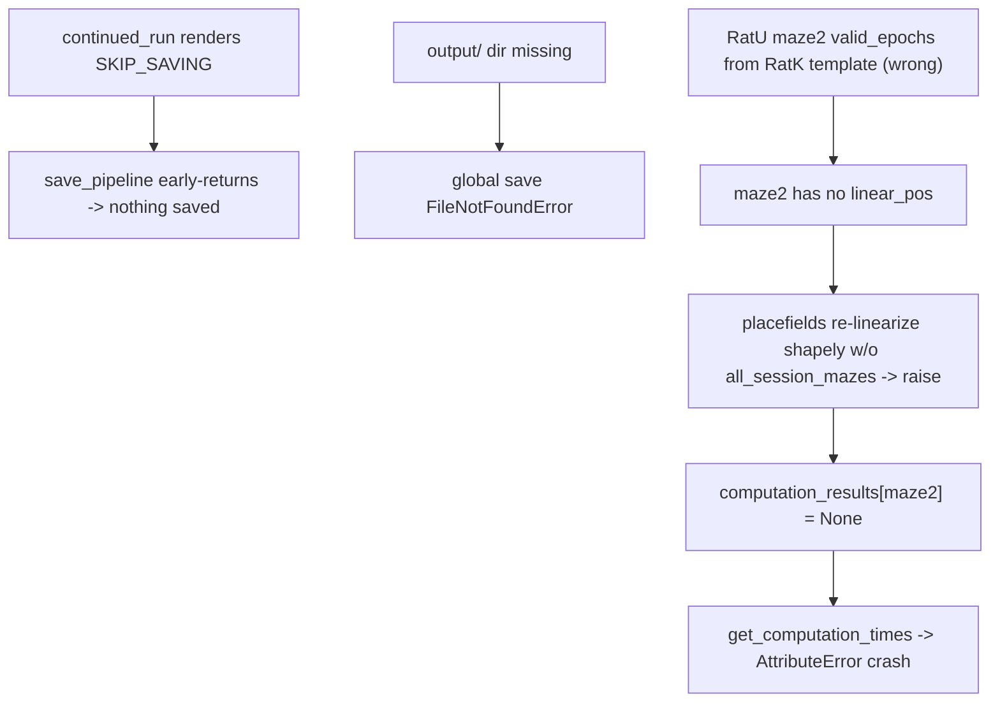

## Root causes (from the failing RatU Day3TwoNovel log)

1. **Nothing is saved.** The `continued_run` phase renders the "Reloading as needed" branch of [`python_template.py.j2`](h:/TEMP/Spike3DEnv_ExploreUpgrade/Spike3DWorkEnv/pyPhoPlaceCellAnalysis/src/pyphoplacecellanalysis/Resources/Templates/python_template.py.j2) which hardcodes `saving_mode=PipelineSavingScheme.SKIP_SAVING` (line 221). That flag is threaded through `run_specific_batch` -> `batch_load_session` and `on_complete_success_execution_session`, so every `save_pipeline(...)` is skipped (`save_pipeline` early-returns when `not saving_mode.shouldSave`, [NeuropyPipeline.py:844](h:/TEMP/Spike3DEnv_ExploreUpgrade/Spike3DWorkEnv/pyPhoPlaceCellAnalysis/src/pyphoplacecellanalysis/General/Pipeline/NeuropyPipeline.py)).
2. **Global save would fail anyway.** `safeSaveData` opens the path without creating parents ([Loading.py:76](h:/TEMP/Spike3DEnv_ExploreUpgrade/Spike3DWorkEnv/pyPhoPlaceCellAnalysis/src/pyphoplacecellanalysis/General/Pipeline/Stages/Loading.py)); the `<session>/output/` dir does not exist -> `FileNotFoundError`.
3. **End-of-run crash.** `get_computation_times` does `v.computation_times` where `v` is `None` ([Computation.py:617](h:/TEMP/Spike3DEnv_ExploreUpgrade/Spike3DWorkEnv/pyPhoPlaceCellAnalysis/src/pyphoplacecellanalysis/General/Pipeline/Stages/Computation.py)); the failed `maze2` epoch left a `None` result -> `AttributeError`, reported as the run error.
4. **maze2 computations fail (cascade).** Shapely linearization resolves `maze2 -> (23253, 26011)` from RatK template fallback, which does not overlap RatU's real `maze2` epoch `(19405, 23143)`. So `maze2`'s filtered position has no `linear_pos`; `perform_compute_placefields` then re-linearizes with `method='shapely'` and no `all_session_mazes` ([placefields.py:2090](h:/TEMP/Spike3DEnv_ExploreUpgrade/Spike3DWorkEnv/NeuroPy/neuropy/analyses/placefields.py)) -> raises -> `pf1D/pf2D` KeyErrors cascade.
5. **kdiba-only directional computations error for bapun.** `split_to_directional_laps`, `merged_directional_placefields`, `directional_decoders_*` call `find_LongShortGlobal_epoch_names()` (kdiba-only) and are NOT in `_KDIBA_ONLY_EXTENDED_COMPUTATIONS` ([BatchCompletionHandler.py:32](h:/TEMP/Spike3DEnv_ExploreUpgrade/Spike3DWorkEnv/pyPhoPlaceCellAnalysis/src/pyphoplacecellanalysis/General/Batch/BatchJobCompletion/BatchCompletionHandler.py)), so they run and throw.

## Fixes

### A. Saving (shared template) - guarantees the session pickle saves
- In [`python_template.py.j2`](h:/TEMP/Spike3DEnv_ExploreUpgrade/Spike3DWorkEnv/pyPhoPlaceCellAnalysis/src/pyphoplacecellanalysis/Resources/Templates/python_template.py.j2) "Reloading as needed" branch (line ~221), change `saving_mode=PipelineSavingScheme.SKIP_SAVING` -> `PipelineSavingScheme.TEMP_THEN_OVERWRITE`. This is correct for all formats (`clean_run` already saves; `figure_run`/freeze stays `SKIP_SAVING`). With `should_save=IF_CHANGED` already set on both local+global options, the local pickle saves in `on_complete` (line 810) and global results save when `newly_computed_values>0`.

### B. Auto-create parent dirs on save - fixes the output/ FileNotFoundError
- In [`Loading.py`](h:/TEMP/Spike3DEnv_ExploreUpgrade/Spike3DWorkEnv/pyPhoPlaceCellAnalysis/src/pyphoplacecellanalysis/General/Pipeline/Stages/Loading.py) `safeSaveData` (and the non-safe branch of `saveData`), add `pkl_path.parent.mkdir(parents=True, exist_ok=True)` before `open(...)`.

### C. Harden end-of-run crash - never abort after results computed
- In [`Computation.py`](h:/TEMP/Spike3DEnv_ExploreUpgrade/Spike3DWorkEnv/pyPhoPlaceCellAnalysis/src/pyphoplacecellanalysis/General/Pipeline/Stages/Computation.py) `get_computation_times` (line ~616), skip `None` results: `if v is None: continue`, and guard `self.global_computation_results.computation_times` if `None`.

### D. Placefield linearization safety net - prevents the cascade
- In [`placefields.py`](h:/TEMP/Spike3DEnv_ExploreUpgrade/Spike3DWorkEnv/NeuroPy/neuropy/analyses/placefields.py) `perform_compute_placefields` (line ~2090), wrap `active_pos.compute_linearized_position(method=linearization_method)` in try/except; on failure, warn and fall back to `method='isomap'`. This guarantees placefields compute (so no `None` epoch result) even when shapely setup is unavailable.

### E. Per-session shapely valid_epochs (RatU/RatJ Day3TwoNovel) - so computations are correct, not just non-crashing
- In [`position_util.py`](h:/TEMP/Spike3DEnv_ExploreUpgrade/Spike3DWorkEnv/NeuroPy/neuropy/utils/position_util.py) `resolve_shapely_valid_epochs`: prefer the session's own `epochs` bounds (unvalidated, with a warning) over a different session's `template_fallback` times when all validated tiers fail. A session's own epoch labels are more trustworthy than another rat's hardcoded times. This makes RatU `maze2 -> (19405, 23143)` from its own epochs.
- Escape hatch if a session still resolves wrong: add `valid_epochs_override={'maze2': (...)}` to that session's `linearization_parameters` in [`BapunDataSessionFormat.py`](h:/TEMP/Spike3DEnv_ExploreUpgrade/Spike3DWorkEnv/NeuroPy/neuropy/core/session/Formats/Specific/BapunDataSessionFormat.py); the wiring already flows it through ([PendingNotebookCode.py:5227](h:/TEMP/Spike3DEnv_ExploreUpgrade/Spike3DWorkEnv/pyPhoPlaceCellAnalysis/src/pyphoplacecellanalysis/SpecificResults/PendingNotebookCode.py)).

### F. Skip kdiba-only directional computations for bapun
- In [`BatchCompletionHandler.py`](h:/TEMP/Spike3DEnv_ExploreUpgrade/Spike3DWorkEnv/pyPhoPlaceCellAnalysis/src/pyphoplacecellanalysis/General/Batch/BatchJobCompletion/BatchCompletionHandler.py) line 32, add to `_KDIBA_ONLY_EXTENDED_COMPUTATIONS`: `split_to_directional_laps`, `merged_directional_placefields`, `directional_decoders_decode_continuous`, `directional_decoders_evaluate_epochs`, `directional_decoders_epoch_heuristic_scoring` (they depend on `find_LongShortGlobal_epoch_names`, kdiba-only). The existing non-kdiba skip path then drops them cleanly.

### G. Regenerate scripts and verify
- After the library edits, re-run [`ProcessBatchOutputs_Bapun_Batch.ipy`](h:/TEMP/Spike3DEnv_ExploreUpgrade/Spike3DWorkEnv/Spike3D/ProcessBatchOutputs_Bapun_Batch.ipy) (manual mode, `continued_run`) to regenerate the per-session `run_*.py` from the fixed template, confirm the generated script no longer contains `SKIP_SAVING` in the run branch, then launch overnight.

## Notes / scope
- No `.ipynb` edits. The `.ipy` driver itself needs no logic change (it only generates scripts); the saving fix lives in the shared template it renders. The only reason to touch the `.ipy` would be the optional `valid_epochs_override` per session (done in `BapunDataSessionFormat.py` instead).
- These library files are shared across the Spike3D workspace repos (NeuroPy, pyPhoPlaceCellAnalysis); changes are format-agnostic and safe for kdiba.