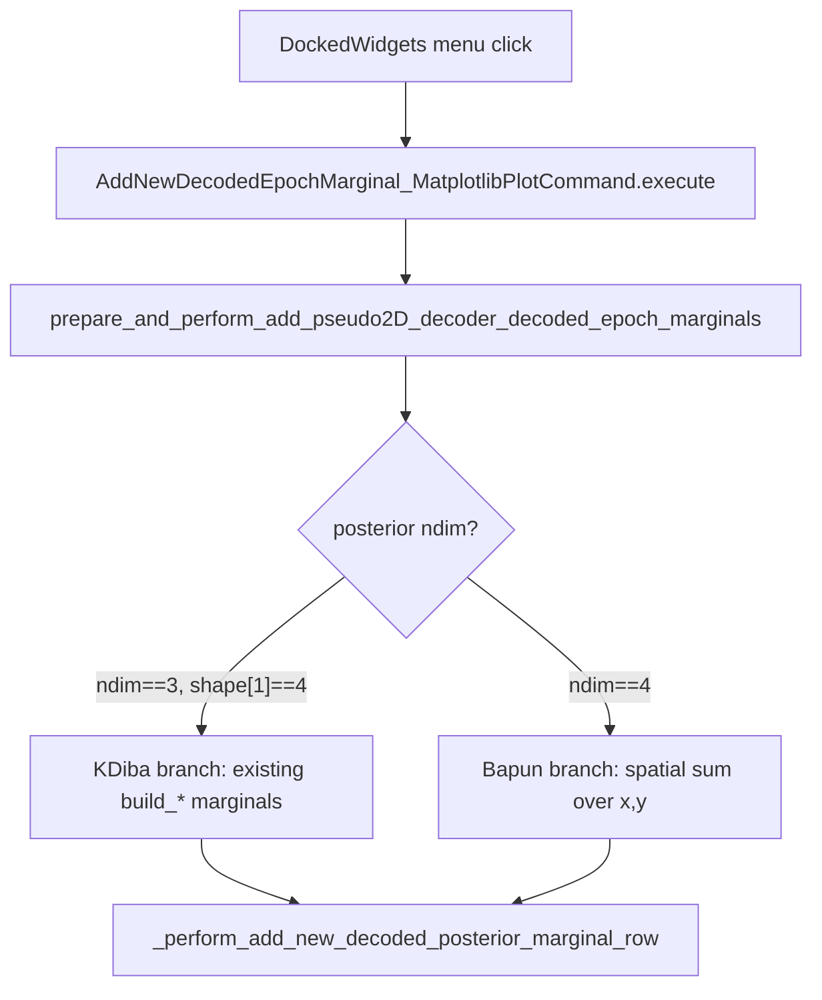

# Fix Pseudo2D Marginals/Positions for Bapun Sessions

## Problem

Both dock menu commands assume KDiba-style cache contents:

```10834:10838:h:\TEMP\Spike3DEnv_ExploreUpgrade\Spike3DWorkEnv\pyPhoPlaceCellAnalysis\src\pyphoplacecellanalysis\General\Pipeline\Stages\ComputationFunctions\MultiContextComputationFunctions\DirectionalPlacefieldGlobalComputationFunctions.py
        pseudo2D_decoder_continuously_decoded_result: DecodedFilterEpochsResult = continuously_decoded_dict.get('pseudo2D', None)
        assert len(pseudo2D_decoder_continuously_decoded_result.p_x_given_n_list) == 1
        non_marginalized_raw_result = DirectionalPseudo2DDecodersResult.build_non_marginalized_raw_posteriors(...)
```

Bapun/non-KDiba continuous decode stores a **`SingleEpochDecodedResult`** with 4D posterior `(n_x, n_y, n_contexts, n_time)` via [`decode_using_contextual_pf2D_decoder`](h:\TEMP\Spike3DEnv_ExploreUpgrade\Spike3DWorkEnv\pyPhoPlaceCellAnalysis\src\pyphoplacecellanalysis\SpecificResults\PendingNotebookCode.py) (line 5862). That object has `.p_x_given_n` and precomputed `.marginal_z`, not `.p_x_given_n_list`.



## Primary file to change

[`DirectionalPlacefieldGlobalComputationFunctions.py`](h:\TEMP\Spike3DEnv_ExploreUpgrade\Spike3DWorkEnv\pyPhoPlaceCellAnalysis\src\pyphoplacecellanalysis\General\Pipeline\Stages\ComputationFunctions\MultiContextComputationFunctions\DirectionalPlacefieldGlobalComputationFunctions.py)

All changes stay in this file (no PendingNotebookCode changes needed).

---

## Step 1: Add shared resolver + contextual marginal helper

Add two small helpers near `DirectionalPseudo2DDecodersResult.get_proper_p_x_given_n_list` (~line 2945):

**`_resolve_pseudo2D_continuous_result(pseudo2D_result) -> Tuple[SingleEpochDecodedResult, NDArray, str]`**
- Accept `DecodedFilterEpochsResult` or `SingleEpochDecodedResult` (what the cache may contain).
- If `DecodedFilterEpochsResult`: `get_result_for_epoch(0)` + `time_bin_containers[0].centers`.
- If `SingleEpochDecodedResult`: use directly + `time_bin_container.centers`.
- Classify format from `p_x_given_n.ndim`:
  - `ndim == 3` and `shape[1] == 4` → `'four_directional'` (KDiba, unchanged path)
  - `ndim == 4` → `'contextual_pf2D'` (Bapun)
  - else: raise clear `ValueError` with shape info

**`build_contextual_marginal_over_track_ID(single_epoch_result) -> NDArray`**
- Mirror existing logic in [`decode_using_contextual_pf2D_decoder`](h:\TEMP\Spike3DEnv_ExploreUpgrade\Spike3DWorkEnv\pyPhoPlaceCellAnalysis\src\pyphoplacecellanalysis\SpecificResults\PendingNotebookCode.py) lines 5869–5883 and [`_add_context_marginal_to_timeline`](h:\TEMP\Spike3DEnv_ExploreUpgrade\Spike3DWorkEnv\pyPhoPlaceCellAnalysis\src\pyphoplacecellanalysis\SpecificResults\PendingNotebookCode.py) lines 5908–5911:
  - Prefer `single_epoch_result.marginal_z.p_x_given_n` if present
  - Else `np.nansum(p_x_given_n, axis=(0,1))` then normalize per time bin
- Returns shape `(n_contexts, n_time_bins)` — maps to existing `marginal_over_track_ID` row

**`_get_context_y_bin_labels(curr_active_pipeline, n_contexts) -> List[str]`**
- Read `DirectionalDecodersDecoded.pf1D_Decoder_dict.keys()` when available (e.g. `roam`/`sprinkle`, `maze1`/`maze2`)
- Fallback: `['context_0', 'context_1', ...]`

---

## Step 2: Branch in `prepare_and_perform_add_pseudo2D_decoder_decoded_epoch_marginals` (~line 10813)

At the top of the method, replace the hard-coded `DecodedFilterEpochsResult` / `p_x_given_n_list` access with:

```python
pseudo2D_raw = continuously_decoded_dict.get('pseudo2D', None)
single_epoch_result, time_window_centers, decoder_format = _resolve_pseudo2D_continuous_result(pseudo2D_raw)
```

**KDiba branch (`decoder_format == 'four_directional'`)** — keep existing code exactly:
- Pass `pseudo2D_raw` (or re-wrap as before) into `build_non_marginalized_raw_posteriors`, `build_custom_marginal_over_direction`, `build_custom_marginal_over_long_short`
- Existing asserts for 4/2 bin counts and label sets unchanged

**Bapun branch (`decoder_format == 'contextual_pf2D'`)**:
- `marginal_over_track_ID = build_contextual_marginal_over_track_ID(single_epoch_result)`
- `non_marginalized_raw_result = marginal_over_track_ID` when enabled (2 rows, not 4)
- `marginal_over_direction = None` — skip row (same as current default `enable_marginal_over_direction=False`)
- Replace hard-coded `assert ... shape[0] == 4` with dynamic `n_y_bins = posterior.shape[0]`
- Use `_get_context_y_bin_labels(...)` for `helper_matplotlib_add_pseudo2D_marginal_labels` on enabled rows
- Reuse existing `_perform_add_new_decoded_posterior_marginal_row` + dock config loop (no new widget API)

Default menu params already favor the row that matters for Bapun (`enable_marginal_over_track_ID=True`, others False via `spike_raster_plt_2d.params`).

---

## Step 3: Branch in `prepare_and_perform_add_pseudo2D_decoder_decoded_epochs` (~line 10430) — Positions menu

Same resolver at top. **KDiba branch** unchanged (split axis 1 into 4 tracks).

**Bapun branch**:
- Split 4D posterior on **context axis** (axis 2), not decoder axis:
  ```python
  context_names = _get_context_y_bin_labels(curr_active_pipeline, p_x_given_n.shape[2])
  split_dict = {name: np.squeeze(p_x_given_n[:, :, i, :]) for i, name in enumerate(context_names)}
  ```
- Add one dock row per context via existing `_perform_add_new_decoded_posterior_row`
- Use generic/neutral dock colors (e.g. `CustomCyclicColorsDockDisplayConfig`) since Bapun has no long_LR/RL color scheme

---

## Step 4: Optional but recommended — surface Qt errors in menu

In [`DockedWidgets_MenuProvider.py`](h:\TEMP\Spike3DEnv_ExploreUpgrade\Spike3DWorkEnv\pyPhoPlaceCellAnalysis\src\pyphoplacecellanalysis\GUI\Qt\Menus\SpecificMenus\DockedWidgets_MenuProvider.py) line 189–190, wrap command execution so future failures print tracebacks instead of failing silently:

```python
from pyphocorehelpers.gui.Qt.ExceptionPrintingSlot import pyqtExceptionPrintingSlot

@pyqtExceptionPrintingSlot()
def _run_menu_command(cmd, *args, **kwargs):
    return cmd(*args, **kwargs)

curr_actions_dict[a_name].triggered.connect(lambda checked=False, cmd=a_build_command: _run_menu_command(cmd))
```

Minimal one-line alternative: connect via a lambda that calls `cmd.execute()` inside try/except with `traceback.print_exc()`.

---

## Verification (manual, in notebook)

After implementation, re-run the earlier notebook snippet against a Bapun session (`RatNDay4OpenField`):

1. Confirm cache type: `SingleEpochDecodedResult`, `p_x_given_n.ndim == 4`
2. `AddNewDecodedEpochMarginal_MatplotlibPlotCommand(..., active_time_bin_sizes_whitelist=[(0.25, 0.25)]).execute()` — should add `marginal_over_track_ID_ContinuousDecode - t_bin_size: (0.25, 0.25)` dock row
3. Click **Docked Widgets → Pseudo2D Marginals (t_bin_sizes)** menu — same result, no silent failure
4. Trigger **Pseudo2D Positions** menu — should add 2 context position tracks (not 4 directional tracks)
5. Regression: run same commands on a KDiba long/short session — 4-decoder marginals/positions unchanged

No new test file required for minimal scope; optional lightweight unit test with synthetic `(10, 8, 2, 100)` array could be added later.

## Out of scope (not required for this fix)

- Changing what `decode_using_contextual_pf2D_decoder` stores in the cache (would break pickles)
- Fixing `split_pseudo2D_continuous_result_to_1D_continuous_result` (same `p_x_given_n_list` assumption, separate feature)
- Notebook changes
