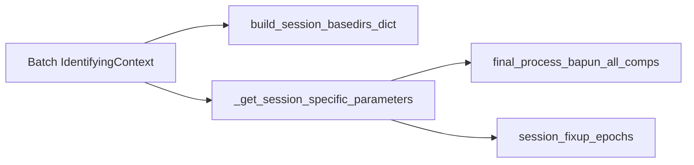

# Add missing Bapun session hardcoded parameters

Single file: [`BapunDataSessionFormat.py`](h:\TEMP\Spike3DEnv_ExploreUpgrade\Spike3DWorkEnv\NeuroPy\neuropy\core\session\Formats\Specific\BapunDataSessionFormat.py)

`build_session_basedirs_dict` already lists all batch contexts. The gap is `_get_session_specific_parameters` (causes `IndexError` on lookup) and two epoch-fixup queries that omit the new session names.



## 1. Add four `HardcodedProcessingParameters` dict entries (no new subfunctions)

Insert before the fallback `IdentifyingContext(format_name='bapun')` entry (~line 419). Reuse existing reward-zone and lap-builder callables by reference only.

| New context | Clone from | Rationale |
|-------------|------------|-----------|
| `RatJ`, `Day4Openfield` | [`RatK Day4Openfield`](h:\TEMP\Spike3DEnv_ExploreUpgrade\Spike3DWorkEnv\NeuroPy\neuropy\core\session\Formats\Specific\BapunDataSessionFormat.py) (lines 378–388) | User confirmed: single-maze open field (`decoder_building_session_names=['maze']`, RatK reward zones + lap builder) |
| `RatU`, `Day5Openfield` | [`Day5OpenfieldSD`](h:\TEMP\Spike3DEnv_ExploreUpgrade\Spike3DWorkEnv\NeuroPy\neuropy\core\session\Formats\Specific\BapunDataSessionFormat.py) (lines 370–377) | Same on-disk session (`RatUDay5OpenfieldSD`); mirrors existing `Day5OpenfieldSD` alias pattern |
| `RatJ`, `Day3TwoNovel` | [`RatS Day5TwoNovel`](h:\TEMP\Spike3DEnv_ExploreUpgrade\Spike3DWorkEnv\NeuroPy\neuropy\core\session\Formats\Specific\BapunDataSessionFormat.py) (lines 404–410) | Notebook notes N/U maze shapes; reuse `Day5TwoNovel_all_session_mazes` |
| `RatU`, `Day3TwoNovel` | [`RatK Day3TwoNovel`](h:\TEMP\Spike3DEnv_ExploreUpgrade\Spike3DWorkEnv\NeuroPy\neuropy\core\session\Formats\Specific\BapunDataSessionFormat.py) (lines 411–418) | Reward zones already defined in `_subfn_rat_U_Day3TwoNovel_reward_zones`; reuse `RatK_Day3TwoNovel_all_session_mazes` |

Each entry is a one-block copy with `animal` / `session_name` changed only. **Every new block gets a full-line `#` comment immediately above it** documenting clone source, inferred epoch structure, and reused helpers — for pre-implementation validation.

### Exact blocks to insert (before `## Fallback defaults:` ~line 419)

```python
            # VALIDATE RatJ Day4Openfield: clone RatK Day4Openfield (single-maze open field, pre/maze/post); reuses _subfn_rat_K_Day4Openfield_reward_zones + _subfn_rat_K_Day4Openfield_build_Bapun_Day4OpenField_laps_from_reward_zones; batch context ProcessBatchOutputs_Bapun_Batch.ipy OpenField list
            IdentifyingContext(format_name= 'bapun', animal= 'RatJ', session_name= 'Day4Openfield'): HardcodedProcessingParameters(
                decoder_building_session_names=['maze'],
                global_session_name='maze',
                non_global_activity_session_names=['maze'],
                grid_bin_bounds=bapun_open_field_grid_bin_bounds,
                lap_estimation_parameters=dict(reward_zones=_subfn_rat_K_Day4Openfield_reward_zones, custom_lap_estimation_fn=_subfn_rat_K_Day4Openfield_build_Bapun_Day4OpenField_laps_from_reward_zones, use_full_2D_lap_estimation=True, minimum_epoch_duration = 2.5, minimum_run_speed=10.0, merging_adjacent_max_separation_sec=6.0),
                linearization_parameters=dict(method='umap', all_session_mazes=None),
            ),

            # VALIDATE RatU Day5Openfield: clone Day5OpenfieldSD alias (same on-disk folder RatUDay5OpenfieldSD); roam/sprinkle epochs + RatU grid bounds + _subfn_rat_U_Day5OpenfieldSD_reward_zones + paradigm fixup; batch renamed context (Day5Openfield vs Day5OpenfieldSD)
            IdentifyingContext(format_name= 'bapun', animal= 'RatU', session_name= 'Day5Openfield'): HardcodedProcessingParameters(
                decoder_building_session_names=['roam', 'sprinkle', 'maze_GLOBAL'],
                global_session_name='maze_GLOBAL',
                non_global_activity_session_names=['roam', 'sprinkle'],
                grid_bin_bounds=bapun_open_field_grid_bin_bounds_rat_U,
                lap_estimation_parameters=dict(reward_zones=_subfn_rat_U_Day5OpenfieldSD_reward_zones, custom_lap_estimation_fn=_subfn_rat_U_Day4Openfield_build_Bapun_Day5OpenfieldSD_laps_from_reward_zones, use_full_2D_lap_estimation=True, minimum_epoch_duration = 2.5, minimum_run_speed=10.0, merging_adjacent_max_separation_sec=6.0),
                linearization_parameters=dict(method='umap', all_session_mazes=None),
            ),

            # VALIDATE RatJ Day3TwoNovel: clone RatS Day5TwoNovel (N/U shapely mazes); reuses Day5TwoNovel_all_session_mazes (valid_epochs are RatS-specific — may need tuning); maze1/maze2/maze_GLOBAL epochs; notebook InteractivePipelineLoadFromPickle_Bapun_RatJ_D3TwoNovel
            IdentifyingContext(format_name= 'bapun', animal= 'RatJ', session_name= 'Day3TwoNovel'): HardcodedProcessingParameters(decoder_building_session_names=['maze1', 'maze2', 'maze_GLOBAL'],
                global_session_name='maze_GLOBAL',
                non_global_activity_session_names=['maze1', 'maze2'],
                grid_bin_bounds=bapun_open_field_grid_bin_bounds,
                lap_estimation_parameters=dict(reward_zones=None, custom_lap_estimation_fn=None, use_full_2D_lap_estimation=True, minimum_epoch_duration = 2.5, minimum_run_speed=10.0, merging_adjacent_max_separation_sec=6.0),
                linearization_parameters=dict(method='shapely', all_session_mazes=Day5TwoNovel_all_session_mazes),
            ),

            # VALIDATE RatU Day3TwoNovel: clone RatK Day3TwoNovel; reuses _subfn_rat_U_Day3TwoNovel_reward_zones + RatK_Day3TwoNovel_all_session_mazes + bapun_grid_bin_bounds_rat_U_Day3TwoNovel (shapely valid_epochs are RatK-specific — may need tuning)
            IdentifyingContext(format_name= 'bapun', animal= 'RatU', session_name= 'Day3TwoNovel'): HardcodedProcessingParameters(decoder_building_session_names=['maze1', 'maze2', 'maze_GLOBAL'],
                global_session_name='maze_GLOBAL',
                non_global_activity_session_names=['maze1', 'maze2'],
                grid_bin_bounds=bapun_grid_bin_bounds_rat_U_Day3TwoNovel,
                lap_estimation_parameters=dict(reward_zones=_subfn_rat_U_Day3TwoNovel_reward_zones, custom_lap_estimation_fn=None, use_full_2D_lap_estimation=True, minimum_epoch_duration = 2.5, minimum_run_speed=10.0, merging_adjacent_max_separation_sec=6.0),
                linearization_parameters=dict(method='shapely', all_session_mazes=RatK_Day3TwoNovel_all_session_mazes),
            ),
```

**Not in scope (already handled):** RatS `Day1OpenField` / `Day4OpenField` match existing `Day1Openfield` / `Day4Openfield` keys via case-insensitive `IdentifyingContext.query`.

## 2. Epoch fixup query tweaks (~lines 619–622)

Two edits in `_bapun_session_fixup_epochs_to_be_non_overlapping`, each preceded by a validation comment:

```python
            # VALIDATE epoch fixup: RatK + RatJ Day4Openfield share single-maze pre/maze/post (3 epochs); disable maze_GLOBAL when already fixed
            is_bapun_ratK_or_ratJ_Day4Openfield_sess = curr_sess_context.query(criteria={'format_name':'bapun', 'animal': ['RatK', 'RatJ'], 'session_name': 'Day4Openfield'})
            ...
            if is_bapun_ratK_or_ratJ_Day4Openfield_sess:  # replaces `if is_bapun_ratK_Day4OpenField_sess:`
```

```python
            # VALIDATE epoch fixup: RatU Day5 on-disk session; batch uses Day5Openfield context name alongside legacy Day5OpenfieldSD / RatUDay5OpenfieldSD aliases
            is_bapun_RatU_Day5OpenfieldSD_sess = curr_sess_context.query(criteria={'format_name':'bapun', 'animal': 'RatU', 'session_name': ['RatUDay5OpenfieldSD', 'Day5OpenfieldSD', 'Day5Openfield']})
```

TwoNovel sessions need no new fixup branches (they already use `maze1`/`maze2` directly).

## 3. Fix RatJ Day3TwoNovel disk-folder override in `session_specs` (~line 459)

Replace with comment + corrected tuple:

```python
            # VALIDATE path: on-disk folder is RatJ/Day3TwoNovel (not RatJDay3TwoNovel); session_name in IdentifyingContext stays Day3TwoNovel
            ('RatJ', 'Day3TwoNovel', None),
```

On-disk folder is `RatJ/Day3TwoNovel` per session enumeration and the RatJ TwoNovel notebook; the `RatJDay3TwoNovel` override likely resolves to a non-existent path.

## 4. Explicitly out of scope (minimal-edit constraint)

- No new module-level `ShapelyMazeCollection` objects (RatJ/RatU TwoNovel reuse existing collections; `valid_epochs` may need per-session tuning later).
- No new `_subfn_*` reward-zone or lap-builder functions.
- No changes to batch `.ipy`, tests, or `load_session` linearization whitelist.
- No switch from `IdentifyingContext.matching` to `find_best_matching_contexts` (would be a broader refactor).

## Verification

After edits, sanity-check that each batch context resolves params without error:

```python
from neuropy.utils.result_context import IdentifyingContext
from neuropy.core.session.Formats.Specific.BapunDataSessionFormat import BapunDataSessionFormatRegisteredClass as F

for ctx in [
    IdentifyingContext(format_name='bapun', animal='RatJ', session_name='Day4Openfield'),
    IdentifyingContext(format_name='bapun', animal='RatU', session_name='Day5Openfield'),
    IdentifyingContext(format_name='bapun', animal='RatJ', session_name='Day3TwoNovel'),
    IdentifyingContext(format_name='bapun', animal='RatU', session_name='Day3TwoNovel'),
]:
    p = F._get_session_specific_parameters(ctx)
    print(ctx, p.decoder_building_session_names)
```

Expected: `['maze']`, `['roam','sprinkle','maze_GLOBAL']`, `['maze1','maze2','maze_GLOBAL']`, `['maze1','maze2','maze_GLOBAL']`.
