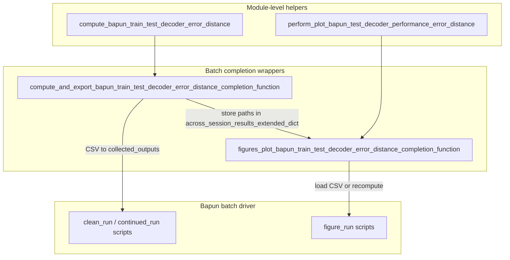

# Bapun train-test decoder error helper

## Goal

Port the notebook prototype into [`batch_user_completion_helpers.py`](h:\TEMP\Spike3DEnv_ExploreUpgrade\Spike3DWorkEnv\pyPhoPlaceCellAnalysis\src\pyphoplacecellanalysis\General\Batch\BatchJobCompletion\UserCompletionHelpers\batch_user_completion_helpers.py) as reusable helpers plus batch completion wrappers, then wire into [`ProcessBatchOutputs_Bapun_Batch.ipy`](h:\TEMP\Spike3DEnv_ExploreUpgrade\Spike3DWorkEnv\Spike3D\ProcessBatchOutputs_Bapun_Batch.ipy).

## Architecture



## 1. Add pure helpers (new section after generalized decode completions ~L3436)

Insert a section **"Bapun Train-Test Decoder Error"** with two module-level functions.

### `compute_bapun_train_test_decoder_error_distance`

Clean port of the provided snippet with these adjustments:

- **Imports (lazy, inside function)** — match existing file style:
  - `compute_train_test_split_epochs_decoders` from [`PendingNotebookCode.py`](h:\TEMP\Spike3DEnv_ExploreUpgrade\Spike3DWorkEnv\pyPhoPlaceCellAnalysis\src\pyphoplacecellanalysis\SpecificResults\PendingNotebookCode.py) (already supports Bapun via `curr_active_pipeline`)
  - `TrainTestLapsSplitting`, `get_proper_global_spikes_df`, `CustomDecodeEpochsResult` from [`DirectionalPlacefieldGlobalComputationFunctions.py`](h:\TEMP\Spike3DEnv_ExploreUpgrade\Spike3DWorkEnv\pyPhoPlaceCellAnalysis\src\pyphoplacecellanalysis\General\Pipeline\Stages\ComputationFunctions\MultiContextComputationFunctions\DirectionalPlacefieldGlobalComputationFunctions.py)
  - `DecodedFilterEpochsResult` from `Analysis.Decoder.reconstruction` (type hint only)
- **Drop unused imports** from the snippet (`sklearn.metrics.mean_squared_error`, `EpochHelpers`).
- **Remove notebook cruft** (bare `test_err_df` / `test_err_agg_df` display lines).
- **Parameters** (single-line signatures per project rules):
  - `curr_active_pipeline`
  - `training_data_portion: float = 9.0/10.0` (match your prototype; differs from PendingNotebookCode default `5/6`)
  - `laps_decoding_time_bin_size: float = 0.250`
  - `maze_epoch_names: Optional[List[str]] = None` (forward to `compute_train_test_split_epochs_decoders`; auto-resolved from `BapunDataSessionFormatRegisteredClass` when `None`)
  - `debug_print: bool = False`
- **Return** `Tuple[pd.DataFrame, pd.DataFrame, Dict[str, DecodedFilterEpochsResult]]` → `(test_err_agg_df, test_err_df, test_decode_results)`.
- **Logic** (unchanged from prototype):
  1. `train_test_result = compute_train_test_split_epochs_decoders(...)`
  2. `test_decode_results = TrainTestLapsSplitting.decode_using_new_decoders(...)`
  3. `CustomDecodeEpochsResult.build_measured_decoded_position_comparison(...)` on test epochs
  4. Add `'maze'` column, concat per-maze err dfs, groupby agg on `sq_err` / `err_cm`

### `perform_plot_bapun_test_decoder_performance_error_distance`

- **Inputs**: `curr_active_pipeline`, `test_err_df`, optional `title_string` / `subtitle_string`.
- **Dynamic subtitle**: default to `" vs ".join(sorted(test_err_df['maze'].unique()))` instead of hardcoded `'roam vs sprinkle'`.
- **Plot**: scatter `t` vs `sq_err`, optionally color by `maze` (use the commented split-by-maze approach from your snippet).
- **Formatting**: keep `flexitext` + `FormattedFigureText` + `build_display_context_for_session('test_decoded_measured_sq_err')` pattern from prototype.
- **Return** `(fig, ax)`.

Both helpers get `@function_attributes(..., tags=['bapun', 'train-test', 'decoder', ...])`.

## 2. Add batch completion wrappers

Follow the established pattern used by [`compute_and_export_session_extended_placefield_peak_information_completion_function`](h:\TEMP\Spike3DEnv_ExploreUpgrade\Spike3DWorkEnv\pyPhoPlaceCellAnalysis\src\pyphoplacecellanalysis\General\Batch\BatchJobCompletion\UserCompletionHelpers\batch_user_completion_helpers.py) (L3095+) and [`figures_plot_cell_first_spikes_characteristics_completion_function`](h:\TEMP\Spike3DEnv_ExploreUpgrade\Spike3DWorkEnv\pyPhoPlaceCellAnalysis\src\pyphoplacecellanalysis\General\Batch\BatchJobCompletion\UserCompletionHelpers\batch_user_completion_helpers.py) (L2027+).

### `compute_and_export_bapun_train_test_decoder_error_distance_completion_function(self, global_data_root_parent_path, curr_session_context, curr_session_basedir, curr_active_pipeline, across_session_results_extended_dict, training_data_portion=9.0/10.0, laps_decoding_time_bin_size=0.250, maze_epoch_names=None, save_csv=True, debug_print=False) -> dict`

- **Guard**: if `getattr(curr_session_context, 'format_name', None) != 'bapun'`, log warning and return `across_session_results_extended_dict` unchanged.
- **Compute**: call `compute_bapun_train_test_decoder_error_distance(...)`.
- **Export** to `self.collected_outputs_path` with prefix `{BATCH_DATE_TO_USE}-{session_name}`:
  - `{prefix}_bapun_train_test_decoder_error.csv` (`test_err_df`)
  - `{prefix}_bapun_train_test_decoder_error_agg.csv` (`test_err_agg_df`)
- **Store** in `across_session_results_extended_dict['compute_and_export_bapun_train_test_decoder_error_distance_completion_function']`:
  - `test_err_agg_df`, `test_err_df_csv_path`, `test_err_agg_csv_path`, `training_data_portion`, `laps_decoding_time_bin_size`
- **Error handling**: try/except with `CapturedException` like sibling completion functions; respect `self.fail_on_exception`.

### `figures_plot_bapun_train_test_decoder_error_distance_completion_function(self, ..., write_png=True, write_vector_format=False, force_recompute=False) -> dict`

- **Guard**: same Bapun `format_name` check.
- **Load data** (figure phase runs in a separate script from compute phases):
  1. Prefer CSV path from `across_session_results_extended_dict` if present in same run.
  2. Else load `{CURR_BATCH_OUTPUT_PREFIX}_bapun_train_test_decoder_error.csv` from `self.collected_outputs_path`.
  3. Else if `force_recompute`, call compute helper inline.
- **Plot + export**: `FileOutputManager(FigureOutputLocation.CUSTOM, ...)` + `build_and_write_to_file(fig, display_context, ...)` from [`ExportHelpers.py`](h:\TEMP\Spike3DEnv_ExploreUpgrade\Spike3DWorkEnv\pyPhoPlaceCellAnalysis\src\pyphoplacecellanalysis\General\Mixins\ExportHelpers.py).
- **Store** figure paths in `across_session_results_extended_dict['figures_plot_bapun_train_test_decoder_error_distance_completion_function']`.

## 3. Wire into Bapun batch driver

Update [`ProcessBatchOutputs_Bapun_Batch.ipy`](h:\TEMP\Spike3DEnv_ExploreUpgrade\Spike3DWorkEnv\Spike3D\ProcessBatchOutputs_Bapun_Batch.ipy):

### Imports (L72–74 area)

Add:
- `compute_and_export_bapun_train_test_decoder_error_distance_completion_function`
- `figures_plot_bapun_train_test_decoder_error_distance_completion_function`

### Phase-aware completion dict in `process_all_phases` (L190–195 area)

Currently the same flat dict is used for every phase. Change minimally so figure-only helpers are not re-run on compute phases:

```python
active_override_dict = dict(phase_any_run_custom_user_completion_functions_dict)
if active_phase.is_figure_phase:
    active_override_dict = active_override_dict | bapun_figure_custom_user_completion_functions_dict
custom_user_completion_function_template_code, ... = MAIN_get_template_string(..., override_custom_user_completion_functions_dict=active_override_dict)
```

### Configuration block (L397–404 area)

Split into two dicts:

**Run phases** — add:
```python
'compute_and_export_bapun_train_test_decoder_error_distance_completion_function': compute_and_export_bapun_train_test_decoder_error_distance_completion_function,
```

**Figure phase only** — new dict:
```python
bapun_figure_custom_user_completion_functions_dict = {
    'figures_plot_bapun_train_test_decoder_error_distance_completion_function': figures_plot_bapun_train_test_decoder_error_distance_completion_function,
}
```

### Override kwargs in `process_all_phases` (L247–277 area)

Add entry aligned with existing Bapun decoding kwargs:
```python
'compute_and_export_bapun_train_test_decoder_error_distance_completion_function': dict(
    training_data_portion=9.0/10.0,
    laps_decoding_time_bin_size=laps_decoding_time_bin_size,
    debug_print=False,
),
```

Pass `bapun_figure_custom_user_completion_functions_dict` into `process_all_phases` as a new optional parameter (default `{}`).

## 4. Prerequisites / assumptions

- Pipeline must already have per-context `pf2D_Decoder` computed (`compute_train_test_split_epochs_decoders` asserts this for each maze in `maze_epoch_names`).
- Bapun batch run phases already include placefield computation (`pf_computation` in `ProcessingScriptPhases.get_run_configuration` extended lists) — no new global computation registration needed unless you want this in an earlier/lighter phase.
- **Do not** add to `MAIN_get_template_string` default dict (Bapun explicitly overrides; KDIBA should not get this helper by default).

## 5. Verification (manual)

After implementation, on one Bapun session pickle (e.g. RatN Day4OpenField):

1. Call helper directly:
   ```python
   test_err_agg_df, test_err_df, _ = compute_bapun_train_test_decoder_error_distance(curr_active_pipeline)
   ```
2. Run generated `run_*.py` with the new completion function embedded; confirm CSVs appear under `collected_outputs`.
3. Run `figure_run` script; confirm PNG exported and scatter plot shows per-maze `sq_err` vs `t`.
4. Confirm KDIBA batch scripts are unaffected (no new entries in KDIBA drivers).

## Files touched

| File | Change |
|------|--------|
| [`batch_user_completion_helpers.py`](h:\TEMP\Spike3DEnv_ExploreUpgrade\Spike3DWorkEnv\pyPhoPlaceCellAnalysis\src\pyphoplacecellanalysis\General\Batch\BatchJobCompletion\UserCompletionHelpers\batch_user_completion_helpers.py) | +2 helpers, +2 completion functions (~150–200 lines) |
| [`ProcessBatchOutputs_Bapun_Batch.ipy`](h:\TEMP\Spike3DEnv_ExploreUpgrade\Spike3DWorkEnv\Spike3D\ProcessBatchOutputs_Bapun_Batch.ipy) | imports, phase-aware dict merge, config + kwargs |

No changes to `PendingNotebookCode.py` — reuse existing `compute_train_test_split_epochs_decoders`.
