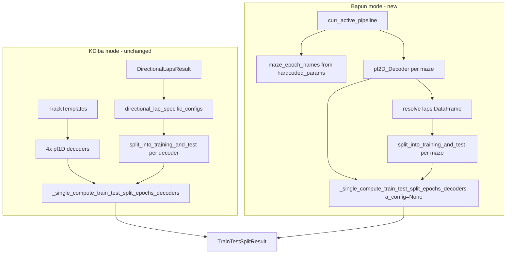

# Bapun-compatible train/test split for `compute_train_test_split_epochs_decoders`

## Problem

[`compute_train_test_split_epochs_decoders`](h:/TEMP/Spike3DEnv_ExploreUpgrade/Spike3DWorkEnv/pyPhoPlaceCellAnalysis/src/pyphoplacecellanalysis/SpecificResults/PendingNotebookCode.py) (lines 12967–13075) only accepts KDiba-specific inputs:

- `DirectionalLapsResult.directional_lap_specific_configs` (4 directional configs: `maze1_odd`, etc.)
- `TrackTemplates.get_decoders_dict()` (4 × 1D decoders: `long_LR`, …)

Bapun OpenField / TwoMaze pipelines instead expose:

- Per-context **`pf2D_Decoder`** in `curr_active_pipeline.computation_results[maze_name].computed_data`
- Context names from `hardcoded_params.non_global_activity_session_names` — e.g. `['roam', 'sprinkle']` (OpenField) or `['maze1', 'maze2']` (TwoMaze)
- Lap epochs on `filtered_sessions[maze_name].laps` (no `DirectionalLapsResult`)

The in-progress notebook cell in [`InteractivePipelineLoadFromPickle_Bapun_RatN_D4OpenField.ipynb`](h:/TEMP/Spike3DEnv_ExploreUpgrade/Spike3DWorkEnv/Spike3D/OpenField/InteractivePipelineLoadFromPickle_Bapun_RatN_D4OpenField.ipynb) (~16430) already loops over `hardcoded_params.non_global_activity_session_names` and calls `_single_compute_train_test_split_epochs_decoders`, but still references nonexistent `directional_laps_results` / `decoders_dict` — this function should replace that boilerplate.



## Implementation (single file)

**File:** [`PendingNotebookCode.py`](h:/TEMP/Spike3DEnv_ExploreUpgrade/Spike3DWorkEnv/pyPhoPlaceCellAnalysis/src/pyphoplacecellanalysis/SpecificResults/PendingNotebookCode.py) — lines ~12967–13075 only (+ small helper immediately above if needed).

### 1. Update function signature and dispatch

Change signature to:

```python
def compute_train_test_split_epochs_decoders(
    directional_laps_results: Optional[DirectionalLapsResult] = None,
    track_templates: Optional[TrackTemplates] = None,
    curr_active_pipeline=None,
    maze_epoch_names: Optional[List[str]] = None,
    training_data_portion: float = 5.0/6.0,
    debug_output_hdf5_file_path=None,
    debug_plot: bool = False,
    debug_print: bool = False,
) -> TrainTestSplitResult:
```

**Dispatch rules:**

| Inputs provided | Mode |
|---|---|
| `curr_active_pipeline` | Bapun |
| `directional_laps_results` + `track_templates` | KDiba (existing logic) |
| neither / both ambiguous | `ValueError` with clear message |

### 2. Bapun branch (new)

Reuse existing loop body and [`_single_compute_train_test_split_epochs_decoders`](h:/TEMP/Spike3DEnv_ExploreUpgrade/Spike3DWorkEnv/pyPhoPlaceCellAnalysis/src/pyphoplacecellanalysis/SpecificResults/PendingNotebookCode.py) (line 12887), which already supports `a_config=None`.

**Resolve maze names** (if `maze_epoch_names is None`):

```python
from neuropy.core.session.Formats.Specific.BapunDataSessionFormat import BapunDataSessionFormatRegisteredClass
hardcoded_params = BapunDataSessionFormatRegisteredClass._get_session_specific_parameters(
    session_context=curr_active_pipeline.get_session_context())
maze_epoch_names = hardcoded_params.non_global_activity_session_names
```

**Per-maze decoder:** `deepcopy(curr_active_pipeline.computation_results[name].computed_data.pf2D_Decoder)` with assert that `pf2D_Decoder` exists.

**Resolve laps DataFrame** (fallback chain, per existing design notes in [bapun_train-test_validation plan](h:/TEMP/Spike3DEnv_ExploreUpgrade/Spike3DWorkEnv/Spike3D/.cursor/plans/bapun_train-test_validation_61f44c19.plan.md)):

1. `ensure_dataframe(deepcopy(decoder.pf.epochs))`
2. `computation_results[name].computation_config.pf_params.computation_epochs`
3. `filtered_sessions[name].laps`

**Split identity columns** (Bapun may lack direction):

```python
identity_cols = ['label', 'lap_id']
if 'lap_dir' in a_prev_computation_epochs_df.columns:
    identity_cols.append('lap_dir')
```

**Split call** (same as KDiba, dynamic identity cols):

```python
an_epoch_training_df, an_epoch_test_df = a_prev_computation_epochs_df.epochs.split_into_training_and_test(
    training_data_portion=training_data_portion,
    group_column_name='lap_id',
    additional_epoch_identity_column_names=identity_cols,
    skip_get_non_overlapping=False,
    debug_print=False,
)
```

Call `_single_compute_train_test_split_epochs_decoders(a_decoder=..., a_config=None, ...)` with `a_modern_name=maze_name`.

### 3. Extract shared result assembly (minimal DRY)

The last ~15 lines (collect `train_epoch_names`, build `train_lap_specific_pf1D_Decoder_dict`, `test_epochs_dict`, `train_epochs_dict`, return `TrainTestSplitResult`) are identical for both modes — extract to a tiny local helper `_assemble_train_test_split_result(...)` placed just above the public function to avoid duplicating that block.

### 4. KDiba branch

Move existing body into `elif directional_laps_results is not None and track_templates is not None:` block unchanged in behavior.

### 5. Docstring + working example

Expand the docstring on `compute_train_test_split_epochs_decoders` with:

- Parameter documentation for new args
- **Bapun OpenField example** (`roam` / `sprinkle`)
- **Bapun TwoMaze example** (`maze1` / `maze2`)
- Optional decode step using existing [`TrainTestLapsSplitting.decode_using_new_decoders`](h:/TEMP/Spike3DEnv_ExploreUpgrade/Spike3DWorkEnv/pyPhoPlaceCellAnalysis/src/pyphoplacecellanalysis/General/Pipeline/Stages/ComputationFunctions/MultiContextComputationFunctions/DirectionalPlacefieldGlobalComputationFunctions.py) + `get_proper_global_spikes_df`

Example pattern (to embed in docstring):

```python
from pyphoplacecellanalysis.SpecificResults.PendingNotebookCode import compute_train_test_split_epochs_decoders
from pyphoplacecellanalysis.General.Pipeline.Stages.ComputationFunctions.MultiContextComputationFunctions.DirectionalPlacefieldGlobalComputationFunctions import TrainTestLapsSplitting, get_proper_global_spikes_df

# Requires a fully-computed Bapun pipeline (pf2D_Decoder per context)
train_test_result = compute_train_test_split_epochs_decoders(
    curr_active_pipeline=curr_active_pipeline,
    # maze_epoch_names=['roam', 'sprinkle'],  # OpenField; omit to auto-detect
    training_data_portion=5.0/6.0,
    debug_print=True,
)

global_spikes_df = get_proper_global_spikes_df(curr_active_pipeline)
test_decode_results = TrainTestLapsSplitting.decode_using_new_decoders(
    global_spikes_df,
    train_test_result.train_lap_specific_pf1D_Decoder_dict,  # holds train-only pf2D decoders for Bapun
    train_test_result.test_epochs_dict,
    laps_decoding_time_bin_size=0.5,
)
```

Note: `TrainTestSplitResult.train_lap_specific_pf1D_Decoder_dict` keeps the KDiba field name but will store Bapun **2D** train-only decoders — consistent with downstream decode helpers.

## Out of scope

- No notebook edits (per user rule)
- No changes to `DirectionalPlacefieldGlobalComputationFunctions.py` / `TrainTestLapsSplitting`
- No refactor of `evaluate_bapun_context_decoder_performance` (can consume `TrainTestSplitResult` in a follow-up)

## Verification

After implementation, sanity-check on a loaded Bapun pickle (OpenField or TwoMaze):

1. `compute_train_test_split_epochs_decoders(curr_active_pipeline=...)` returns without referencing `DirectionalLapsResult`
2. Keys in `train_epochs_dict` / `test_epochs_dict` match maze names (`roam`, `sprinkle` or `maze1`, `maze2`)
3. For each maze, train + test epoch durations per `lap_id` partition the original lap duration (~5/6 train, ~1/6 test)
4. `train_lap_specific_pf1D_Decoder_dict[maze].pf` differs from the full-session pipeline decoder (placefields rebuilt on train epochs only)
5. Existing KDiba call path still works when both `directional_laps_results` and `track_templates` are passed
