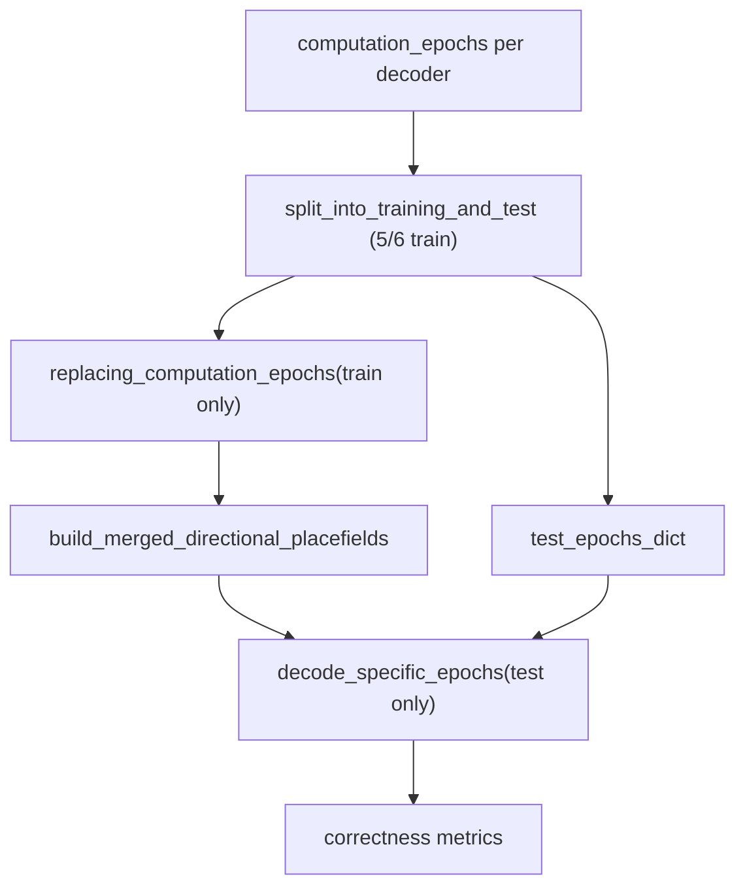

# Bapun Context Decoder Train/Test Performance Validation

## Problem

[`evaluate_bapun_context_decoder_performance`](h:/TEMP/Spike3DEnv_ExploreUpgrade/Spike3DWorkEnv/pyPhoPlaceCellAnalysis/src/pyphoplacecellanalysis/SpecificResults/PendingNotebookCode.py) (lines 301–335) currently:

1. Deep-copies the **full** per-maze `pf2D_Decoder` from `computation_results` (trained on all laps)
2. Merges them into a pseudo-2D contextual decoder
3. Decodes **all** laps from `filtered_sessions[maze_name].laps`

This leaks test data into training and is not a rigorous performance estimate.

## Reference implementation (KDiba — do not modify)

The correct pattern lives in [`_do_train_test_split_decode_and_evaluate`](h:/TEMP/Spike3DEnv_ExploreUpgrade/Spike3DWorkEnv/pyPhoPlaceCellAnalysis/src/pyphoplacecellanalysis/General/Pipeline/Stages/ComputationFunctions/MultiContextComputationFunctions/DirectionalPlacefieldGlobalComputationFunctions.py) (~5600–5699), backed by [`TrainTestLapsSplitting.compute_train_test_split_laps_decoders`](h:/TEMP/Spike3DEnv_ExploreUpgrade/Spike3DWorkEnv/pyPhoPlaceCellAnalysis/src/pyphoplacecellanalysis/General/Pipeline/Stages/ComputationFunctions/MultiContextComputationFunctions/DirectionalPlacefieldGlobalComputationFunctions.py) (~5844–6031):



Core mechanism: [`EpochHelpers.split_epochs_into_training_and_test`](h:/TEMP/Spike3DEnv_ExploreUpgrade/Spike3DWorkEnv/NeuroPy/neuropy/core/epoch.py) randomly samples `training_data_portion` (default 5/6) of each lap's duration for training; the complement is test. Decoders are rebuilt via `BasePositionDecoder.replacing_computation_epochs(...)`, which recomputes placefields from training spikes only.

## Reusable code already in PendingNotebookCode.py

Reuse (no KDiba edits needed):

- [`_single_compute_train_test_split_epochs_decoders`](h:/TEMP/Spike3DEnv_ExploreUpgrade/Spike3DWorkEnv/pyPhoPlaceCellAnalysis/src/pyphoplacecellanalysis/SpecificResults/PendingNotebookCode.py) (~12892) — generalized helper that takes any decoder + train/test DataFrames and returns a train-only decoder via `replacing_computation_epochs`
- `BasePositionDecoder.replacing_computation_epochs` / `PfND.replacing_computation_epochs` — same as KDiba

Do **not** call `TrainTestLapsSplitting` or `directional_train_test_split` pipeline computation — those are KDiba directional-track specific (4 decoders, `TrackTemplates`, `DirectionalLapsResult`).

## Implementation plan

All changes confined to [`PendingNotebookCode.py`](h:/TEMP/Spike3DEnv_ExploreUpgrade/Spike3DWorkEnv/pyPhoPlaceCellAnalysis/src/pyphoplacecellanalysis/SpecificResults/PendingNotebookCode.py), lines ~169–335.

### 1. Extend `BapunContextDecoderPerformanceResult`

Add fields (per user preference):

- `training_data_portion: float`
- `test_data_portion: float`
- `train_epochs_dict: Dict[str, pd.DataFrame]` — keyed by maze name
- `test_epochs_dict: Dict[str, pd.DataFrame]` — keyed by maze name

### 2. Add a private helper on the result class

Add `BapunContextDecoderPerformanceResult._build_train_test_split_pf2D_decoder(...)` that, for one maze:

- **Source laps**: `ensure_dataframe(decoder.pf.epochs)` (preferred — reflects actual PF computation epochs). Fallback: `computation_results[maze_name].computation_config.pf_params.computation_epochs`, then `filtered_sessions[maze_name].laps`.
- **Identity columns**: start with `['label', 'lap_id']`; append `'lap_dir'` only if present (KDiba uses all three; Bapun may lack `lap_dir`).
- **Split**: `a_laps_df.epochs.split_into_training_and_test(training_data_portion=..., group_column_name='lap_id', additional_epoch_identity_column_names=identity_cols, ...)`
- **Train decoder**: call `_single_compute_train_test_split_epochs_decoders(a_decoder=decoder, a_config=None, an_epoch_training_df=..., an_epoch_test_df=..., a_modern_name=maze_name)` and return `(train_decoder, test_df, train_df)`

### 3. Refactor `evaluate_bapun_context_decoder_performance`

Add parameter: `training_data_portion: float = 5.0/6.0`.

Replace step 1 (decoder extraction) logic:

| Before | After |
|--------|-------|
| `pf2D_Decoder_dict[name] = deepcopy(computed pf2D_Decoder)` | For each maze: split laps → `train_pf2D_Decoder_dict[name] = train_only_decoder` |
| Merge full decoders | Merge **train-only** decoders (same `conform_to_position_bins` + `build_merged_directional_placefields` loop) |
| Decode `filtered_sess.laps` (all laps) | Decode `test_epochs_dict[maze_name]` only (`ensure_Epoch(test_df).get_non_overlapping()`) |

Keep unchanged: neuron subsetting (`included_neuron_IDs`), time-bin clamping (`find_minimum_time_bin_duration`), marginal computation, correctness checks, combined summary.

Update docstring to document train/test rigor and new parameters/result fields.

### 4. Update design-notes comment block

Add a row to the existing comparison table noting the train/test split step now mirrors `_do_train_test_split_decode_and_evaluate` / `TrainTestLapsSplitting.compute_train_test_split_laps_decoders`.

## Key code touchpoints

Current leaky path (to replace):

```362:366:h:/TEMP/Spike3DEnv_ExploreUpgrade/Spike3DWorkEnv/pyPhoPlaceCellAnalysis/src/pyphoplacecellanalysis/SpecificResults/PendingNotebookCode.py
pf2D_Decoder_dict: Dict[str, BasePositionDecoder] = {
    name: deepcopy(curr_active_pipeline.computation_results[name].computed_data.pf2D_Decoder)
    for name in maze_epoch_names
}
```

KDiba split call to mirror (parameters, not location):

```5936:5938:h:/TEMP/Spike3DEnv_ExploreUpgrade/Spike3DWorkEnv/pyPhoPlaceCellAnalysis/src/pyphoplacecellanalysis/General/Pipeline/Stages/ComputationFunctions/MultiContextComputationFunctions/DirectionalPlacefieldGlobalComputationFunctions.py
a_laps_training_df, a_laps_test_df = a_laps_df.epochs.split_into_training_and_test(
    training_data_portion=training_data_portion, group_column_name='lap_id',
    additional_epoch_identity_column_names=['label', 'lap_id', 'lap_dir'], ...)
```

## Files modified

- [`PendingNotebookCode.py`](h:/TEMP/Spike3DEnv_ExploreUpgrade/Spike3DWorkEnv/pyPhoPlaceCellAnalysis/src/pyphoplacecellanalysis/SpecificResults/PendingNotebookCode.py) only

## Out of scope

- No edits to `DirectionalPlacefieldGlobalComputationFunctions.py`, `TrainTestLapsSplitting`, or any KDiba pipeline computation registration
- No new tests unless requested (no existing unit test for this function found)

## Verification

After implementation, sanity-check on a Bapun two-maze pipeline:

1. `result.train_epochs_dict['maze1']` + `result.test_epochs_dict['maze1']` partition each lap's time (no overlap, durations sum to original lap duration)
2. Train epochs are ~5/6 of each lap; test epochs are the complement
3. `result.overall_percent_correct` is computed only over test-lap epochs (fewer epochs than before if all laps were previously included)
4. `pf2D_Decoder_dict` in the result holds **train-only** decoders (placefields differ from pipeline originals)
