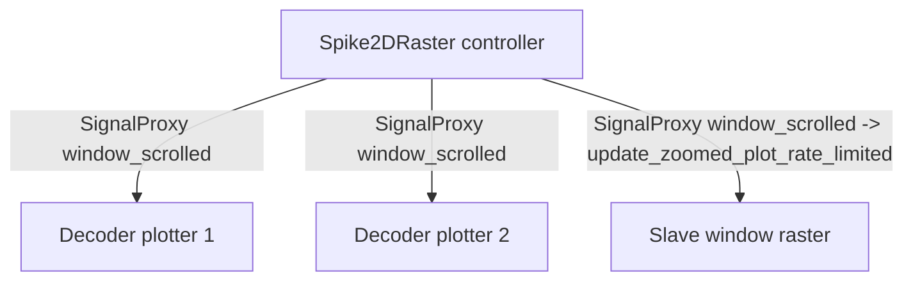

# Time-synchronized raster row for Bapun decoders window

## Context

`[build_combined_time_synchronized_Bapun_decoders_window](h:\TEMP\Spike3DEnv_ExploreUpgrade\Spike3DWorkEnv\pyPhoPlaceCellAnalysis\src\pyphoplacecellanalysis\SpecificResults\PendingNotebookCode.py)` builds:

- One `[Spike2DRaster](h:\TEMP\Spike3DEnv_ExploreUpgrade\Spike3DWorkEnv\pyPhoPlaceCellAnalysis\src\pyphoplacecellanalysis\GUI\PyQtPlot\Widgets\SpikeRasterWidgets\Spike2DRaster.py)` **driver** (`controlling_widget`) from `all_epochs_spikes_df` (concatenated filtered placefield spikes across `included_filter_names`).
- Multiple `[TimeSynchronizedPositionDecoderPlotter](h:\TEMP\Spike3DEnv_ExploreUpgrade\Spike3DWorkEnv\pyPhoPlaceCellAnalysis\src\pyphoplacecellanalysis\Pho2D\PyQtPlots\TimeSynchronizedPlotters\TimeSynchronizedPositionDecoderPlotter.py)` widgets, merged in nested `_subfn_merge_plotters` via `[add_display_dock](h:\TEMP\Spike3DEnv_ExploreUpgrade\Spike3DWorkEnv\pyPhoPlaceCellAnalysis\src\pyphoplacecellanalysis\GUI\PyQtPlot\DockingWidgets\DynamicDockDisplayAreaContent.py)` with `dockAddLocationOpts=['right']`.
- The controller is added **last** with `['bottom']`, and `[connect_drivable_to_driver](h:\TEMP\Spike3DEnv_ExploreUpgrade\Spike3DWorkEnv\pyPhoCoreHelpers\src\pyphocorehelpers\gui\Qt\GlobalConnectionManager.py)` wires `driver.window_scrolled` → decoder `on_window_changed_rate_limited` using `pg.SignalProxy` (same delay/rateLimit as today).

Decoder posteriors track the active window because they consume `(start_t, end_t)` from that signal. A spike raster that should match **must** update the same way the in-widget scroll region does: `[update_zoomed_plot](h:\TEMP\Spike3DEnv_ExploreUpgrade\Spike3DWorkEnv\pyPhoPlaceCellAnalysis\src\pyphoplacecellanalysis\GUI\PyQtPlot\Widgets\SpikeRasterWidgets\Spike2DRaster.py)` (updates `main_plot_widget` x-range and `spikes_window.update_window_start_end`). The existing rate-limited slot `[update_zoomed_plot_rate_limited](h:\TEMP\Spike3DEnv_ExploreUpgrade\Spike3DWorkEnv\pyPhoPlaceCellAnalysis\src\pyphoplacecellanalysis\GUI\PyQtPlot\Widgets\SpikeRasterWidgets\Spike2DRaster.py)` is the right target for `SignalProxy`, **not** the default drivable hook (`update_window_start_end` only on `spikes_window`), which does not refresh the 2D scatter.

## Implementation (all in `PendingNotebookCode.py` unless noted)

1. **Extend nested `_subfn_merge_plotters`** (starts ~4298) with an optional `window_sync_raster_widget: Optional[Spike2DRaster] = None` parameter.
  - After the loop that docks each decoder dock to the right, **before** docking `a_controlling_widget`:
    - If `window_sync_raster_widget` is not `None`, call `add_display_dock` for identifier e.g. `decoding_window_spikes` with `dockAddLocationOpts=['bottom']`, `widget=window_sync_raster_widget`, and a `dockSize` height tuned for a single raster strip (e.g. ~120–160 px; width can scale with number of decoder docks or reuse `final_desired_width`).
  - Keep the existing controller dock as the **next** `['bottom']` dock so the large control raster stays at the bottom of the stack.
2. **Construct the slave raster** after `controlling_widget` exists and `all_epochs_spikes_df` is built (same path as today, ~4516–4545), only when `controlling_widget is not None`:
  - Use the same `fixed_window_duration` and initial window as the driver (`controlling_widget.spikes_window.active_time_window` or the same `update_scroll_window_region` pair used for the driver).
  - Build with **internal** (non-docked-track) UI so the dock is one compact strip: pass a `[VisualizationParameters](h:\TEMP\Spike3DEnv_ExploreUpgrade\Spike3DWorkEnv\pyPhoCoreHelpers\src\pyphocorehelpers\DataStructure\general_parameter_containers.py)` instance and set `use_docked_pyqtgraph_plots` to **False** **before** `Spike2DRaster` runs `_buildGraphics` (same pattern as `init_from_independent_data` but with custom params + `[SpikesDataframeWindow](h:\TEMP\Spike3DEnv_ExploreUpgrade\Spike3DWorkEnv\pyPhoPlaceCellAnalysis\src\pyphoplacecellanalysis\General\Model\SpikesDataframeWindow.py)`, `should_show=False`).
  - After construction, **hide** `slave.plots.background_static_scroll_window_plot` (and its `LinearRegionItem`) so the row is window-only spikes, aligned with the decoders, without a second draggable overview.
3. **Wire synchronization** inside `_subfn_merge_plotters` after `try_register_any_control_widgets` and `register_driver`, alongside the existing decoder loop:
  - If `window_sync_raster_widget is not None` and `a_controlling_widget is not None`, call `connect_drivable_to_driver` with `custom_connect_function` that uses the **same** `pg.SignalProxy(driver.window_scrolled, delay=0.2, rateLimit=60, slot=drivable.update_zoomed_plot_rate_limited)` pattern as the decoder connections.
  - Store the connection under `_display_sync_connections['decoding_window_spikes']` (or similar) for parity with other plotters.
4. **Initial paint**: After connections, call once `window_sync_raster_widget.update_zoomed_plot(*driver_active_window)` so the row matches the first frame before the user scrolls.
5. **Optional API flag**: Add `show_decoding_window_raster: bool = True` to `build_combined_time_synchronized_Bapun_decoders_window` so callers can disable the row without removing the helper logic.
6. **Expose on container**: Set `_out_container.ui.window_sync_raster` (and optionally mirror into `plots_data`) for notebook/debug access.

## Edge cases

- `**controlling_widget is None`**: Do not create or dock the slave; no connection (same as today when there is no time driver).
- **External controller** (`is_controlling_widget_external=True`): Same wiring; slave still follows the provided driver’s `window_scrolled`.
- **Default drivable registration**: `Spike2DRaster` is a known drivable (`on_window_changed` exists). The **custom** connection avoids the default `connect_additional_controlled_plotter` path, which is insufficient for 2D scatter refresh.

## Files touched

- Primary: `[PendingNotebookCode.py](h:\TEMP\Spike3DEnv_ExploreUpgrade\Spike3DWorkEnv\pyPhoPlaceCellAnalysis\src\pyphoplacecellanalysis\SpecificResults\PendingNotebookCode.py)` — nested merge function + slave construction + sync hook + container field.
- No changes required to core `Spike2DRaster` or decoder classes if the above wiring is used as specified.

## Verification

- Run the existing notebook path that calls `build_combined_time_synchronized_Bapun_decoders_window`, scroll the main raster, and confirm: decoder posteriors, new spike row x-extent, and spike content all advance together for the same `[start_t, end_t]`.

