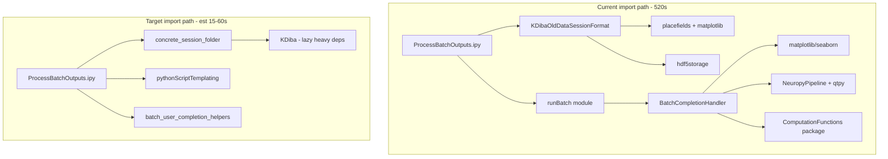

# Batch script generator import optimization

## Problem (measured on Great Lakes)

| Checkpoint | Time | Issue |
|---|---|---|
| `session_formats:Base+Bapun+KDiba` | 108s | KDiba pulls `placefields` (matplotlib/scipy) + `hdf5storage` at import; Bapun unused |
| `Loading+runBatch+NeuropyPipeline` | 412s | Script imports full [`runBatch.py`](h:/TEMP/Spike3DEnv_ExploreUpgrade/Spike3DWorkEnv/pyPhoPlaceCellAnalysis/src/pyphoplacecellanalysis/General/Batch/runBatch.py) but only needs `ConcreteSessionFolder` |
| All runtime work | &lt;2s | Not worth optimizing |



## Strategy (minimal new code, no behavior change)

Three surgical changes—no new abstractions beyond one extracted module, no changes to generated run/SLURM scripts.

---

### 1. Extract `ConcreteSessionFolder` to a lightweight module

**New file:** [`pyPhoPlaceCellAnalysis/src/pyphoplacecellanalysis/General/Batch/concrete_session_folder.py`](h:/TEMP/Spike3DEnv_ExploreUpgrade/Spike3DWorkEnv/pyPhoPlaceCellAnalysis/src/pyphoplacecellanalysis/General/Batch/concrete_session_folder.py)

Move from [`runBatch.py`](h:/TEMP/Spike3DEnv_ExploreUpgrade/Spike3DWorkEnv/pyPhoPlaceCellAnalysis/src/pyphoplacecellanalysis/General/Batch/runBatch.py) (lines ~105–337):
- `BackupMethods` enum
- `ConcreteSessionFolder` class (all methods including `build_concrete_session_folders`)

**Dependencies only:**
- `IdentifyingContext`, `DataSessionFormatRegistryHolder`, `KDibaOldDataSessionFormatRegisteredClass`
- `pyphocorehelpers` path helpers (`copy_movedict`, `build_cross_root_copydict`, `convert_filelist_to_new_parent`)
- attrs/neuropy serialization mixins already used by the class

**No imports of:** `BatchCompletionHandler`, `NonInteractiveProcessing`, `AcrossSessionResults`, `NeuropyPipeline`, `Loading`.

**Update [`runBatch.py`](h:/TEMP/Spike3DEnv_ExploreUpgrade/Spike3DWorkEnv/pyPhoPlaceCellAnalysis/src/pyphoplacecellanalysis/General/Batch/runBatch.py):**
```python
from pyphoplacecellanalysis.General.Batch.concrete_session_folder import ConcreteSessionFolder, BackupMethods
```
Delete the moved class/enum definitions. All existing `from runBatch import ConcreteSessionFolder` call sites keep working unchanged.

---

### 2. Trim heavy/dead imports in `KDibaOldDataSessionFormat`

**File:** [`NeuroPy/neuropy/core/session/Formats/Specific/KDibaOldDataSessionFormat.py`](h:/TEMP/Spike3DEnv_ExploreUpgrade/Spike3DWorkEnv/NeuroPy/neuropy/core/session/Formats/Specific/KDibaOldDataSessionFormat.py)

Remove unused top-level imports (verified by grep—only comments reference them):
- `PlacefieldComputationParameters` from `neuropy.analyses.placefields` (**pulls matplotlib + scipy**)
- `estimate_session_laps`, `get_non_overlapping_epochs`, `drop_overlapping`
- top-level `from neuropy.utils.load_exported import import_mat_file` (already re-imported lazily inside load methods at lines 884, 953, etc.)

Move to lazy import inside the one method that uses it:
- `build_lap_computation_epochs` → local import at start of `build_lap_only_short_long_bin_aligned_computation_configs` (~line 322)

Session loading behavior unchanged; only import timing changes.

---

### 3. Slim [`ProcessBatchOutputs_qclus1246789_Only.ipy`](h:/TEMP/Spike3DEnv_ExploreUpgrade/Spike3DWorkEnv/Spike3D/ProcessBatchOutputs_qclus1246789_Only.ipy) imports

**Remove** (not referenced anywhere in script body):
- `BapunDataSessionFormatRegisteredClass`, `RachelDataSessionFormat`, `HiroDataSessionFormatRegisteredClass`
- `DataSessionFormatRegistryHolder`, `find_local_session_paths`, `Epoch`
- `saveData`, `loadData`, bare `import runBatch`, all `BatchRun`/`run_diba_batch`/handler enums
- `PipelineSavingScheme`, `UserAnnotationsManager`, `SessionBatchProgress`
- `AcrossSessionsResults` and all metadata/copydict helpers
- `inspect`, `Template`, `write_test_script`, `display` (only in comments)
- duplicate `deepcopy` import

**Replace with minimal imports:**
```python
from neuropy.utils.result_context import IdentifyingContext
from neuropy.core.session.Formats.Specific.KDibaOldDataSessionFormat import KDibaOldDataSessionFormatRegisteredClass
from pyphoplacecellanalysis.General.Batch.concrete_session_folder import ConcreteSessionFolder
from pyphoplacecellanalysis.General.Batch.pythonScriptTemplating import (
    ProcessingScriptPhases, BatchScriptsCollection, generate_batch_single_session_scripts,
    build_windows_powershell_run_script,
)
from pyphocorehelpers.programming_helpers import copy_to_clipboard
# + batch_user_completion_helpers imports (unchanged)
```

**Keep** `[TIMING]` checkpoints (per your preference), but update labels to match the new import blocks:
- `session_formats:KDiba`
- `concrete_session_folder`
- `pythonScriptTemplating`
- `batch_user_completion_helpers`

**Optional 3-line env guard** at top of script (before heavy imports, harmless if unused):
```python
os.environ.setdefault('MPLBACKEND', 'Agg')
os.environ.setdefault('MPLCONFIGDIR', f'/tmp/mpl-cache-{os.getuid()}')
os.environ.setdefault('QT_QPA_PLATFORM', 'offscreen')
```

---

## What we are NOT changing

- Generated `.py` / `.sh` / `.ipynb` content or SLURM job behavior
- `should_generate_run_notebooks`, `should_create_vscode_workspace` defaults (runtime is already &lt;1s)
- `batch_user_completion_helpers` logic (already fast at 0.25s; uses lazy imports inside functions)
- Broad lazy-import refactors across `NeuropyPipeline`, `Computation.py`, or `runBatch` heavy paths (out of scope; extraction solves the generator case)

---

## Expected outcome

| Checkpoint | Before | After (cold start, estimate) |
|---|---|---|
| KDiba import | ~108s | ~10–30s (no placefields/matplotlib chain) |
| runBatch stack | ~412s | **0s** (not imported) |
| Runtime phases | ~2s | ~2s |
| **Total** | **~523s** | **~15–45s** |

Second run in same IPython process should remain ~2s (module cache).

---

## Verification

On Great Lakes, re-run:
```bash
ipython ProcessBatchOutputs_qclus1246789_Only.ipy
```

Confirm:
1. `[TIMING SUMMARY]` total drops from ~520s to &lt;60s on cold start
2. `scripts_output_path` and all 12 `sbatch` lines still print correctly
3. Spot-check one generated `run_*.py` still contains embedded completion functions and correct `job_suffix`
4. Existing code still works: `from pyphoplacecellanalysis.General.Batch.runBatch import ConcreteSessionFolder` (re-export path)

Quick regression import test (optional):
```python
from pyphoplacecellanalysis.General.Batch.concrete_session_folder import ConcreteSessionFolder
from pyphoplacecellanalysis.General.Batch.runBatch import ConcreteSessionFolder as CSF2
assert ConcreteSessionFolder is CSF2
```
