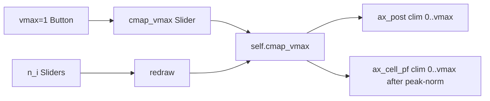

# Adjustable cmap norm slider for Bayesian debugger

## Target

[`PendingNotebookCode.py`](h:\TEMP\Spike3DEnv_ExploreUpgrade\Spike3DWorkEnv\pyPhoPlaceCellAnalysis\src\pyphoplacecellanalysis\SpecificResults\PendingNotebookCode.py) — `InteractiveBayesian2DEquationDebugger` (`_imshow_map`, `buildUI`, `redraw`, export control-axis listing).

## Behavior (chosen)

One shared slider `cmap_vmax` in **[0.01, 1.0]**, default **1.0**:

| Panel | Color limits |
|-------|----------------|
| Posterior `P(x\|n)` | `vmin=0`, `vmax=cmap_vmax` (absolute; posterior already ∈ [0,1]) |
| Placefields | Peak-normalize each PF (`f / peak_Hz`), then `vmin=0`, `vmax=cmap_vmax` |

At **1.0**: normal full-range display. Lowering vmax (e.g. 0.05) saturates hot bins and reveals low-magnitude structure. Other panels (power, exp, joint L, per-cell L, conflict K) stay auto-scaled as today.

Reset: action-stack button **`vmax=1`** sets the slider back to 1.0.



## Implementation

### 1. State fields

Near existing UI fields (~1600):

- `cmap_vmax: float = 1.0`
- `cmap_vmax_slider: Any = None`
- `cmap_vmax_slider_ax: Any = None`

### 2. Apply clim in `redraw` / `_imshow_map`

In `redraw`, only for posterior + PF:

```python
vmax = float(self.cmap_vmax)
self._imshow_map(self.ax_post, parts['posterior'], ..., vmin=0.0, vmax=vmax)
# PF: pass peak-normalized map, same vmin/vmax
self._imshow_map(ax, self.tuning_curves[i] / max(self.peak_rates[i], 1e-12), ..., cmap=cmap, vmin=0.0, vmax=vmax)
```

Store returned `AxesImage`s in `self.ims` (`'post'`, `'pf_{i}'`) so the clim slider can update without a full recompute when only vmax changes.

Optional title hint when `vmax < 1`: append `clim=[0, {vmax:.3g}]` on posterior (and optionally PF) so the active scale is visible.

### 3. UI in `buildUI`

- Grow the controls band by one `slider_pitch` so mosaic bottom clears the new row:
  - `controls_band_h = (n_cells + 1) * slider_pitch + controls_top_pad`
  - Keep n-sliders stacked as today; place the cmap slider on the **bottom** row of that stack (`y = controls_bottom`), same x/width as n-sliders (`[0.17, y, 0.55, slider_h]`).
- `Slider(..., 'cmap vmax', 0.01, 1.0, valinit=1.0, valfmt='%0.2f')` → `on_changed(self.on_cmap_vmax)`.
- Add `('vmax=1', lambda _e: self.reset_cmap_vmax())` to `action_specs` (below Export PNG / n=0).

### 4. Callbacks

- `on_cmap_vmax`: set `self.cmap_vmax`; if `self.ims` has post/pf images, `set_clim(0, vmax)` + `draw_idle`; else `redraw()`.
- `reset_cmap_vmax`: `self.cmap_vmax_slider.set_val(1.0)` (triggers `on_cmap_vmax`).

### 5. Export hide list

In `_get_export_control_axes`, also append `self.cmap_vmax_slider_ax` when present. Wire slider into `fig._bayes_eqn_ui` for debugging convenience.

## Out of scope

- Clim control for power / exp / L / conflict panels
- Separate per-panel vmax sliders
- Notebook edits

## Verification

1. Open viewer → posterior/PF look like today’s full-range at vmax=1.
2. Drag **cmap vmax** down → low bins become visible; power/exp/L unchanged.
3. Click **vmax=1** → returns to [0, 1].
4. Change n-sliders → redraw keeps the current vmax.
5. Export PNG → cmap slider + reset button hidden when `export_include_controls=False`.
