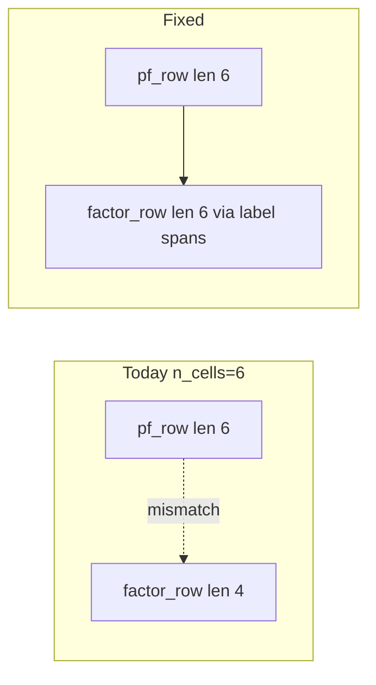

# Support up to 10 cells in Bayesian 2D debugger

## Problem

In [`buildUI`](h:\TEMP\Spike3DEnv_ExploreUpgrade\Spike3DWorkEnv\pyPhoPlaceCellAnalysis\src\pyphoplacecellanalysis\SpecificResults\PendingNotebookCode.py) (~1944–1990), cell rows are sized to `n_grid_cols = max(n_factor_cols, n_cells)`, but `factor_row` is always length **4** (Bayesian) or **5** (DST). `subplot_mosaic` requires every mosaic row to have the same length, so layouts with `n_cells > n_factor_cols` fail.



## Approach

Keep the existing single `subplot_mosaic`. When `n_grid_cols > len(factor_labels)`, **repeat each bottom-panel label** so the row length equals `n_grid_cols`. Matplotlib merges repeated labels into one spanning axes — bottom panels become wider than a single cell column (as requested; they need not match cell widths 1:1).

Even column distribution example (`n_cells=10`, Bayesian):

- `decoded_posterior` ×3, `term0` ×3, `term1` ×2, `joint_likelihood` ×2

When `n_cells < n_factor_cols`, keep today’s behavior: pad cell rows with `"."` and leave factor labels unexpanded.

## Changes (all in `PendingNotebookCode.py`)

### 1. Helper on the class

Add a small `@classmethod` next to the other layout helpers:

```python
@classmethod
def _expand_mosaic_row(cls, labels: List[str], n_cols: int) -> List[str]:
    """Pad/repeat labels so row length == n_cols (subplot_mosaic spanning)."""
```

- If `len(labels) == n_cols`: return as-is
- If `len(labels) < n_cols`: distribute spans via `divmod` (earlier panels get +1 when remainder)
- Assert `len(labels) <= n_cols` (caller sets `n_grid_cols = max(...)`)

### 2. Cap + layout in `buildUI`

- Assert `1 <= n_cells <= 10` early in `buildUI` (and optionally in `setup` after resolving ids) with a clear error.
- After building `factor_row` labels, set:
  - `factor_row = self._expand_mosaic_row(factor_row, n_grid_cols)`
- Deduplicate the DST branch that rebuilds `pf_row`/`E_row`/`L_row` identically — one path builds cell rows + pad, then DST only adds `E_row` / `conflict_K`.
- Soften figure width for many columns so 10 cells is usable, e.g. `fig_w = min(3.2, 28.0 / n_grid_cols) * n_grid_cols` (keeps ~3.2" per column for ≤8, caps total ~28" at 10).

Cell axis keys stay `cell_{chr(97+i)}_*` (`a`–`j` for 10 cells); no rename needed.

### 3. Docs only

Update the class docstring layout note to mention support for up to 10 cells and that the bottom factor row spans the cell grid.

## Out of scope

- Nested GridSpecs / fully independent bottom-row column widths
- Changing computation/`redraw` (already loops over `n_cells`)
- Notebook edits

## Verification

Manually construct the viewer with `neuron_ids` of length 2, 4, 5 (DST), and 10; confirm mosaic builds, sliders match cells, and bottom panels still update on slider change.