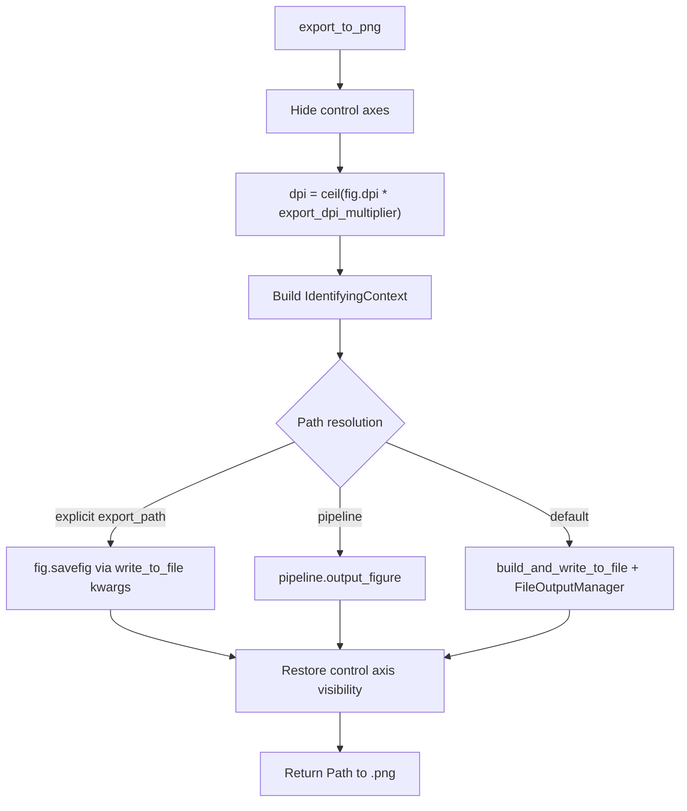

# PNG export for InteractiveBayesian2DEquationDebugger

## Target

[`PendingNotebookCode.py`](h:\TEMP\Spike3DEnv_ExploreUpgrade\Spike3DWorkEnv\pyPhoPlaceCellAnalysis\src\pyphoplacecellanalysis\SpecificResults\PendingNotebookCode.py) lines **1529–2255**: `InteractiveBayesian2DEquationDebugger` + `build_interactive_bayesian_2d_eqn_viewer`.

## Spike3D export conventions to reuse

Match patterns already used in batch/display code:

| Setting | Typical value | Source |
|---------|---------------|--------|
| `write_png` | `True` | `AcrossSessionResults`, batch figures |
| `write_vector_format` | `False` | same |
| `bbox_inches` | `'tight'` | `AcrossSessionResults.save_figure_kwargs` |
| `pad_inches` | `0` | same |
| `dpi` | `ceil(fig.dpi * 2.0)` | `export_dpi_multiplier=2.0` in display functions |
| rcParams | `savefig.transparent=True`, `ps.fonttype=42`, `pdf.fonttype=42` | PendingNotebookCode / PhoDiba plots |

**Path resolution priority** (when exporting):

1. Explicit `export_path: Path` argument
2. `curr_active_pipeline.output_figure(...)` when pipeline passed
3. Fallback: `build_and_write_to_file(...)` → daily programmatic output folder via `FileOutputManager`

**Filename context**: build an `IdentifyingContext` from mode (`DST`/`Bayesian`), `aclu_list`, current `n`, and `reliability_modifier_mode`; sanitize with existing `sanitize_filename_for_Windows`.

## Implementation

### 1. Add optional export config fields on the class

On `InteractiveBayesian2DEquationDebugger` (near existing UI fields ~1598):

- `curr_active_pipeline: Optional[Any] = None`
- `export_output_parent_path: Optional[Path] = None` (optional override for `FileOutputManager`)
- `export_dpi_multiplier: float = 2.0`
- `export_include_controls: bool = False` (user chose **plots only** as default)

### 2. Add export helpers (instance methods)

**`_get_export_control_axes(self) -> List[Axes]`** — collect axes to hide during save:
- `self.slider_axes`
- button axes from `self.buttons`
- `self.reliability_mode_radio.ax` / `self.drop_negative_terms_check.ax` if present

**`_build_export_context(self) -> IdentifyingContext`** — e.g.:

```python
IdentifyingContext(
    display='interactive_bayesian_2d_eqn_viewer',
    decoder_mode=('DST' if self.is_dst else 'Bayesian'),
    neuron_ids=tuple(self.aclu_list),
    n=tuple(int(x) for x in self.n),
    reliability_mode=self.reliability_modifier_mode.name,
)
```

**`export_to_png(self, export_path=None, curr_active_pipeline=None, write_vector_format=False, debug_print=True, **kwargs) -> Path`**

Core flow:



- Wrap save in `mpl.rc_context({...transparent/fonttype...})`
- Use `try/finally` to restore axis visibility even on failure
- Print saved path (matches `write_to_file` behavior)
- Store last path on `self.last_export_png_path` for convenience

### 3. UI: Export PNG button in `buildUI`

In the existing quick-set button row (~2091–2102), shift layout slightly and add:

- `ax_btn_export = fig.add_axes([0.60, btn_y, 0.10, btn_h])`
- `b_export = Button(ax_btn_export, 'Export PNG')`
- `b_export.on_clicked(lambda _e: self.export_to_png())`

Update `self.buttons` tuple and `fig._bayes_eqn_ui` to include `export_to_png=self.export_to_png` and `b_export`.

### 4. Extend wrapper + docstring

Update `build_interactive_bayesian_2d_eqn_viewer(...)` to accept and forward:

- `curr_active_pipeline=None`
- `export_output_parent_path=None`
- `export_dpi_multiplier=2.0`

Update class docstring **Usage** block with examples:

```python
# Interactive + one-click export button
fig, sliced_decoder, used_ids = build_interactive_bayesian_2d_eqn_viewer(
    decoder=decoder, neuron_ids=(38, 49), curr_active_pipeline=curr_active_pipeline)
fig._bayes_eqn_ui['export_to_png']()  # or click "Export PNG"

# Programmatic export to explicit path
dbgr = InteractiveBayesian2DEquationDebugger(decoder=decoder, neuron_ids=(38, 49))
dbgr.export_to_png(export_path=Path('out/bayes_2d_debug.png'))
```

### 5. Imports (local to section, minimal)

Add near the existing section imports (~1522) only what is needed:

```python
from pyphoplacecellanalysis.General.Mixins.ExportHelpers import (
    build_and_write_to_file, FileOutputManager, FigureOutputLocation, ContextToPathMode)
```

(`sanitize_filename_for_Windows` is already imported at file top.)

## Out of scope

- PDF/SVG export (can reuse same helper later with `write_vector_format=True`)
- Auto-export on every slider change
- Notebook edits

## Verification

After implementation, manually:

1. Build viewer in notebook with `curr_active_pipeline` → click **Export PNG** → file appears under session programmatic figures folder with descriptive name.
2. Call `export_to_png(export_path=...)` → file written at explicit path, controls not visible in PNG.
3. Confirm interactive window still shows controls after export (visibility restored).
