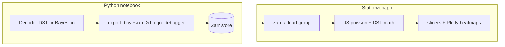

# Bayesian 2D Equation Debugger Webapp

## Defaults (locked)

- **Frontend:** vanilla HTML/JS + Plotly + zarrita (CDN ESM) — no build step, no Python backend for compute
- **On-disk format:** Zarr v2 directory store (matches prior discussion; Spike3D already depends on `zarr>=2.18.2,<3`)
- **Serve:** static HTTP (`python -m http.server` from the webapp folder, or any static host)

## What gets exported (minimal recompute payload)

Mirror what [`InteractiveBayesian2DEquationDebugger.setup`](h:\TEMP\Spike3DEnv_ExploreUpgrade\Spike3DWorkEnv\pyPhoPlaceCellAnalysis\src\pyphoplacecellanalysis\SpecificResults\PendingNotebookCode.py) keeps after `get_by_id`:

| Field | Shape / type | Notes |
|-------|----------------|-------|
| `tuning_curves` | `(n_cells, nx, ny)` float32 | from sliced `ratemap` |
| `neuron_ids` | `(n_cells,)` int32 | ACLUs |
| `xbin`, `ybin` | edges | imshow extent |
| `tau` | scalar attr | `time_bin_size` |
| `seed_n` | `(n_cells,)` int32 | initial slider values |
| `is_dst` | bool attr | |
| `reliability_active`, `reliability_silent` | `(n_cells,)` float32 | DST only |
| UI attrs | `max_spikes_per_cell`, `show_log_likelihood`, `drop_negative_contributing_terms_mode` | |

Do **not** export spikes, full-session posteriors, or `spikes_df`.

Zarr layout (supports multiple named exports in one store):

```text
bayesian_2d_eqn_debugger.zarr/
  .zattrs  {format: "bayesian_2d_eqn_debugger/v1", keys: [...]}
  JS15_maze_cells_27_29_31/
    tuning_curves, neuron_ids, xbin, ybin, seed_n
    [reliability_active, reliability_silent]
    .zattrs {tau, is_dst, neuron_ids, ...}
```

## Architecture



## 1. Python exporter

Add a focused module (keep out of the huge `PendingNotebookCode.py`):

[`pyphoplacecellanalysis/Analysis/Decoder/eqn_debugger_export.py`](h:\TEMP\Spike3DEnv_ExploreUpgrade\Spike3DWorkEnv\pyPhoPlaceCellAnalysis\src\pyphoplacecellanalysis\Analysis\Decoder\eqn_debugger_export.py)

- `export_bayesian_2d_eqn_debugger(decoder, out_path, group_key, neuron_ids=None, ...)`  
  - Resolve `neuron_ids` the same way as the debugger (`None` / int index → disjoint pair; tuple → explicit)
  - `sliced = decoder.get_by_id(..., defer_compute_all=True)`
  - If DST and reliability missing → `_compute_reliability_metrics()`
  - Write/overwrite group under `zarr.open_group(out_path, mode='a')`
  - Chunk `tuning_curves` as `(1, nx, ny)` for per-cell lazy fetch
- Optional thin wrapper method or notebook one-liner documented in the webapp README

Notebook usage (for the open JS15 cell):

```python
from pyphoplacecellanalysis.Analysis.Decoder.eqn_debugger_export import export_bayesian_2d_eqn_debugger
export_bayesian_2d_eqn_debugger(
    a_dst_decoder2D,
    out_path=Path("webapps/bayesian_2d_eqn_debugger/data/bayesian_2d_eqn_debugger.zarr"),
    group_key="JS15_cells_27_29_31",
    neuron_ids=(27, 29, 31),
)
```

(Ask before editing the `.ipynb`; provide the cell as copy-paste unless you explicitly want it inserted.)

## 2. JS math port (parity with Python)

Port these classmethods from `PendingNotebookCode.py` into `js/math.js`:

- `_poisson_factor_maps` (incl. `drop_negative_contributing_terms_mode` and `1e-12` floor)
- `_dst_Ei_maps`
- `_compute_conflict_map` via the same `iterative_intersection` logic as [`BayesianPlacemapPositionDecoderDST.iterative_intersection`](h:\TEMP\Spike3DEnv_ExploreUpgrade\Spike3DWorkEnv\pyPhoPlaceCellAnalysis\src\pyphoplacecellanalysis\Analysis\Decoder\reconstruction_dst.py) (lines 393–404) — **not** the commented `1−Π E_i`
- `_orient_2d_for_imshow` = `fliplr(rot90(M, k=-1))` for display orientation parity

Factorial: small integer lookup / loop (`n ≤ max_spikes_per_cell`, default 15).

## 3. Static webapp UI

Create under Spike3D:

```text
Spike3D/webapps/bayesian_2d_eqn_debugger/
  index.html
  css/style.css
  js/math.js
  js/zarr_loader.js
  js/app.js
  data/                 # gitignore large zarr; keep .gitkeep + README
  README.md
```

UI parity with matplotlib debugger:

- Per-cell placefield heatmaps
- Per-cell `L_i` heatmaps
- DST: per-cell `E_i` + conflict map
- Factor row: posterior, power, exp, joint L (optional log10)
- Per-cell spike-count range inputs / sliders (`0…max_spikes_per_cell`)
- Buttons: `n=0`, `n=1`, `n≈E` (`round(τ · peak_rate)`)
- Group selector if store has multiple keys (from root `.zattrs.keys`)

Plotly `Heatmap` with `xbin`/`ybin` extent; redraw on slider change (data is tiny: ~3×30×28).

## 4. Load path

1. User exports Zarr into `webapps/.../data/`
2. `cd webapps/bayesian_2d_eqn_debugger && python -m http.server 8000`
3. Open `http://localhost:8000/`
4. App lists Zarr groups → loads selected group → initializes `n` from `seed_n` → first redraw

## Out of scope

- Full-session spike scrubbing / epoch seeding UI (seed is fixed at export time via `seed_n`)
- Replacing the matplotlib notebook debugger
- Editing the open `.ipynb` unless you request it
- Zarr v3 / npm build pipeline
