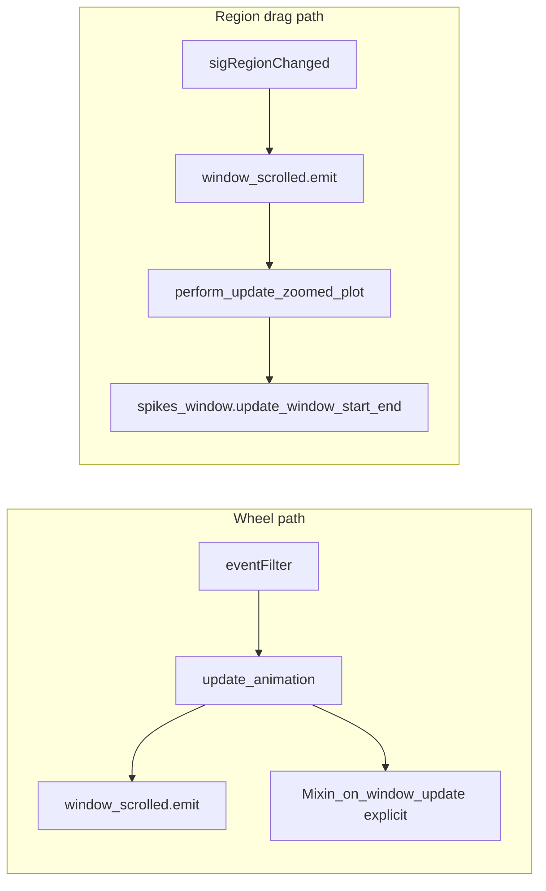

# Bottom / left bar sync from TimeWindow

## Problem (recap)

[`Spike3DRasterWindowWidget.update_animation`](h:\TEMP\Spike3DEnv_ExploreUpgrade\Spike3DWorkEnv\pyPhoPlaceCellAnalysis\src\pyphoplacecellanalysis\GUI\Qt\SpikeRasterWindows\Spike3DRasterWindowWidget.py) **manually** calls `SpikeRasterBottomFrameControlsMixin_on_window_update` and `SpikeRasterLeftSidebarControlsMixin_on_window_update` after emitting `window_scrolled`. **Linear region drag** only goes through `window_scrolled` → `Spike2DRaster.perform_update_zoomed_plot` → `spikes_window.update_window_start_end`, which updates the model but **never** hits those mixin calls, so the UI drifts.

## Approach

Use **`self.spike_raster_plt_2d.spikes_window.timeWindow.window_changed_signal`** (from [`TimeWindow`](h:\TEMP\Spike3DEnv_ExploreUpgrade\Spike3DWorkEnv\pyPhoPlaceCellAnalysis\src\pyphoplacecellanalysis\General\Model\TimeWindow.py)) as the single trigger for refreshing chrome. It already fires whenever [`LiveWindowedData.update_window_start` / `update_window_start_end`](h:\TEMP\Spike3DEnv_ExploreUpgrade\Spike3DWorkEnv\pyPhoPlaceCellAnalysis\src\pyphoplacecellanalysis\General\Model\LiveWindowedData.py) run, which covers region drag, programmatic jumps, and wheel-driven updates (after `window_scrolled` runs `perform_update_zoomed_plot`).

## Implementation steps

1. **Add a small slot on `Spike3DRasterWindowWidget`** (same file as above), e.g. `_on_drive_spikes_window_time_changed(self, start_t: float, end_t: float)`, decorated with `@pyqtExceptionPrintingSlot(float, float)`. It should call:
   - `self.SpikeRasterBottomFrameControlsMixin_on_window_update(start_t, end_t)`
   - `self.SpikeRasterLeftSidebarControlsMixin_on_window_update(start_t, end_t)`  
   This mirrors what `update_animation` does today so the **left** bar’s window-duration spinbox stays correct when the overview region width changes (handles), not just the bottom doubles.

2. **Connect the signal once the 2D plotter exists**—in the existing block in `initUI` / bottom-bar wiring where `spike_raster_plt_2d` is non-`None` ([~lines 360–407](h:\TEMP\Spike3DEnv_ExploreUpgrade\Spike3DWorkEnv\pyPhoPlaceCellAnalysis\src\pyphoplacecellanalysis\GUI\Qt\SpikeRasterWindows\Spike3DRasterWindowWidget.py)):
   - `conn = self.spike_raster_plt_2d.spikes_window.timeWindow.window_changed_signal.connect(self._on_drive_spikes_window_time_changed)`
   - Append `conn` to `self.ui.bottom_bar_connections` (or `self.ui.additional_connections` with a clear key) for discoverability; optional: disconnect in teardown if you extend `GlobalConnectionManagerAccessingMixin_on_destroy` later.

3. **Remove redundant mixin calls from `update_animation`** (same file, ~594–595): after the new connection, `window_scrolled.emit` will synchronously refresh `spikes_window`, which emits `window_changed_signal`, which runs the new slot—so the explicit `SpikeRaster*Mixin_on_window_update` pair becomes duplicate work and can be deleted. **Keep** `update_scroll_window_region` and `window_scrolled.emit` as they are (still needed for 3D/synced plotters and zoomed-view updates).

4. **Leave one-shot init untouched**: `_run_delayed_gui_load_code` → `init_left_and_bottom_bar_times_from_active_window()` should remain so initial values are synced even before the first programmatic window change during the session.

## Risk / sanity checks

- **Order**: Qt direct connections run synchronously; after `window_scrolled.emit(...)`, downstream `perform_update_zoomed_plot` runs before `update_animation` returns, so removing the trailing mixin calls is safe.
- **`self.blockSignals(True)` in [`SpikeRasterBottomFrameControlsMixin_on_window_update`](h:\TEMP\Spike3DEnv_ExploreUpgrade\Spike3DWorkEnv\pyPhoPlaceCellAnalysis\src\pyphoplacecellanalysis\GUI\Qt\PlaybackControls\Spike3DRasterBottomPlaybackControlBarWidget.py)**: Pre-existing oddity (blocks the root widget); no change needed for this task—the spinboxes are still updated via `bottom_playback_control_bar_widget.on_window_changed`.
- **Noise**: Removing the duplicate mixin calls drops one extra repaint per wheel step; connects may still fire twice in some jumps (duration set then `update_window_start_end`); harmless.

## Verification (manual)

- Drag overview **region body** with LMB: bottom start/end doubles track region edges.
- Drag **handles**: bottom + left duration spin match new width.
- Mouse wheel scroll over raster: unchanged behavior visually; doubles still correct.
- Edit duration in left sidebar / jump from bottom bar: controls stay consistent.

