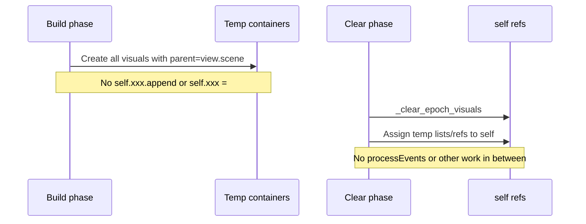

# Build-then-clear refactor for update_epoch_display

## Goal

Reduce the chance of drawing in a half-cleared state (and thus MeshVisual/access-violation crashes) by:

1. Building all new visuals into temporary containers (no mutation of `self`'s visual lists during build).
2. In one go: clear old visuals (detach + clear lists), then assign the new containers to `self`.
3. Avoiding any other work or event processing between clear and attach.

## Current flow (problem)

- [PredictiveDecodingComputations.py](h:\TEMP\Spike3DEnv_ExploreUpgrade\Spike3DWorkEnv\pyPhoPlaceCellAnalysis\src\pyphoplacecellanalysis\General\Pipeline\Stages\ComputationFunctions\MultiContextComputationFunctions\PredictiveDecodingComputations.py) line 7654: `_clear_epoch_visuals()` runs at the **start** of `update_epoch_display`.
- Then ~600 lines run that create visuals and assign/append to `self.*`. During that window, a re-entrant paint (e.g. from the debugger’s `processEvents()`) can draw the scene while it is half-updated, leading to invalid GL state and crashes.

## Target flow

- **Build phase**: Compute all data (epoch_data, posterior_2d, time_bin_colors, all_time_distances, etc.) and create every new visual into **local/temp** lists and variables. When creating each visual, keep using `parent=view.scene` so it is added to the scene immediately (scene will temporarily contain old + new; that is acceptable).
- **Clear + attach phase**: A single, tight block that (1) calls `_clear_epoch_visuals()`, (2) if time_bin_views were rebuilt, detach old views from grid and assign `self.time_bin_views`, (3) assign all temp lists and single-refs to the corresponding `self` attributes. Do not call `QApplication.processEvents()`, `canvas.update()`, or any other work between the start of clear and the last assign.

## Implementation steps

### 1. Extend _clear_epoch_visuals to cover all epoch-driven visuals

In [PredictiveDecodingComputations.py](h:\TEMP\Spike3DEnv_ExploreUpgrade\Spike3DWorkEnv\pyPhoPlaceCellAnalysis\src\pyphoplacecellanalysis\General\Pipeline\Stages\ComputationFunctions\MultiContextComputationFunctions\PredictiveDecodingComputations.py) around 7167–7178, add to the cleared lists so that the same method also:

- Detaches and clears `full_position_background_line`.
- Detaches and clears `trajectory_arrows`.
- Detaches and sets to `None`: `current_position_line`.

This keeps a single place that “clears everything” so the clear+attach block is consistent.

### 2. Remove the initial _clear_epoch_visuals() call

In `update_epoch_display` (line 7654), remove the call to `self._clear_epoch_visuals()` at the start. The only call will be in the new clear+attach block after all builds.

### 3. Introduce temp containers and build into them

For every visual list and single-ref that is currently written to during `update_epoch_display`, introduce a temp list or variable and build into that instead of `self`:

- **Lists**: e.g. `new_colorbar_rects`, `new_colorbar_texts`, `new_past_lines`, `new_future_lines`, `new_full_position_background_line`, `new_centroid_dots`, `new_centroid_arrows`, `new_past_mask_contours`, `new_posterior_mask_contours`, `new_future_mask_contours`, `new_timeline_ticks`, `new_time_bin_images`, `new_time_bin_labels`. For trajectory debug arrows and render data, use e.g. `new_trajectory_debug_arrows_past`, `new_trajectory_debug_arrows_future`, `new_render_data_dict_list_past`, `new_render_data_dict_list_future`.
- **Single refs**: `new_posterior_img`, `new_epoch_info_text`, `new_timeline_bar`, `new_timeline_epoch_rect`, `new_timeline_epoch_triangle`, `new_current_position_line`.
- **Time bin views**: When `len(self.time_bin_views) != n_bins_to_show`, build `new_time_bin_views` (add views via `self.time_bin_grid.add_view(...)`) and use that list for the rest of the build; when the count is unchanged, keep using `self.time_bin_views` for the build and do **not** replace `self.time_bin_views` in the attach phase.

Concretely:

- Replace every `self.colorbar_rects.append(rect)` with `new_colorbar_rects.append(rect)` (and create `new_colorbar_rects = []` once before the colorbar block). Same pattern for all other list appends that currently go to `self.*`.
- Replace `self.posterior_img = vz.Image(...)` with `new_posterior_img = vz.Image(...)` (and at the end of the clear+attach block do `self.posterior_img = new_posterior_img`). Same for other single refs.
- For `_render_trajectory_side`, call it with `lines_list=new_past_lines` (and empty `new_trajectory_debug_arrows_past`, `new_render_data_dict_list_past`), and with `lines_list=new_future_lines` for the future side. It returns `(lines_list, trajectory_debug_arrows, render_data_dict_list)`; assign those returns to the corresponding new_* variables and do **not** assign to `self` until the attach phase.
- For the current-position line block (7997–8037): always create a new line (or leave `new_current_position_line = None` when there is no data) instead of reusing `self.current_position_line` with `set_data`. Build into `new_current_position_line` and into `new_trajectory_arrows` (new list) where the code currently appends to `self.trajectory_arrows` (and clear that list in branches); in the attach phase set `self.current_position_line = new_current_position_line` and `self.trajectory_arrows = new_trajectory_arrows`.
- For time bins: if view count changes, build `new_time_bin_views` and use it for the loop that creates `new_time_bin_images` and `new_time_bin_labels`; otherwise use `self.time_bin_views` for that loop and do not create `new_time_bin_views` (so in attach we only assign `self.time_bin_images = new_time_bin_images`, `self.time_bin_labels = new_time_bin_labels`).

Ensure no `self.*` visual list or single-ref is written to during the build phase (only temp vars and, where needed, `self.time_bin_views` read and possibly `self.time_bin_grid.add_view` for new views).

### 4. Add the single clear+attach block

After all build logic (and before `self.canvas.title = ...`, table update, `self.canvas.update()`, and `self.epoch_slider.blockSignals(False)`), add one block that:

1. Calls `self._clear_epoch_visuals()`.
2. If `new_time_bin_views` was created (view count changed): for each view in `self.time_bin_views` set `view.parent = None`, then `self.time_bin_views.clear()`, then `self.time_bin_views = new_time_bin_views`.
3. Assigns every temp list and single-ref to the corresponding `self` attribute (e.g. `self.colorbar_rects = new_colorbar_rects`, `self.posterior_img = new_posterior_img`, `self.past_lines = new_past_lines`, `self.trajectory_debug_arrows['past'] = new_trajectory_debug_arrows_past`, `self.render_data_dict_list_dict['past'] = new_render_data_dict_list_past`, and so on for all of the above).

Keep this block as small as possible: no conditionals except for the time_bin_views branch, no loops except the detach of old time_bin_views, and no `processEvents()` or `canvas.update()` between the start of step 1 and the end of step 3.

### 5. Leave trailing logic unchanged

Keep after the clear+attach block: title update, optional table update via `QTimer.singleShot(0, ...)`, `self.canvas.update()`, and `self.epoch_slider.blockSignals(False)`. Do not add any event processing between clear and the final assign in step 4.

## Files to change

- [PredictiveDecodingComputations.py](h:\TEMP\Spike3DEnv_ExploreUpgrade\Spike3DWorkEnv\pyPhoPlaceCellAnalysis\src\pyphoplacecellanalysis\General\Pipeline\Stages\ComputationFunctions\MultiContextComputationFunctions\PredictiveDecodingComputations.py): `_clear_epoch_visuals` (extend), `update_epoch_display` (remove initial clear, introduce temp vars, build into temps, add clear+attach block).

## Notes

- Building with `parent=view.scene` (current behavior) is kept so we don’t need to verify VisPy’s behavior with `parent=None` and later reparenting. The scene briefly holds both old and new visuals during build; only the clear+attach step removes the old ones and updates `self`, minimizing the half-cleared window.
- `_render_trajectory_side` does not need a new parameter; it already accepts `lines_list` (and optional arrows/render lists) and returns the filled lists. Call it with new_* lists and use the returned values in the attach phase.
- The existing table update and `canvas.update()` stay after the clear+attach block so they don’t run between clear and attach.
