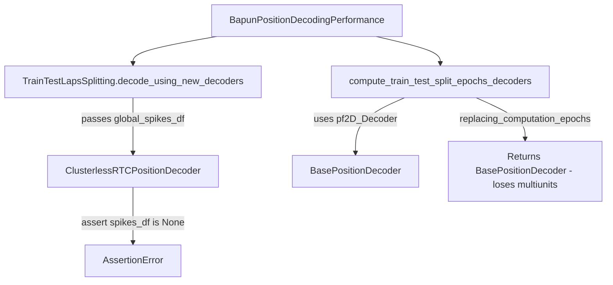

# Clusterless train/test performance (library)

## Problem

[`BapunPositionDecodingPerformance.compute_bapun_train_test_decoder_error_distance`](h:\TEMP\Spike3DEnv_ExploreUpgrade\Spike3DWorkEnv\pyPhoPlaceCellAnalysis\src\pyphoplacecellanalysis\SpecificResults\PendingNotebookCode.py) always uses `pf2D_Decoder` / `pf1D_Decoder`. Three gaps block clusterless:



## Backwards-compatibility contract

Add `use_clusterless_decoders: Optional[bool] = None` to the public APIs below:

| Value | Behavior |
|-------|----------|
| `None` (default) | **Auto**: per maze, use `pf2D_ClusterlessDecoder` / `pf1D_ClusterlessDecoder` only when the corresponding standard decoder is `None` and clusterless exists (mirrors [`overwrite_standard_decoders`](h:\TEMP\Spike3DEnv_ExploreUpgrade\Spike3DWorkEnv\pyPhoPlaceCellAnalysis\src\pyphoplacecellanalysis\Analysis\Decoder\rtc_clusterless_decoder.py)) |
| `False` | Always use standard `pf2D_Decoder` / `pf1D_Decoder` (today's behavior) |
| `True` | Always use clusterless keys; raise clear `ValueError` if missing |

**Notebook note (TwoNovel):** this session has both decoder types, so auto mode alone will still pick unit decoders. To evaluate clusterless, pass `use_clusterless_decoders=True` or run `overwrite_standard_decoders(..., enable_force_overwrite=True)` first.

---

## 1. `ClusterlessRTCPositionDecoder.replacing_computation_epochs`

**File:** [`rtc_clusterless_decoder.py`](h:\TEMP\Spike3DEnv_ExploreUpgrade\Spike3DWorkEnv\pyPhoPlaceCellAnalysis\src\pyphoplacecellanalysis\Analysis\Decoder\rtc_clusterless_decoder.py)

Override the base method (which currently returns a plain `BasePositionDecoder` and drops clusterless state):

- `deepcopy(self)`
- Replace `pf` with train-restricted epochs: `self.pf.replacing_computation_epochs(epochs)`
- **Keep** full-session `multiunits`, `rtc_time`, `sampling_frequency_hz`, `clusterless_params` (test decoding slices these by epoch time)
- Clear fitted / cached state so classifier re-fits on train data via `build_clusterless_training_data_from_pfnd`: `classifier`, `rtc_results`, `p_x_given_n`, `flat_p_x_given_n`, `most_likely_*`, `is_training_mask`, `rtc_position_bin_centers`, `estimated_log_likelihood_memory_bytes`, `time_binning_container`

Add small helper on the class:

```python
@classmethod
def is_clusterless_decoder(cls, decoder) -> bool:
    return isinstance(decoder, cls)
```

---

## 2. `TrainTestLapsSplitting.decode_using_new_decoders`

**File:** [`DirectionalPlacefieldGlobalComputationFunctions.py`](h:\TEMP\Spike3DEnv_ExploreUpgrade\Spike3DWorkEnv\pyPhoPlaceCellAnalysis\src\pyphoplacecellanalysis\General\Pipeline\Stages\ComputationFunctions\MultiContextComputationFunctions\DirectionalPlacefieldGlobalComputationFunctions.py)

In the dict comprehension (~line 5939), per decoder:

```python
spikes_arg = None if ClusterlessRTCPositionDecoder.is_clusterless_decoder(v) else deepcopy(global_spikes_df)
v.decode_specific_epochs(spikes_df=spikes_arg, ...)
```

- Lazy-import `ClusterlessRTCPositionDecoder` inside the method to avoid import cycles
- `global_spikes_df` may be `None` when all decoders are clusterless (see step 4)
- Unit-decoder path unchanged

---

## 3. Decoder resolution helpers + train/test split

**File:** [`PendingNotebookCode.py`](h:\TEMP\Spike3DEnv_ExploreUpgrade\Spike3DWorkEnv\pyPhoPlaceCellAnalysis\src\pyphoplacecellanalysis\SpecificResults\PendingNotebookCode.py)

Add private helpers (near `_bapun_session_supports_lin_pos_decoder_eval`):

```python
def _resolve_bapun_position_decoder(computed_data, decoder_dim: str, use_clusterless_decoders: Optional[bool]) -> BasePositionDecoder:
    # decoder_dim in ('2D', '1D')
    # implements None/True/False logic above; clear error messages

def _bapun_session_supports_lin_pos_decoder_eval(..., use_clusterless_decoders: Optional[bool] = None) -> bool:
    # check pf1D or pf1D_ClusterlessDecoder per resolution mode
```

Update **`compute_train_test_split_epochs_decoders`**:

- Add `use_clusterless_decoders: Optional[bool] = None`
- In Bapun loop (~13470), replace direct `computed_data.pf2D_Decoder` / `pf1D_Decoder` access with `_resolve_bapun_position_decoder(...)`
- Pass `use_clusterless_decoders` into `_bapun_session_supports_lin_pos_decoder_eval` and `_bapun_split_maze_train_test_decoder` if needed

`_single_compute_train_test_split_epochs_decoders` needs no change once step 1 exists (`deepcopy(a_decoder).replacing_computation_epochs(...)` will stay clusterless-typed).

---

## 4. `BapunPositionDecodingPerformance`

**File:** [`PendingNotebookCode.py`](h:\TEMP\Spike3DEnv_ExploreUpgrade\Spike3DWorkEnv\pyPhoPlaceCellAnalysis\src\pyphoplacecellanalysis\SpecificResults\PendingNotebookCode.py)

Update `compute_bapun_train_test_decoder_error_distance`:

- Add `use_clusterless_decoders: Optional[bool] = None`
- Pass through to `compute_train_test_split_epochs_decoders`
- Only call `get_proper_global_spikes_df` when **any** train decoder in `train_test_result.train_lap_specific_pf1D_Decoder_dict` (and lin_pos dict if present) is **not** clusterless; otherwise pass `global_spikes_df=None` to `decode_using_new_decoders`
- Docstring: document the three modes and that clusterless uses RTC 1 kHz bins ( `laps_decoding_time_bin_size` is metadata for `DecodedFilterEpochsResult`; error comparison still interpolates measured position to decoded bin centers)

---

## 5. Batch completion pass-through (optional kwargs, default `None`)

**File:** [`batch_user_completion_helpers.py`](h:\TEMP\Spike3DEnv_ExploreUpgrade\Spike3DWorkEnv\pyPhoPlaceCellAnalysis\src\pyphoplacecellanalysis\General\Batch\BatchJobCompletion\UserCompletionHelpers\batch_user_completion_helpers.py)

Thread `use_clusterless_decoders: Optional[bool] = None` through:

- `compute_and_export_bapun_train_test_decoder_error_distance_completion_function`
- `figures_plot_bapun_train_test_decoder_error_distance_completion_function`

Store value in `callback_outputs` for traceability. Existing batch jobs unchanged.

---

## 6. Tests

**File:** [`tests/test_rtc_clusterless_decoder.py`](h:\TEMP\Spike3DEnv_ExploreUpgrade\Spike3DWorkEnv\pyPhoPlaceCellAnalysis\tests\test_rtc_clusterless_decoder.py)

| Test | Purpose |
|------|---------|
| `test_clusterless_replacing_computation_epochs_preserves_type` | Returned decoder is `ClusterlessRTCPositionDecoder`; `multiunits`/`rtc_time` preserved; `classifier` cleared |
| `test_clusterless_decode_specific_epochs_requires_none_spikes_df` | Fix existing `test_clusterless_decode_specific_epochs_ignores_spikes_df` to pass `spikes_df=None` (matches assert) |
| `test_decode_using_new_decoders_clusterless_spikes_none` | Mock/light integration: clusterless decoder in dict gets `spikes_df=None` |

**New file or section in existing test module:** `test_bapun_clusterless_decoder_resolution.py` (lightweight)

- `_resolve_bapun_position_decoder` auto / True / False matrix with a mock `computed_data` DynamicContainer
- No full pipeline / Phy data required

Run: `uv run pytest tests/test_rtc_clusterless_decoder.py tests/test_bapun_clusterless_decoder_resolution.py -q` from `pyPhoPlaceCellAnalysis`.

---

## 7. Notebook follow-up (not in library PR)

After library merge, update the performance cell in [`InteractivePipelineLoadFromPickle_Bapun_RatJ_D3TwoNovel.ipynb`](h:\TEMP\Spike3DEnv_ExploreUpgrade\Spike3DWorkEnv\Spike3D\TwoNovel\InteractivePipelineLoadFromPickle_Bapun_RatJ_D3TwoNovel.ipynb):

```python
BapunPositionDecodingPerformance.compute_bapun_train_test_decoder_error_distance(
    curr_active_pipeline,
    use_clusterless_decoders=True,  # required when both decoder types exist
    laps_decoding_time_bin_size=0.250,
    debug_print=True,
)
```

Prerequisite: `position_decoding_clusterless` already computed with `events`.

---

## Files touched (summary)

- [`rtc_clusterless_decoder.py`](h:\TEMP\Spike3DEnv_ExploreUpgrade\Spike3DWorkEnv\pyPhoPlaceCellAnalysis\src\pyphoplacecellanalysis\Analysis\Decoder\rtc_clusterless_decoder.py) — `replacing_computation_epochs`, `is_clusterless_decoder`
- [`DirectionalPlacefieldGlobalComputationFunctions.py`](h:\TEMP\Spike3DEnv_ExploreUpgrade\Spike3DWorkEnv\pyPhoPlaceCellAnalysis\src\pyphoplacecellanalysis\General\Pipeline\Stages\ComputationFunctions\MultiContextComputationFunctions\DirectionalPlacefieldGlobalComputationFunctions.py) — `decode_using_new_decoders`
- [`PendingNotebookCode.py`](h:\TEMP\Spike3DEnv_ExploreUpgrade\Spike3DWorkEnv\pyPhoPlaceCellAnalysis\src\pyphoplacecellanalysis\SpecificResults\PendingNotebookCode.py) — resolution helpers, split + performance API
- [`batch_user_completion_helpers.py`](h:\TEMP\Spike3DEnv_ExploreUpgrade\Spike3DWorkEnv\pyPhoPlaceCellAnalysis\src\pyphoplacecellanalysis\General\Batch\BatchJobCompletion\UserCompletionHelpers\batch_user_completion_helpers.py) — optional kwarg pass-through
- Tests as above

No changes to [`DefaultComputationFunctions.py`](h:\TEMP\Spike3DEnv_ExploreUpgrade\Spike3DWorkEnv\pyPhoPlaceCellAnalysis\src\pyphoplacecellanalysis\General\Pipeline\Stages\ComputationFunctions\DefaultComputationFunctions.py) clusterless computation itself.
