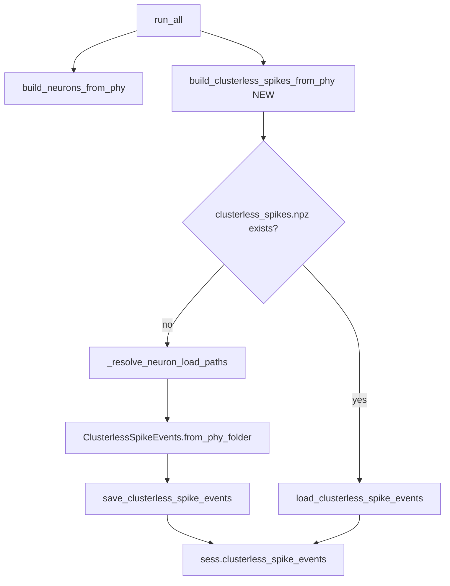

# Auto-build clusterless spikes from Phy in session init

## Context

[Commit 5e1590e](https://github.com/...) made the Bapun loader accept **either** `{session}.neurons.npy` **or** `{session}.clusterless_spikes.npz` as a valid spike source ([`BapunDataSessionFormat.py`](file:///home/halechr/repos/NeuroPy/neuropy/core/session/Formats/Specific/BapunDataSessionFormat.py) lines 629–638). Notebooks currently build the NPZ manually:

```python
events = extract_clusterless_spike_events_from_phy_folder(phy_path, electrode_mode="channel")
save_clusterless_spike_events(basedir / f"{sess.name}.clusterless_spikes.npz", events)
```

[`RawDataInitializationMixin`](file:///home/halechr/repos/NeuroPy/neuropy/core/session/init_from_raw_data.py) already has phy path resolution (`_resolve_neuron_load_paths`) and `build_neurons_from_phy`, but no clusterless equivalent.



## 1. Move Phy extraction into NeuroPy as a classmethod

**File:** [`neuropy/core/clusterless_spike_events.py`](file:///home/halechr/repos/NeuroPy/neuropy/core/clusterless_spike_events.py)

Add `ClusterlessSpikeEvents.from_phy_folder(phy_path, t_start=None, t_end=None, electrode_mode="channel", n_mark_dims=4, chunk_size=100_000, sampling_frequency_hz=1000.0) -> ClusterlessSpikeEvents` by relocating the body of `extract_clusterless_spike_events_from_phy_folder` from [`rtc_clusterless_adapters.py`](file:///home/halechr/repos/pyPhoPlaceCellAnalysis/src/pyphoplacecellanalysis/Analysis/Decoder/rtc_clusterless_adapters.py) (lines 187–372), including nested `_subfn_*` helpers.

- Required Phy files: `params.py`, `spike_times.npy`, `spike_templates.npy`, `pc_features.npy`, `pc_feature_ind.npy` (ignores `spike_clusters.npy` — clusterless uses all detected spikes).
- Default `electrode_mode="channel"` (matches RatJ/RatS notebooks; shank mode falls back to channel when `channel_shanks.npy` is missing/degenerate).
- When `t_start`/`t_end` omitted, infer session span from `params.py` / dat file / last spike (existing logic).
- Return value sets `source_phy_path=str(phy_path)`.

**Exports:** add `from_phy_folder` to [`neuropy/core/__init__.py`](file:///home/halechr/repos/NeuroPy/neuropy/core/__init__.py) if useful, but primary access is via the classmethod.

**pyPho backward compat:** replace `extract_clusterless_spike_events_from_phy_folder` body with a thin wrapper:

```python
def extract_clusterless_spike_events_from_phy_folder(...):
    return ClusterlessSpikeEvents.from_phy_folder(...)
```

No behavior change for existing pyPho tests.

## 2. Extend `NeuronLoadConfig` with clusterless knobs

**File:** [`init_from_raw_data.py`](file:///home/halechr/repos/NeuroPy/neuropy/core/session/init_from_raw_data.py) (lines 19–28)

Add fields to existing `NeuronLoadConfig` (shared phy path resolution):

| Field | Default | Purpose |
|-------|---------|---------|
| `build_clusterless_if_missing` | `True` | Skip phy extraction when NPZ already exists |
| `save_clusterless` | `True` | Write `{basename}.clusterless_spikes.npz` to `basedir` |
| `clusterless_electrode_mode` | `"channel"` | Passed to `from_phy_folder` |
| `clusterless_sampling_frequency_hz` | `1000.0` | RTC binning metadata stored in NPZ |

## 3. Add `build_clusterless_spikes_from_phy` to `RawDataInitializationMixin`

**File:** [`init_from_raw_data.py`](file:///home/halechr/repos/NeuroPy/neuropy/core/session/init_from_raw_data.py) (after `build_neurons_from_phy`, ~line 1081)

New classmethod mirroring `build_neurons_from_phy` structure:

1. Resolve `basename` from `sess` (same logic as neurons path).
2. `clusterless_save_path = default_clusterless_spike_events_path(basedir, basename)`.
3. **If file exists:** `load_clusterless_spike_events`, set `events.filename`, attach `sess.clusterless_spike_events`, return.
4. **If missing and `build_clusterless_if_missing`:**
   - Resolve phy folder via `_resolve_neuron_load_paths(config, basedir, basename)` — reuse same `phy_folder` / `sorting_run_name` / `curation_review_path` args as neurons (clusterless uses raw phy spikes, not curation CSV filter).
   - Validate clusterless Phy files exist (`pc_features.npy`, etc.); if missing, print warning and return `None` (do not fail entire `run_all`).
   - Optional `t_start`/`t_end` from `sess.eegfile.duration` or `sess.t_start`/`sess.t_stop` when available; else let `from_phy_folder` infer.
   - `events = ClusterlessSpikeEvents.from_phy_folder(resolved_phy_folder, ...)`
   - If `save_clusterless`: `save_clusterless_spike_events(clusterless_save_path, events)`; set `events.filename`.
   - Attach `sess.clusterless_spike_events = events`.
5. On failure: print `WARNING: build_clusterless_spikes_from_phy: ...` and return `None` (consistent with neurons path).

## 4. Wire into `run_all`

**File:** [`init_from_raw_data.py`](file:///home/halechr/repos/NeuroPy/neuropy/core/session/init_from_raw_data.py) (~line 1290)

After `build_neurons_from_phy(...)`, add:

```python
cls.build_clusterless_spikes_from_phy(sess, basedir=basedir, phy_folder=phy_folder, curation_review_path=curation_review_path, sorting_run_name=sorting_run_name, neuron_load_config=neuron_load_config)
```

**Related fix in `run_all` paradigm block** (lines 1301–1303): currently assumes `sess.neurons` is always present. Update to use clusterless or eeg duration as fallback when neurons is `None` (aligns with 5e1590e clusterless-only sessions):

```python
spike_t_start = sess.neurons.t_start if sess.neurons is not None else (sess.clusterless_spike_events.t_start if getattr(sess, 'clusterless_spike_events', None) is not None else 0.0)
spike_t_stop = sess.neurons.t_stop if sess.neurons is not None else (sess.clusterless_spike_events.t_stop if getattr(sess, 'clusterless_spike_events', None) is not None else sess.eegfile.duration)
```

## 5. Tests

**NeuroPy** — extend [`tests/test_clusterless_spike_events.py`](file:///home/halechr/repos/NeuroPy/tests/test_clusterless_spike_events.py):

- Port `_write_synthetic_phy_folder` helper from pyPho tests.
- `test_from_phy_folder_synthetic` — roundtrip via classmethod.
- `test_build_clusterless_spikes_from_phy_creates_npz` — temp session dir, call mixin method, assert NPZ exists and `sess.clusterless_spike_events` populated.
- `test_build_clusterless_spikes_from_phy_skips_existing` — pre-save NPZ, assert no re-extraction.

**pyPhoPlaceCellAnalysis** — existing `test_extract_clusterless_spike_events_*` tests should pass unchanged via the thin wrapper.

## Files touched (summary)

| Repo | File | Change |
|------|------|--------|
| NeuroPy | `neuropy/core/clusterless_spike_events.py` | Add `from_phy_folder` classmethod + helpers |
| NeuroPy | `neuropy/core/session/init_from_raw_data.py` | Extend config, add builder, wire `run_all`, fix paradigm timing |
| NeuroPy | `tests/test_clusterless_spike_events.py` | New tests |
| pyPhoPlaceCellAnalysis | `rtc_clusterless_adapters.py` | Thin wrapper delegating to NeuroPy classmethod |

## Out of scope

- Notebook edits (per user rule)
- Changing `build_mua_pbe_artifact_epochs` (still neurons-only; clusterless sessions skip MUA/PBE)
- Dense `build_multiunits_from_phy_folder` path (remains in pyPho for decoding)
