# Sparse clusterless spike storage for portable transfer

## Problem

`build_multiunits_from_phy_folder` allocates a dense `(n_time, n_marks, n_electrodes)` tensor up front. For RatJ full session at 1 kHz:

- `n_time = 54_130_000` → shape `(54130000, 4, 60)` float64 ≈ **97 GiB** (your `MemoryError`)
- Per-epoch (maze1, 3183 s) is feasible: `(3183000, 4, 60)` ≈ **5.7 GiB**

RTC's `ClusterlessClassifier.predict()` requires dense multiunits at decode time, but **storage and transfer should be sparse** (one row per detected spike), analogous to how sorted decoding uses `neurons.npy` + `flattened.spikes.npy` (events) rather than a full time×unit rate matrix.

```mermaid
flowchart LR
  phyFolder[Phy_folder_pc_features] --> extract[extract_clusterless_spike_events]
  extract --> npz["session.clusterless_spikes.npz"]
  npz --> load[load_clusterless_spike_events]
  load --> materialize["build_multiunits_from_spike_events(epoch)"]
  materialize --> dense["multiunits + rtc_time"]
  dense --> decode[ClusterlessRTCPositionDecoder]
```



## Proposed on-disk format

**File:** `{session_name}.clusterless_spikes.npz` in the session basedir (next to `neurons.npy`, `flattened.spikes.npy`).

**Arrays (compressed `np.savez_compressed`):**

| Key | dtype | shape | Notes |
|-----|-------|-------|-------|
| `spike_times_sec` | float32 | (n_spikes,) | seconds |
| `electrode_indices` | int16 | (n_spikes,) | after channel/shank mapping |
| `marks` | float32 | (n_spikes, n_mark_dims) | peak-channel PC marks (default 4) |

**Metadata** (stored as scalar arrays or a small JSON string in the npz):

- `sampling_frequency_hz` (default 1000.0 — RTC clock used when materializing)
- `electrode_mode` (`"channel"` or `"shank"`)
- `n_mark_dims`, `t_start`, `t_end` (extraction bounds)
- optional `source_phy_path`, `version`

**Estimated size:** ~100–650 MB for 5–30M spikes vs 97 GiB dense full session.

## Code changes (pyPhoPlaceCellAnalysis)

Primary file: [`rtc_clusterless_adapters.py`](file:///home/halechr/repos/pyPhoPlaceCellAnalysis/src/pyphoplacecellanalysis/Analysis/Decoder/rtc_clusterless_adapters.py)

### 1. `ClusterlessSpikeEvents` dataclass

```python
@dataclass
class ClusterlessSpikeEvents:
    spike_times_sec: np.ndarray
    electrode_indices: np.ndarray
    marks: np.ndarray
    sampling_frequency_hz: float = 1000.0
    electrode_mode: str = "channel"
    n_mark_dims: int = 4
    t_start: float = 0.0
    t_end: float = 0.0
```

### 2. Extract (no dense allocation)

`extract_clusterless_spike_events_from_phy_folder(phy_path, t_start, t_end, electrode_mode, n_mark_dims, chunk_size)`

- Reuse existing `_subfn_*` helpers from [`build_multiunits_from_phy_folder`](file:///home/halechr/repos/pyPhoPlaceCellAnalysis/src/pyphoplacecellanalysis/Analysis/Decoder/rtc_clusterless_adapters.py) (lines 184–257): mmap reads, epoch slice, peak-channel marks, electrode mapping.
- **Change:** append per-chunk `(spike_times_sec, electrode_indices, marks)` into preallocated or growing arrays instead of calling `_subfn_bin_spikes_to_multiunits`.
- Never call `np.full((len(rtc_time), ...))`.

### 3. Save / load

- `save_clusterless_spike_events(filepath, events)` → `np.savez_compressed`
- `load_clusterless_spike_events(filepath)` → `ClusterlessSpikeEvents`
- Optional convenience: `default_clusterless_spike_events_path(session_basedir, session_name)` mirroring Bapun naming (`RatJ-Day3TwoNovel-....clusterless_spikes.npz`).

### 4. Materialize dense for an epoch

`build_multiunits_from_spike_events(events, t_start, t_end, sampling_frequency_hz=None)`

- Filter events to `[t_start, t_end]`.
- Build `rtc_time` for that window only.
- Bin filtered spikes into dense `(n_time, n_marks, n_electrodes)` via existing `_assign_spike_marks_to_multiunits` + `_drop_empty_multiunit_electrodes`.
- This is the only step that allocates the large tensor, and only for the requested epoch.

### 5. Refactor existing public API

`build_multiunits_from_phy_folder` becomes a thin wrapper:

```python
events = extract_clusterless_spike_events_from_phy_folder(...)
return build_multiunits_from_spike_events(events, t_start, t_end, sampling_frequency_hz)
```

Existing maze1 notebook usage unchanged; full-session call still OOMs if you try to materialize the whole session (by design).

### 6. Pipeline integration

In [`DefaultComputationFunctions.py`](file:///home/halechr/repos/pyPhoPlaceCellAnalysis/src/pyphoplacecellanalysis/General/Pipeline/Stages/ComputationFunctions/DefaultComputationFunctions.py) `_perform_clusterless_position_decoding_computation` (lines 87–119):

- Add kwargs: `clusterless_spike_events=None` (object or path).
- Priority: `multiunits` > `clusterless_spike_events` > `build_multiunits_from_session`.
- When `clusterless_spike_events` is a path, call `load_clusterless_spike_events`.
- Per-pf epoch bounds (`t_start`/`t_end` from `pf.filtered_pos_df`) already match what sorted decoding uses — no full-session materialization.

### 7. Tests

Extend [`test_rtc_clusterless_decoder.py`](file:///home/halechr/repos/pyPhoPlaceCellAnalysis/tests/test_rtc_clusterless_decoder.py):

- `test_extract_clusterless_spike_events_synthetic_phy` — event count, dtypes, epoch filtering.
- `test_save_load_clusterless_spike_events_roundtrip` — npz roundtrip.
- `test_build_multiunits_from_spike_events_matches_phy_folder` — materialized output matches current `build_multiunits_from_phy_folder` on synthetic phy folder for a short epoch.

## Notebook workflow (RatJ; no notebook edits unless you ask)

**Once on machine with Phy folder:**

```python
from pyphoplacecellanalysis.Analysis.Decoder.rtc_clusterless_adapters import (
    extract_clusterless_spike_events_from_phy_folder, save_clusterless_spike_events,
)

events = extract_clusterless_spike_events_from_phy_folder(
    phy_path, t_start=sess.t_start, t_end=sess.t_stop,
    electrode_mode="channel",
)
save_clusterless_spike_events(basedir / f"{sess.name}.clusterless_spikes.npz", events)
```

**On transfer machine (no Phy folder):**

```python
from pyphoplacecellanalysis.Analysis.Decoder.rtc_clusterless_adapters import (
    load_clusterless_spike_events, build_multiunits_from_spike_events,
)

events = load_clusterless_spike_events(basedir / f"{sess.name}.clusterless_spikes.npz")
multiunits, rtc_time = build_multiunits_from_spike_events(events, t_start=11510.0, t_end=14693.0)
# or pass clusterless_spike_events=events into perform_computations
```

## Important constraints (document in docstrings)

1. **Do not materialize full-session dense multiunits at 1 kHz** — always scope to pf epoch (or sub-epoch).
2. **Decode-time RAM** is separate: even maze1 at 1 kHz can hit RTC likelihood limits for 2D fine grids (see [`2026-06-30_MemoryAllocationIssue_in_clusterless_decoding.md`](file:///home/halechr/repos/Spike3D/EXTERNAL/DEVELOPER_NOTES/2026-06-30_MemoryAllocationIssue_in_clusterless_decoding.md)); use `ClusterlessDecodingParameters.max_log_likelihood_memory_gib`, lower `clusterless_sampling_frequency_hz`, or coarser `rtc_2d_place_bin_size_override` as needed.
3. Sorted-unit path (`build_multiunits_from_session`) remains unchanged for sessions with `neurons.waveforms`; the new format is for **true clusterless** (all Phy spikes, no unit identity).

## Out of scope (follow-up)

- NeuroPy `BapunDataSessionFormat` auto-discovery of `.clusterless_spikes.npz` in session spec (can add later like `flattened.spikes.npy`).
- Notebook cell edits in [`InteractivePipelineLoadFromPickle_Bapun_RatJ_D3TwoNovel.ipynb`](file:///home/halechr/repos/Spike3D/TwoNovel/InteractivePipelineLoadFromPickle_Bapun_RatJ_D3TwoNovel.ipynb).
