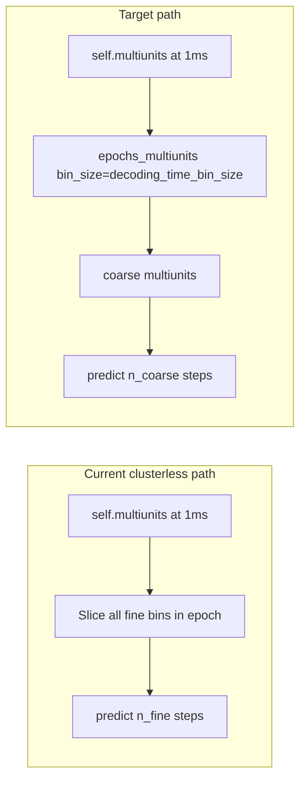

# Coarse clusterless epoch decoding

## Problem

[`decode_specific_epochs`](h:\TEMP\Spike3DEnv_ExploreUpgrade\Spike3DWorkEnv\pyPhoPlaceCellAnalysis\src\pyphoplacecellanalysis\Analysis\Decoder\rtc_clusterless_decoder.py) currently selects **every 1 ms fine bin** inside each epoch and passes them to RTC predict. Changing line 297 from `self.time_bin_size` to `decoding_time_bin_size` would **not reduce compute** because:

- `decode()` only uses `time_bin_size` when `rtc_time` is absent (line 210–213)
- RTC cost scales with `n_time` in `classifier.predict(multiunits, time=rtc_time, ...)` (line 413)

Bayesian decoding avoids this by re-binning spikes first via [`epochs_spkcount`](h:\TEMP\Spike3DEnv_ExploreUpgrade\Spike3DWorkEnv\NeuroPy\neuropy\analyses\decoders.py) in [`_build_decode_specific_epochs_result_shell`](h:\TEMP\Spike3DEnv_ExploreUpgrade\Spike3DWorkEnv\pyPhoPlaceCellAnalysis\src\pyphoplacecellanalysis\Analysis\Decoder\reconstruction.py), then calling `decode(..., time_bin_size=decoding_time_bin_size)`.



## Implementation

### 1. Add `epochs_multiunits` helper in adapters

**File:** [`rtc_clusterless_adapters.py`](h:\TEMP\Spike3DEnv_ExploreUpgrade\Spike3DWorkEnv\pyPhoPlaceCellAnalysis\src\pyphoplacecellanalysis\Analysis\Decoder\rtc_clusterless_adapters.py)

Add a function mirroring the binning contract of `epochs_spkcount`:

```python
def epochs_multiunits(multiunits, rtc_time, epochs, bin_size, slideby=None, use_single_time_bin_per_epoch=False, debug_print=False)
    -> Tuple[List[np.ndarray], List[np.ndarray], np.ndarray, List[BinningContainer]]
```

**Binning rules** (match `epochs_spkcount` exactly):
- `use_single_time_bin_per_epoch=True`: one bin `[epoch.start, epoch.stop]`, center at midpoint
- `slideby` set and `slideby < bin_size`: sliding windows via the same start/stop edge logic as `_sliding_epoch_window_spike_counts` / `BinningContainer.from_sliding_windows`
- Otherwise: `compute_spanning_bins(..., bin_size=bin_size, variable_start_value=epoch.start, variable_end_value=epoch.stop)` with the same short-epoch fallback (`epoch_duration < bin_size` → single epoch-spanning bin)

**Aggregation helper** (private): for each temporal window `[start, stop)` and each electrode, copy marks from the **last fine time bin in that window with a finite spike** (your choice; matches [`_assign_spike_marks_to_multiunits`](h:\TEMP\Spike3DEnv_ExploreUpgrade\Spike3DWorkEnv\pyPhoPlaceCellAnalysis\src\pyphoplacecellanalysis\Analysis\Decoder\rtc_clusterless_adapters.py) overwrite semantics).

**Output per epoch:**
- `coarse_multiunits`: shape `(n_coarse_bins, n_marks, n_electrodes)`, NaN where no spike
- `coarse_rtc_time`: bin centers (from `BinningContainer.centers`)
- `BinningContainer` built with `BinningContainer.init_from_edges(...)` (non-sliding) or `from_sliding_windows(...)` (sliding), with `step=bin_size` / `slideby` set consistently

**Validation:**
- Reject `bin_size < fine_bin_size` (cannot upsample from dense multiunits without spike events)
- Assert `len(centers) == coarse_multiunits.shape[0]` and posterior time dim will match

### 2. Refactor `decode_specific_epochs` loop

**File:** [`rtc_clusterless_decoder.py`](h:\TEMP\Spike3DEnv_ExploreUpgrade\Spike3DWorkEnv\pyPhoPlaceCellAnalysis\src\pyphoplacecellanalysis\Analysis\Decoder\rtc_clusterless_decoder.py) lines 249–319

Replace the manual fine-index selection block with:

1. Default `decoding_time_bin_size = self.time_bin_size` when `None` (keep)
2. Call `epochs_multiunits(active_multiunits, active_rtc_time, filter_epochs_df, bin_size=decoding_time_bin_size, slideby=slideby, use_single_time_bin_per_epoch=use_single_time_bin_per_epoch, debug_print=debug_print)`
3. Loop over returned per-epoch `(selected_multiunits, selected_rtc_time, curr_time_bin_container, n_coarse_bins)` instead of recomputing edges manually

**Decode call** (line 297):
```python
self.decode(selected_multiunits, time_bin_size=decoding_time_bin_size, rtc_time=selected_rtc_time, ...)
```

**Metadata consistency:**
- Remove hand-built `BinningInfo(step=self.time_bin_size, ...)` blocks (lines 292–295, 301)
- Use containers returned by `epochs_multiunits` directly
- Set `time_bin_edges.append(curr_time_bin_container.edges)` (same as Bayesian `_perform_decoding_specific_epochs`)

**No `self` mutation in this function:** keep all work in locals; do not assign `self.multiunits`, `self.rtc_time`, `self.classifier`, etc. (Note: existing `decode()` → `_predict_clusterless_posterior` still sets `self.rtc_results`; that pre-existing side effect is unchanged.)

### 3. Optional fast path (only if equal bin size)

When `np.isclose(decoding_time_bin_size, self.time_bin_size)`, `epochs_multiunits` should produce one coarse bin per fine bin (aggregation degenerates to identity). Keeps one code path without a separate branch.

### 4. RTC dynamics note (document, verify in tests)

Classifier is **fit at 1 ms** (`clusterless_sampling_frequency_hz`). Coarse predict passes explicit `time=coarse_rtc_time` with spacing `decoding_time_bin_size`. If RTC transitions are per-step (not per-second), trajectories may be over-constrained unless `movement_var` is scaled by `decoding_time_bin_size / self.time_bin_size`.

**Plan:** ship re-binning first (the speed fix). Add a follow-up guard in `_predict_clusterless_posterior` only if validation shows issues: `deepcopy(classifier)` + scale `RandomWalk.movement_var` on the copy for predict-only (never assign back to `self.classifier`).

### 5. Tests

**File:** [`tests/test_rtc_clusterless_decoder.py`](h:\TEMP\Spike3DEnv_ExploreUpgrade\Spike3DWorkEnv\pyPhoPlaceCellAnalysis\tests\test_rtc_clusterless_decoder.py)

Add/update tests:

| Test | Assertion |
|------|-----------|
| `test_epochs_multiunits_coarsens_dense_multiunits` | 20 ms epoch at 1 ms fine → ~1 bin at 0.05 s; last-spike marks preserved |
| `test_clusterless_decode_specific_epochs_coarse_bins` | `decoding_time_bin_size=0.05` on 20 ms epoch → `nbins≈1`, posterior last dim matches, container `edge_info.step≈0.05` |
| Existing tests at `0.001` | Still pass (identity coarsening) |
| `use_single_time_bin_per_epoch` | Still returns 1 bin per epoch |

Run: `uv run pytest tests/test_rtc_clusterless_decoder.py -q`

## Files touched

- [`rtc_clusterless_adapters.py`](h:\TEMP\Spike3DEnv_ExploreUpgrade\Spike3DWorkEnv\pyPhoPlaceCellAnalysis\src\pyphoplacecellanalysis\Analysis\Decoder\rtc_clusterless_adapters.py) — new `epochs_multiunits` + aggregation helper
- [`rtc_clusterless_decoder.py`](h:\TEMP\Spike3DEnv_ExploreUpgrade\Spike3DWorkEnv\pyPhoPlaceCellAnalysis\src\pyphoplacecellanalysis\Analysis\Decoder\rtc_clusterless_decoder.py) — refactor `decode_specific_epochs` loop
- [`tests/test_rtc_clusterless_decoder.py`](h:\TEMP\Spike3DEnv_ExploreUpgrade\Spike3DWorkEnv\pyPhoPlaceCellAnalysis\tests\test_rtc_clusterless_decoder.py) — coarse-bin coverage

## Expected speedup

For a ~10 s lap at 1 ms (`~10,000` HMM steps) with `decoding_time_bin_size=0.05` (`~200` steps): **~50× fewer** likelihood/HMM steps per epoch, plus proportional memory reduction for `p_x_given_n`.
