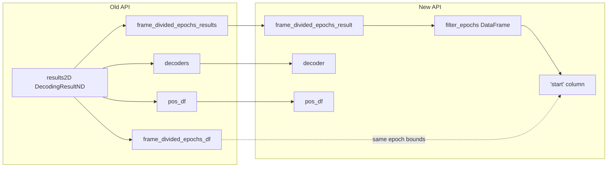

# Complete results2D refactor in SingleArtistMultiEpochBatchHelpers

## Current state

You have already:

- Replaced the single `results2D` field with three fields: `frame_divided_epochs_result`, `decoder`, `pos_df` ([SingleArtistMultiEpochBatchHelpers.py](h:\TEMP\Spike3DEnv_ExploreUpgrade\Spike3DWorkEnv\pyPhoPlaceCellAnalysis\src\pyphoplacecellanalysis\PhoPositionalData\plotting\chunked_2d\SingleArtistMultiEpochBatchHelpers.py) lines 177–181).
- Wired `a_result2D` and `a_new_global2D_decoder` to those new fields (lines 207–214).

Remaining work: remove the last two references to `results2D` inside the class and align constructor/docstring with the new API.

---

## 1. Replace the only live `results2D` usage (line 544)

**Location:** `add_track_positions` (around line 544).

**Current:**

```python
frame_division_epoch_separator_vlines = active_ax.vlines(self.results2D.frame_divided_epochs_df['start'].to_numpy(), ...)
```

**Change:** Use epoch boundaries from `frame_divided_epochs_result`. [DecodedFilterEpochsResult](h:\TEMP\Spike3DEnv_ExploreUpgrade\Spike3DWorkEnv\pyPhoPlaceCellAnalysis\src\pyphoplacecellanalysis\Analysis\Decoder\reconstruction.py) has `filter_epochs: pd.DataFrame` with `'start'` and `'stop'` (same semantics as `DecodingResultND.frame_divided_epochs_df`). So:

- Replace with: `self.frame_divided_epochs_result.filter_epochs['start'].to_numpy()`.

No new field is needed; the refactor stays minimal.

---

## 2. Fix the empty-data validation branch (lines 308–309)

**Location:** `shared_build_flat_stacked_data`, in the block that builds the “available indices” error message when `stacked_flat_global_pos_df` is empty.

**Current:**

```python
if hasattr(self, 'results2D') and self.pos_df is not None and 'global_frame_division_idx' in self.pos_df.columns:
```

**Change:** Drop the `results2D` check. The condition is only used to compute `available_indices` for the error message; `pos_df` is always present with the new API. Use:

- `if self.pos_df is not None and 'global_frame_division_idx' in self.pos_df.columns:`.

---

## 3. Backward compatibility: `from_results2D` (recommended)

Call sites currently use:

`SingleArtistMultiEpochBatchHelpers(results2D=results2D, active_ax=..., frame_divide_bin_size=..., ...)` (see docstring examples at lines 139–140, 150–151).

[DecodingResultND](h:\TEMP\Spike3DEnv_ExploreUpgrade\Spike3DWorkEnv\pyPhoPlaceCellAnalysis\src\pyphoplacecellanalysis\General\Pipeline\Stages\ComputationFunctions\EpochComputationFunctions.py) (lines 457–511) provides:

- `frame_divided_epochs_results[active_epoch_name]` → `DecodedFilterEpochsResult`
- `decoders[active_epoch_name]` → `BasePositionDecoder`
- `pos_df` → `pd.DataFrame`

Add a classmethod so existing code can keep a one-line call:

```python
@classmethod
def from_results2D(cls, results2D: "DecodingResultND", active_epoch_name: str = "global", **kwargs) -> "SingleArtistMultiEpochBatchHelpers":
    return cls(
        frame_divided_epochs_result=results2D.frame_divided_epochs_results[active_epoch_name],
        decoder=results2D.decoders[active_epoch_name],
        pos_df=results2D.pos_df,
        **kwargs,
    )
```

Place it immediately after the field definitions (e.g. after line 181). Then callers with `results2D` use:

`SingleArtistMultiEpochBatchHelpers.from_results2D(results2D, active_ax=track_ax, frame_divide_bin_size=..., desired_epoch_start_idx=..., desired_epoch_end_idx=...)`

No need to support `results2D` in the main `__init__`; the factory keeps the constructor signature clean and explicit.

---

## 4. Docstring and comment cleanup

- **Usage examples (lines 139–140, 150–151):** Update both examples to use the new constructor or the factory, e.g.:
  - “INPUTS: frame_divide_bin_size, frame_divided_epochs_result, decoder, pos_df”
  - Example with `results2D`: `SingleArtistMultiEpochBatchHelpers.from_results2D(results2D, active_ax=track_ax, frame_divide_bin_size=..., desired_epoch_start_idx=..., desired_epoch_end_idx=...)`
  - Optional second example showing direct args: `SingleArtistMultiEpochBatchHelpers(frame_divided_epochs_result=..., decoder=..., pos_df=..., active_ax=..., ...)`
- **Comments (lines 177, 208, 213):** Remove or shorten the commented `# results2D` and old return lines so the refactor is the single source of truth.
- **TYPE_CHECKING:** Remove the duplicate `DecodingResultND` import on line 10; keep one. Add `DecodingResultND` only where needed for `from_results2D` type hint (already under TYPE_CHECKING).

---

## 5. Summary of edits


| Location               | Action                                                                                                        |
| ---------------------- | ------------------------------------------------------------------------------------------------------------- |
| ~544                   | `self.results2D.frame_divided_epochs_df['start']` → `self.frame_divided_epochs_result.filter_epochs['start']` |
| ~308                   | `hasattr(self, 'results2D') and self.pos_df...` → `self.pos_df is not None and ...`                           |
| After ~181             | Add `from_results2D(results2D, active_epoch_name='global', **kwargs)` classmethod                             |
| 139–151, 177, 208, 213 | Update docstring examples and remove obsolete comments; dedupe TYPE_CHECKING import                           |


No other files reference `SingleArtistMultiEpochBatchHelpers(results2D=...)` in this workspace; only the docstring examples in this file need to show the new API.

---

## Data flow (reference)




Epoch boundaries used for vlines come from `frame_divided_epochs_result.filter_epochs` instead of `results2D.frame_divided_epochs_df`.