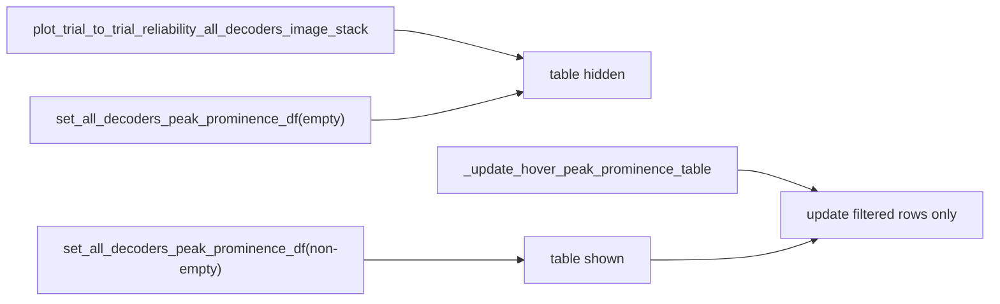

# Conditionally show peak-prominence table column

## Current behavior

In [`TrialByTrialActivityWindow.py`](h:\TEMP\Spike3DEnv_ExploreUpgrade\Spike3DWorkEnv\pyPhoPlaceCellAnalysis\src\pyphoplacecellanalysis\GUI\PyQtPlot\Widgets\ContainerBased\TrialByTrialActivityWindow.py), non-publication windows wrap the pyqtgraph widget and table in an `QHBoxLayout`:

```606:611:h:\TEMP\Spike3DEnv_ExploreUpgrade\Spike3DWorkEnv\pyPhoPlaceCellAnalysis\src\pyphoplacecellanalysis\GUI\PyQtPlot\Widgets\ContainerBased\TrialByTrialActivityWindow.py
content_container = pg.QtWidgets.QWidget()
hbox = pg.QtWidgets.QHBoxLayout(content_container)
hbox.setContentsMargins(0, 0, 0, 0)
hbox.addWidget(root_render_widget, stretch=3)
hbox.addWidget(peak_prominence_table_view, stretch=1)
parent_root_widget.setCentralWidget(content_container)
```

- The hover preview lives **inside** `root_render_widget` at grid column `max_num_columns` (col 5).
- The table is always added and visible at build time, even before any peak data is loaded, leaving a large empty white column (as in your screenshot).
- `_update_hover_peak_prominence_table` only updates the model; it does not control column visibility.

## Target behavior (per your choice)

- **Hidden by default** at window creation.
- **Shown once** `set_all_decoders_peak_prominence_df(...)` is called with a **non-empty** DataFrame.
- **Remain visible** after that, even when the hovered aclu has zero filtered rows (empty table body is OK).
- **Hide again** only if an empty DataFrame is passed to `set_all_decoders_peak_prominence_df` (edge case; keeps API consistent).

## Implementation

### 1. Add a small visibility helper

Add an instance method, e.g. `_set_peak_prominence_table_visible(self, is_visible: bool)`:

- Early-return if `self.ui.peak_prominence_table_view` is `None`.
- No-op if visibility is already the desired state (avoids redundant layout churn).
- Call `table_view.setVisible(is_visible)`.

### 2. Start hidden at build time

In `plot_trial_to_trial_reliability_all_decoders_image_stack` (inside the `if not is_publication_ready_figure:` block):

- After creating `peak_prominence_table_view`, call `peak_prominence_table_view.setVisible(False)`.
- Store `content_hbox` on `PhoUIContainer` (alongside existing `content_container`) so visibility toggles can trigger layout updates if needed later. Optional but low-cost.

### 3. Toggle visibility in `set_all_decoders_peak_prominence_df`

At the end of [`set_all_decoders_peak_prominence_df`](h:\TEMP\Spike3DEnv_ExploreUpgrade\Spike3DWorkEnv\pyPhoPlaceCellAnalysis\src\pyphoplacecellanalysis\GUI\PyQtPlot\Widgets\ContainerBased\TrialByTrialActivityWindow.py) (~line 1378):

```python
has_peak_table_data = (all_decoders_peak_prominence_df is not None) and (len(all_decoders_peak_prominence_df) > 0)
self._set_peak_prominence_table_visible(has_peak_table_data)
```

Keep the existing hover refresh call to `_update_hover_peak_prominence_table` unchanged.

### 4. Protect hover-preview column from horizontal squish

When the table **is** shown, the current `stretch=3:1` hbox steals width from the entire `root_render_widget`, compressing both the subplot grid and the preview column.

Minimal layout tweaks in the same build block:

**Outer hbox (table vs graphics widget):**
- Change to `hbox.addWidget(root_render_widget, stretch=1)` and `hbox.addWidget(peak_prominence_table_view, stretch=0)` so the table only consumes its natural/content width instead of ~25% of the window.
- Set horizontal size policy on the table to `QSizePolicy.Policy.Preferred` (vertical `Expanding`).
- Replace fixed `setMinimumWidth(360)` with a softer default, e.g. `setMinimumWidth(200)`, and still call `resizeColumnsToContents()` after data is loaded in `set_all_decoders_peak_prominence_df` / `_update_hover_peak_prominence_table`.

**Inner pyqtgraph grid (preview column):**
- After adding `hover_preview_plot`, configure the graphics layout column:

```python
preview_layout = root_render_widget.ci.layout
preview_layout.setColumnMinimumWidth(max_num_columns, 90)   # tune if needed
preview_layout.setColumnStretchFactor(max_num_columns, 0)   # preview stays narrow
for col_idx in range(max_num_columns):
    preview_layout.setColumnStretchFactor(col_idx, 1)       # grid columns absorb shrink
```

This keeps shrink pressure on the 5-column subplot grid rather than the preview strip.

### 5. No changes needed in notebook callers

[`PendingNotebookCode.py`](h:\TEMP\Spike3DEnv_ExploreUpgrade\Spike3DWorkEnv\pyPhoPlaceCellAnalysis\src\pyphoplacecellanalysis\SpecificResults\PendingNotebookCode.py) already gates `set_all_decoders_peak_prominence_df` behind `peaks_for_plot is not None and len(peaks_for_plot) > 0` (~line 764). Windows opened without peak data will now correctly omit the table column entirely.

## Data flow (after change)



## Files to change

- [`TrialByTrialActivityWindow.py`](h:\TEMP\Spike3DEnv_ExploreUpgrade\Spike3DWorkEnv\pyPhoPlaceCellAnalysis\src\pyphoplacecellanalysis\GUI\PyQtPlot\Widgets\ContainerBased\TrialByTrialActivityWindow.py) only (single focused diff).

## Manual verification

1. Open a TbyT window **without** calling `set_all_decoders_peak_prominence_df` → no right white table column; hover preview should have full graphics width.
2. Call `set_all_decoders_peak_prominence_df` with non-empty peaks → table column appears with data.
3. Hover aclus with and without peak rows → table stays visible; rows update (may be empty for some aclus).
4. Resize window → preview column should remain readable; subplot grid compresses before preview does.
