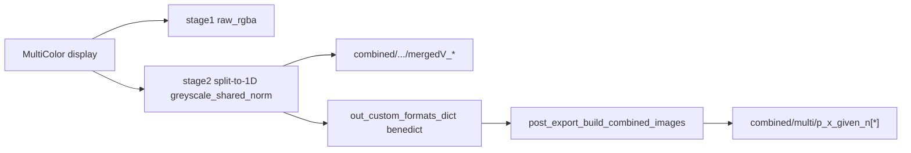

# Confirm combined/multi still produces desired results

**Verdict:** With the recent changes, `combined/multi` **does** still run and will use the competition-normalized panels you want (same source as correct `mergedV_*`). No functional fix is required in [`batch_user_completion_helpers.py`](h:/TEMP/Spike3DEnv_ExploreUpgrade/Spike3DWorkEnv/pyPhoPlaceCellAnalysis/src/pyphoplacecellanalysis/General/Batch/BatchJobCompletion/UserCompletionHelpers/batch_user_completion_helpers.py).

## Current path (your `.ipy` config)

[`ProcessBatchOutputs_qclus1246789_Only.ipy`](h:/TEMP/Spike3DEnv_ExploreUpgrade/Spike3DWorkEnv/Spike3D/ProcessBatchOutputs_qclus1246789_Only.ipy) lists only MultiColor (directional already commented out). That is the intended sole path.

What the recent edits did for this path:

- Default / MultiColor-present: skip directional (no independent-1D overwrite).
- Removed directional→MultiColor `.merge(...)` that could reintroduce wrong panel paths before `multi`.
- Left the post-MultiColor `post_export_build_combined_images(..., layout=greyscale_shared_norm)` call intact (~4748–4758).

## Why panels match desired `mergedV` look

1. MultiColor stage-2 exports competition-normalized 1D greyscale into `ripple.{long_LR,...}.greyscale_shared_norm` ([`EpochComputationFunctions.py`](h:/TEMP/Spike3DEnv_ExploreUpgrade/Spike3DWorkEnv/pyPhoPlaceCellAnalysis/src/pyphoplacecellanalysis/General/Pipeline/Stages/ComputationFunctions/EpochComputationFunctions.py) ~3146–3167).
2. That dict is wrapped as `benedict`, so `post_export_build_combined_images` resolves `ripple.long_LR['greyscale_shared_norm']` ([`data_exporting.py`](h:/TEMP/Spike3DEnv_ExploreUpgrade/Spike3DWorkEnv/pyPhoPlaceCellAnalysis/src/pyphoplacecellanalysis/Pho2D/data_exporting.py) ~1400–1471).
3. Layout requests only `greyscale_shared_norm`; `should_use_raw_rgba_export_image=False` (your kwargs) skips appending raw_rgba.

Pre-fix cluster logs already showed MultiColor succeeding (`after MultiColor: wrote 153 combined/multi images` in the 2026-09-16 Final log) — the bug was early directional `multi` + merge clobber, not MultiColor failing to build `multi`.

## Optional cleanup (non-functional)

Update stale comments in [`ProcessBatchOutputs_qclus1246789_Only.ipy`](h:/TEMP/Spike3DEnv_ExploreUpgrade/Spike3DWorkEnv/Spike3D/ProcessBatchOutputs_qclus1246789_Only.ipy) ~351 and ~358 that still say directional is “required for greyscale_shared_norm + combined/multi”. Leave directional commented out; MultiColor alone is enough.

## What to check on the next run

- Log: `trying "_display_...MultiColorOverlay"` then `beginning export of 1D results in the normalizations style Kamran likes...` then **one** `post_export_build_combined_images after MultiColor` — **no** `after directional`.
- Disk: `combined/multi` timestamps align with MultiColor greyscale / `mergedV`, and panels look competition-normalized like `mergedV` (not independently bright directional stacks).

## Implementation todos

Only if you want the comment cleanup; otherwise this review is complete with no code edits.