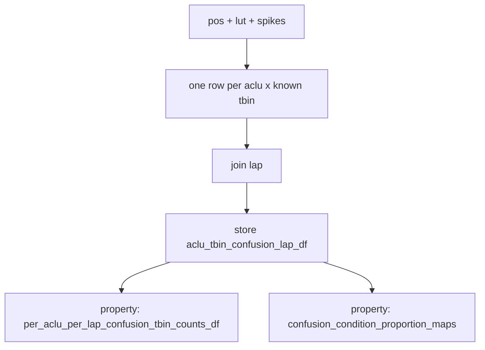

# Confusion-condition × lap: general DF + derived properties

## Decisions

- Count **`n_tbins`** (not spikes) when aggregating; TN/FN included as silent tbins.
- Spatial maps are **visit-conditioned** (animal `(binned_x, binned_y)`), value = **local proportion** of visits in that condition.
- **Mean across laps**: per-lap local proportions, then `nanmean` over laps.
- **Storage**: one general long DataFrame only. Aggregates / maps are **derived properties**, not separately persisted fields.

Condition label (same rules as [`perform_compute_confusion_matrix`](h:\TEMP\Spike3DEnv_ExploreUpgrade\Spike3DWorkEnv\pyPhoPlaceCellAnalysis\src\pyphoplacecellanalysis\Analysis\reliability.py)):

- in-field + spiked → TP
- out-of-field + spiked → FP
- in-field + silent → FN
- out-of-field + silent → TN

Only **known** animal bins (same `known_pos` join as confusion matrix) are labeled.

## Stored member: `aclu_tbin_confusion_lap_df`

One row per `(aclu, t_bin_idx)` that participates in confusion labeling (`lap > -1` only). Columns (all needed for derivation):

- `aclu` (int)
- `t_bin_idx` (0-based, aligned with `time_bin_info_df`)
- `lap` (int, `> -1`)
- `binned_x`, `binned_y` (1-based animal position)
- `is_in_field` (bool)
- `n_spikes` (float/int; 0 for silent)
- `condition` (`TP` / `FP` / `TN` / `FN` string)

This is the only new serialized/computable table stored on the decoder.

## Lap on every t-bin (including silent)

Build `t_bin_idx` (0-based) → `lap` once when wiring the mixin:

1. Prefer modal `lap` from `pfs.filtered_pos_df` grouped by animal `t_bin_idx` (if `lap` column exists).
2. Else modal `lap` from `per_tbin_aclu_per_lap_xy_spike_counts_df` (convert spike 1-based `t_bin_idx` → 0-based).
3. Else leave `aclu_tbin_confusion_lap_df = None` (skip).

## Builder

New classmethod on `CellIndividualReliabilityMatrix` in [`reliability.py`](h:\TEMP\Spike3DEnv_ExploreUpgrade\Spike3DWorkEnv\pyPhoPlaceCellAnalysis\src\pyphoplacecellanalysis\Analysis\reliability.py):

`perform_build_aclu_tbin_confusion_lap_df(per_tbin, time_bin_info_df, in_field_lut, neuron_ids, t_bin_lap_df, max_t_idx=None) -> pd.DataFrame`

Reuse `_prepare_visit_polars_frames` + known-pos / `is_in_field` joins from `perform_compute_confusion_matrix`, cross neuron×known visits (or join spikes onto known visits × aclus), assign `condition`, join lap, filter `lap > -1`, return pandas.

Wire in mixin `_perform_compute_unit_confusion_reliability_variables` after `compute_reliability_matrix` when lap lookup is available; assign `self.aclu_tbin_confusion_lap_df`. Keep the public 5-tuple return unchanged.

## Derived properties (on mixin / decoder)

Compute on read from `self.aclu_tbin_confusion_lap_df` (return `None` if df is `None`). Prefer lightweight groupby/pandas; no need to cache unless profiling says otherwise.

1. **`per_aclu_per_lap_confusion_tbin_counts_df`**  
   `groupby(['aclu','lap','condition']).size()` → `n_tbins`; join lap totals → `n_tbins_in_lap`, `p_tbin = n_tbins / n_tbins_in_lap`.

2. **`confusion_condition_proportion_maps`**  
   Dict `TP`/`FP`/`TN`/`FN` → `ndarray (n_neurons, nx, ny)`.  
   Per lap, at animal `(ix, iy)` for cell `i`:  
   `p_C = n_C_tbins(i, lap, ix, iy) / n_visits(lap, ix, iy)`  
   then `nanmean` over laps (unvisited in a lap → NaN). All-NaN bins → 0.  
   Needs `neuron_IDs` order and `(nx, ny)` from `ratemap` / occupancy shape on `self`.

Optional thin helpers on `CellIndividualReliabilityMatrix` (static/classmethod) that take the df + neuron_ids + shape, so properties stay one-liners.

## Decoder storage / slice / reset

[`reconstruction.py`](h:\TEMP\Spike3DEnv_ExploreUpgrade\Spike3DWorkEnv\pyPhoPlaceCellAnalysis\src\pyphoplacecellanalysis\Analysis\Decoder\reconstruction.py) / [`reconstruction_dst.py`](h:\TEMP\Spike3DEnv_ExploreUpgrade\Spike3DWorkEnv\pyPhoPlaceCellAnalysis\src\pyphoplacecellanalysis\Analysis\Decoder\reconstruction_dst.py):

- Add `aclu_tbin_confusion_lap_df: pd.DataFrame = serialized_field(default=None, ...)`
- Clear in `setup` / `post_load`
- Neuron-slice by filtering `aclu`
- Do **not** store proportion maps or the aggregated counts df as fields (properties only)

## Non-goals

- No change to existing confusion / `reliability_*` math
- No plot wiring yet
- No separate persisted map arrays
