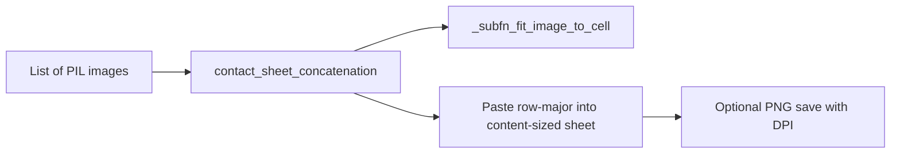

# Contact-sheet style image concatenation (content-sized)

**Goal:** Programmatically build session concatenated strips like screenshot 0, with the XnView dialog knobs from screenshot 1 as parameters — but **content-sized** (no fixed 512×1024 canvas, no multipage `Sheet ####` paging).

**Architecture:** Add **one** public function `contact_sheet_concatenation` in [`media_output_helpers.py`](h:\TEMP\Spike3DEnv_ExploreUpgrade\Spike3DWorkEnv\pyPhoCoreHelpers\src\pyphocorehelpers\plotting\media_output_helpers.py) immediately after `image_grid`. Nested `_subfn_*` helpers inside that function handle cell fit / caption formatting as needed. Do **not** add a second public helper (`from_paths`, folder loaders, etc.). Leave `horizontal_image_stack` / `vertical_image_stack` / `image_grid` and all call sites unchanged.

**Tech stack:** Pillow (`Image`, `ImageDraw`, `ImageFont`), NumPy, existing `ImageHelpers` for font lookup when captions are on.

## Constraints (from feedback)

- **One additional public method only**; use nested `def _subfn_...` for internal steps.
- Follow project conventions: single-line `def` when ≤400 chars (else group kwargs by purpose), `## END for ...` on loops, `@function_attributes(...)`, two blank lines before/after adjacent top-level defs, minimal edits elsewhere, do not prune “unused” imports.
- No rewires of `PosteriorExporting`, notebooks, or other consumers.

## Chosen approach



## Layout semantics (Option B)

- Sheet size is **derived** from: cell size × cols/rows + spacing + margins + optional caption band.
- Grid is row-major: fill left→right, top→bottom.
- `columns` is the primary control; `rows=None` means `ceil(n_images / columns)`. If both are set and `n_images > columns * rows`, **grow rows** (still one image — no paging).
- Cell size = max source width × max source height among inputs (or explicit `cell_size` override).
- `fill_mode=False` (XnView unchecked): letterbox/center each image in its cell preserving aspect ratio; pad with `thumbnail_background_color`.
- `fill_mode=True`: scale to cover the cell (may crop).
- Sheet background filled with `background_color`; outer `margin=(h, v)` around the grid.
- Spacing between cells: `spacing=(h, v)` (XnView Spacing 4×22).
- Optional `separator_color`: when set, fill spacing gutters with that color.
- Captions: `show_information=False` by default. When `True`, render under each thumb via `information_template` / `filenames` / `text_color` / `font`.
- `dpi` only affects PNG save metadata (default 600), not pixel geometry.
- Callers that have paths open the images themselves and pass `filenames=` if captions are needed.

## Defaults aligned to the XnView dialog (where applicable)

- `margin=(0, 22)`, `spacing=(4, 22)`
- `background_color=(255, 255, 204, 255)` (pale yellow)
- `thumbnail_background_color=(200, 255, 200, 255)` (light green)
- `fill_mode=False`, `show_information=False`, `information_template="{Filename}"`
- `text_color=(0, 0, 0, 255)`, monospace font via `ImageHelpers.get_font` / fallback (not Windows “Terminal”)
- `dpi=600`

## API sketch (single public method)

```python
@function_attributes(short_name=None, tags=['image', 'contact_sheet', 'concatenation', 'XnView'], input_requires=[], output_provides=[], uses=['ImageHelpers'], used_by=[], creation_date='2026-09-16 00:00', related_items=['image_grid', 'horizontal_image_stack'])
def contact_sheet_concatenation(imgs: List[Image.Image], columns: int, rows: Optional[int] = None,
                                margin: Tuple[int, int] = (0, 22), spacing: Tuple[int, int] = (4, 22),
                                background_color=(255, 255, 204, 255), thumbnail_background_color=(200, 255, 200, 255), fill_mode: bool = False, separator_color=None,
                                show_information: bool = False, information_template: str = "{Filename}", filenames: Optional[List[str]] = None,
                                text_color=(0, 0, 0, 255), font: str = "DejaVuSansMono.ttf", font_size: Optional[int] = None,
                                cell_size: Optional[Tuple[int, int]] = None, output_path: Optional[Path] = None, dpi: int = 600) -> Image.Image:
    def _subfn_fit_image_to_cell(img: Image.Image, cell_w: int, cell_h: int) -> Image.Image:
        ...
    def _subfn_format_caption(index: int) -> str:
        ...
    # layout + paste + optional save
```

## Out of scope

- Second public method (`contact_sheet_concatenation_from_paths`, folder wrappers).
- Fixed sheet width/height / multipage output (Option A).
- Rewiring export / notebook call sites.
- Matching screenshot 0’s baked-in blue/red rotated LC labels.

## Verification

- Docstring `Usage:` example with a few synthetic `Image.new` tiles; confirm size formula and letterboxing.
- If `output_path` is set, confirm DPI metadata via Pillow.
- No new test module; no edits outside `media_output_helpers.py` except whatever tiny import is strictly required inside that file.
