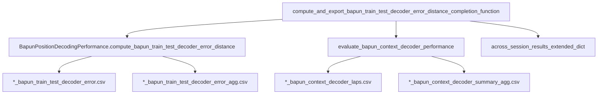

# Integrate Bapun context decoder performance into batch completion

## Goal

Run the notebook workflow below automatically during batch compute phases, inside the existing completion function (no new completion-function registration):

```python
result = evaluate_bapun_context_decoder_performance(
    curr_active_pipeline,
    maze_epoch_names=['maze1', 'maze2'],
    laps_decoding_time_bin_size=0.5,
)
```

**User choice:** use the **same** `laps_decoding_time_bin_size` parameter for both train/test error and context decoding (batch driver currently passes `0.250`).

## Current state

| Piece | Location |
|-------|----------|
| Context evaluation | [`evaluate_bapun_context_decoder_performance`](h:\TEMP\Spike3DEnv_ExploreUpgrade\Spike3DWorkEnv\pyPhoPlaceCellAnalysis\src\pyphoplacecellanalysis\SpecificResults\PendingNotebookCode.py) (L301–498) + `BapunContextDecoderPerformanceResult` (L169–206) |
| Train/test batch export | [`compute_and_export_bapun_train_test_decoder_error_distance_completion_function`](h:\TEMP\Spike3DEnv_ExploreUpgrade\Spike3DWorkEnv\pyPhoPlaceCellAnalysis\src\pyphoplacecellanalysis\General\Batch\BatchJobCompletion\UserCompletionHelpers\batch_user_completion_helpers.py) (L3444–3497) |
| Batch wiring | Already registered in [`ProcessBatchOutputs_Bapun_Batch.ipy`](h:\TEMP\Spike3DEnv_ExploreUpgrade\Spike3DWorkEnv\Spike3D\ProcessBatchOutputs_Bapun_Batch.ipy) (L570, L444–448) |



## Implementation

### 1. Extend completion function in [`batch_user_completion_helpers.py`](h:\TEMP\Spike3DEnv_ExploreUpgrade\Spike3DWorkEnv\pyPhoPlaceCellAnalysis\src\pyphoplacecellanalysis\General\Batch\BatchJobCompletion\UserCompletionHelpers\batch_user_completion_helpers.py)

**Signature** — add one optional toggle (single-line signature preserved):

```python
def compute_and_export_bapun_train_test_decoder_error_distance_completion_function(..., evaluate_context_decoder: bool = True, ...) -> dict:
```

**Imports** (lazy, inside function):

```python
from pyphoplacecellanalysis.SpecificResults.PendingNotebookCode import evaluate_bapun_context_decoder_performance
from neuropy.core.session.Formats.Specific.BapunDataSessionFormat import BapunDataSessionFormatRegisteredClass
```

**Maze epoch resolution** (critical — do not rely on `evaluate_bapun_context_decoder_performance` default `['maze1','maze2']`):

- If `maze_epoch_names is None`, resolve via `BapunDataSessionFormatRegisteredClass._get_session_specific_parameters(...).non_global_activity_session_names` (same as [`compute_train_test_split_epochs_decoders`](h:\TEMP\Spike3DEnv_ExploreUpgrade\Spike3DWorkEnv\pyPhoPlaceCellAnalysis\src\pyphoplacecellanalysis\SpecificResults\PendingNotebookCode.py) L13300–13302).
- **Skip** context evaluation (log `WARN`, leave context callback keys `None`) when `len(resolved_maze_epoch_names) != 2`.
  - Covers single-context OpenField sessions (`['maze']` for RatK/RatS) while still running for roam/sprinkle and maze1/maze2 sessions.

**Error isolation** — keep existing outer `try/except` for train/test; wrap context evaluation in its **own** inner `try/except` so a context failure does not prevent train/test CSV export.

**Compute** (when `evaluate_context_decoder` and `len(maze_epoch_names)==2`):

```python
context_result = evaluate_bapun_context_decoder_performance(
    curr_active_pipeline,
    maze_epoch_names=resolved_maze_epoch_names,
    laps_decoding_time_bin_size=laps_decoding_time_bin_size,
    debug_print=debug_print,
)
```

**CSV exports** (when `save_csv=True`), same `{BATCH_DATE_TO_USE}-{session_name}` prefix:

| File | Content |
|------|---------|
| `{prefix}_bapun_context_decoder_laps.csv` | `context_result.combined_laps_df` (per-lap marginals + `source_maze`, `is_context_correct`, etc.) |
| `{prefix}_bapun_context_decoder_summary_agg.csv` | Per-maze + overall row built from `per_maze_context_correctness` and `overall_percent_correct` |

Suggested summary columns: `maze`, `n_laps`, `percent_context_correct`, `n_correct`.

**Console summary** (mirror notebook usage):

```python
print(f"Overall context-correct: {context_result.overall_percent_correct:.1%}")
for maze_name, correctness in context_result.per_maze_context_correctness.items():
    pct = correctness.percent_correct_tuple.percent_laps_track_identity_estimated_correctly
    print(f"  {maze_name}: {pct:.1%}")
```

**`callback_outputs` additions** (store serializable artefacts only — not decoder objects):

- `context_decoder_evaluated: bool`
- `context_decoder_maze_epoch_names: List[str] | None`
- `context_decoder_overall_percent_correct: float | None`
- `context_decoder_per_maze_percent_correct: dict[str, float] | None`
- `context_decoder_combined_laps_df` (DataFrame reference, same pattern as `test_err_agg_df`)
- `context_decoder_summary_agg_df`
- `context_decoder_laps_csv_path`, `context_decoder_summary_agg_csv_path` (when saved)
- `context_decoder_skip_reason: str | None` (e.g. `"single_context_session"`)

Update docstring with unpack example for batch consumers.

**`@function_attributes`** — add `evaluate_bapun_context_decoder_performance` / `BapunContextDecoderPerformanceResult` to `uses` and `related_items`.

### 2. No changes to [`PendingNotebookCode.py`](h:\TEMP\Spike3DEnv_ExploreUpgrade\Spike3DWorkEnv\pyPhoPlaceCellAnalysis\src\pyphoplacecellanalysis\SpecificResults\PendingNotebookCode.py)

Reuse `evaluate_bapun_context_decoder_performance` as-is. Resolution of `maze_epoch_names` stays in the completion wrapper so OpenField roam/sprinkle sessions work without changing the evaluate function default.

### 3. Batch driver — optional doc-only note

[`ProcessBatchOutputs_Bapun_Batch.ipy`](h:\TEMP\Spike3DEnv_ExploreUpgrade\Spike3DWorkEnv\Spike3D\ProcessBatchOutputs_Bapun_Batch.ipy) already registers the completion function and passes `laps_decoding_time_bin_size`. **No structural wiring changes required** unless you want an explicit `evaluate_context_decoder=True` in the override dict for clarity.

Per your notebook rule: **do not edit `.ipy` unless you ask** — implementation can be completion-function-only.

### 4. Out of scope (unless requested later)

- Separate figure completion function for context marginals
- Renaming the completion function (would break existing batch scripts)
- Moving evaluate logic into a new `BapunContextDecoderPerformance` class

## Verification

On one **TwoNovel** session (e.g. RatN Day3TwoNovel) and one **roam/sprinkle** OpenField session:

1. Re-run batch `continued_run` script with the updated helper.
2. Confirm four CSVs per session under `collected_outputs`:
   - existing train/test error + agg
   - new context laps + summary agg
3. Confirm single-context OpenField (RatS Day1) still exports train/test CSVs and logs context skip warning.
4. Unpack from batch dict:

```python
out = across_session_results_extended_dict['compute_and_export_bapun_train_test_decoder_error_distance_completion_function']
out['context_decoder_overall_percent_correct']
out['context_decoder_combined_laps_df']
```
