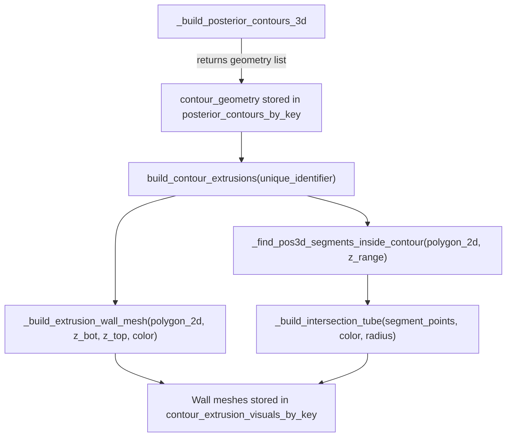

# Contour Extrusion and Position-Line Intersection Highlighting

## Context

Currently, `_build_posterior_contours_3d` in `[predicitive_decoding_vispy.py](h:\TEMP\Spike3DEnv_ExploreUpgrade\Spike3DWorkEnv\pyPhoPlaceCellAnalysis\src\pyphoplacecellanalysis\Pho2D\vispy\predicitive_decoding_vispy.py)` creates 2D contour outlines at specific z-heights (one per t_bin). The user wants:

1. Each contour to be **extruded volumetrically** along the z-axis (both directions from its z-height), creating translucent wall meshes.
2. Portions of the **position line** (`self.pos3d`) that fall inside each extruded contour volume to be **highlighted** with a translucent `vz.Tube` colored to match the contour.

## Architectural Approach




## Changes

All changes are in `[predicitive_decoding_vispy.py](h:\TEMP\Spike3DEnv_ExploreUpgrade\Spike3DWorkEnv\pyPhoPlaceCellAnalysis\src\pyphoplacecellanalysis\Pho2D\vispy\predicitive_decoding_vispy.py)`.

### 1. Store contour geometry from `_build_posterior_contours_3d`

Currently `_build_posterior_contours_3d` (line 2097) only returns `(line_visuals, fill_visuals)`. Modify it to **also** collect and return a list of contour geometry dicts:

```python
contour_geom = {'polygon_2d': pos_2d, 'z_val': z_val, 'rgba': rgba, 't_idx': t_idx}
```

Return signature becomes `Tuple[List[Any], List[Any], List[Dict]]`.

Then in `add_posterior_contours` (line 2290), store this geometry list in the contour entry dict under key `'contour_geometries'`.

### 2. Add new attrs field

Add `contour_extrusion_visuals_by_key: Dict[str, Dict[str, Any]]` (Factory(dict)) to track extrusion wall meshes and intersection tubes separately from the base contour visuals.

### 3. Add `_build_extrusion_wall_mesh` helper

Given a closed 2D polygon, z_bottom, and z_top, create a translucent mesh representing the "walls" of the extruded polygon:

- Take N polygon vertices, create them at both z_bottom and z_top (2N vertices total)
- Build quad faces between adjacent vertices connecting top and bottom rings
- Triangulate each quad into 2 triangles
- Return a `vz.Mesh` visual with the contour color at reduced alpha

### 4. Add `_find_pos3d_segments_inside_contour` helper

Given a contour's 2D polygon and a z-range `[z_bot, z_top]`:

- Use `matplotlib.path.Path.contains_points()` on `self.pos3d[:, :2]` to test (x,y) membership in the polygon
- Combine with z-range filter: `(pos3d[:,2] >= z_bot) & (pos3d[:,2] <= z_top)`
- Find contiguous runs of True values (each run = one segment)
- Return list of `(start_idx, end_idx)` pairs

### 5. Add `_build_intersection_tube` helper

Given a segment of `pos3d[start:end]`, a color, and a radius:

- Skip if fewer than 2 points
- Create a `vz.Tube(points=segment_pts, radius=radius, color=color, tube_points=8, parent=self.view.scene)` with translucent GL state

### 6. Add public `build_contour_extrusions` method

```python
def build_contour_extrusions(self, unique_identifier: str, z_half_extent: Optional[float] = None, tube_radius: float = 1.5, tube_alpha: float = 0.3, wall_alpha: float = 0.1) -> bool:
```

- Reads stored `contour_geometries` from `posterior_contours_by_key[unique_identifier]`
- For each contour geometry entry:
  - Computes z_bot/z_top from `z_val +/- z_half_extent` (default: auto-computed from t_bin edge spacing)
  - Calls `_build_extrusion_wall_mesh` to create wall visuals
  - Calls `_find_pos3d_segments_inside_contour` to find intersecting position segments
  - Calls `_build_intersection_tube` for each segment
- Stores all visuals in `contour_extrusion_visuals_by_key[unique_identifier]`

### 7. Wire up visibility and removal

- Update `set_posterior_contours_visibility` to also toggle extrusion visuals
- Update `remove_posterior_contours` and `clear_posterior_contours` to also remove extrusion visuals
- `set_active_epoch` already delegates to `set_posterior_contours_visibility`, so epoch cycling will automatically show/hide extrusions

### 8. Integrate into `add_epoch_visuals` (optional convenience)

Add `extrude: bool = False` and related kwargs to `add_epoch_visuals`, so callers can enable extrusion + intersection highlighting in a single call.

## Key parameters

- **z_half_extent**: How far to extrude each contour in each z-direction. `None` = auto from t_bin width. Each contour can have different extent if t_bins vary.
- **tube_radius**: Radius of the intersection highlight tube. Should be slightly larger than the position line width (default ~1.5 world units).
- **tube_alpha**: Translucency of intersection tubes (0.3 default).
- **wall_alpha**: Translucency of extrusion wall meshes (0.1 default, subtle).

