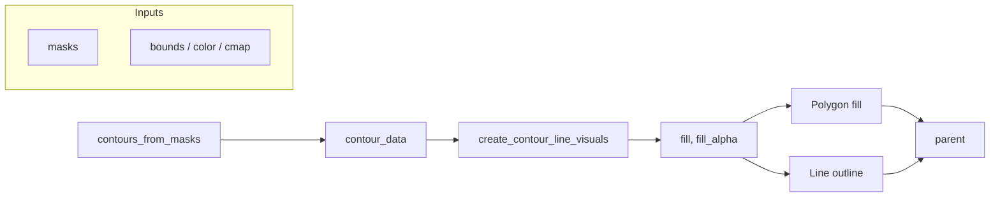

# Add Translucent Fill for Contour Lines

## Scope

- **File**: [vispy_helpers.py](h:\TEMP\Spike3DEnv_ExploreUpgrade\Spike3DWorkEnv\pyPhoPlaceCellAnalysis\src\pyphoplacecellanalysis\Pho2D\vispy\vispy_helpers.py) (contour helpers and `VispyHelpers.render_contours`).
- **Callers**: [PredictiveDecodingComputations.py](h:\TEMP\Spike3DEnv_ExploreUpgrade\Spike3DWorkEnv\pyPhoPlaceCellAnalysis\src\pyphoplacecellanalysis\General\Pipeline\Stages\ComputationFunctions\MultiContextComputationFunctions\PredictiveDecodingComputations.py) uses `create_contour_line_visuals` and `contours_from_masks`; no API change required for existing call sites (new args optional with backward‑compatible defaults).

## Approach

- Use **vispy `vz.Polygon**` for the fill (already used elsewhere in the codebase, e.g. `PredictiveDecodingComputations.py` line 8563: `pos`, `color`, `border_color`, `border_width`, `parent`).
- Fill color = same RGB as the contour line, with a **default fill alpha** (e.g. `0.3`) so the fill is translucent by default.
- Draw **fill first** (lower `order`), then **Line on top** so the outline stays crisp.
- Ensure each contour is **closed** for the polygon (skimage `find_contours` can return open contours on the image boundary); close by appending the first point to the end when the last point is not already equal to the first.

## Implementation

### 1. Helper: closed polygon vertices

- Add a small helper (e.g. `_ensure_closed_pos(pos: NDArray) -> NDArray`) that returns `pos` unchanged if `pos[0]` and `pos[-1]` are close (e.g. within 1e-6), otherwise returns `np.vstack([pos, pos[0:1]])` so vispy Polygon gets a closed loop.

### 2. `create_contour_line_visuals`

- **Signature** (single line per project rules): add optional `fill: bool = False`, `fill_alpha: Optional[float] = 0.3` (when `None`, use a default, e.g. `0.3`).
- **Behavior**:
  - For each `(pos, rgba)` in `contour_data`:
    - If `fill` is True:
      - `pos_closed = _ensure_closed_pos(pos)`.
      - Fill RGBA = `(rgba[0], rgba[1], rgba[2], fill_alpha if fill_alpha is not None else 0.3)`.
      - Create `vz.Polygon(pos=pos_closed, color=fill_rgba, border_width=0, parent=parent)` (no border; line draws the outline), set `polygon.order = order - 1` so fill is behind the line.
      - Append polygon to a list (for internal use; see return below).
    - Create `vz.Line(pos=pos, color=rgba, width=line_width, parent=parent)` and set `line.order = order`; append to `lines` as now.
- **Return**: keep current return type `List` of Line visuals only (backward compatible). Polygon visuals are attached to `parent` but not returned; if needed later, return type could be extended (e.g. return a tuple of `(line_list, polygon_list)` when `fill=True`), but for the requested feature, attaching polygons to the scene is sufficient.

### 3. `VispyHelpers.render_contours`

- Add optional parameters: `fill: bool = False`, `fill_alpha: Optional[float] = 0.3`.
- When `parents is not None`, pass `fill` and `fill_alpha` through to `create_contour_line_visuals(..., fill=fill, fill_alpha=fill_alpha)`.
- No change to return type: still `contour_data` only, or `(contour_data, line_lists)` when parents are given.

### 4. Optional: `__main__` example

- In the `if __name__ == '__main__'` block, optionally call `create_contour_line_visuals(..., fill=True, fill_alpha=0.3)` so the fill can be verified visually (minimal change).

## Data flow (summary)

## Edge cases

- **Empty or degenerate contours**: If `pos` has fewer than 3 points, skip creating a Polygon (vispy may not handle it); still create the Line if desired, or skip both (current code does not filter by point count; can add `if len(pos) >= 3` for the polygon branch only).
- **Multiple contours per mask**: Already supported; each `(pos, rgba)` gets its own Polygon (when fill=True) and Line.

## Files to touch

| File                                                                                                                                                | Changes                                                                                                                                                                                                     |
| --------------------------------------------------------------------------------------------------------------------------------------------------- | ----------------------------------------------------------------------------------------------------------------------------------------------------------------------------------------------------------- |
| [vispy_helpers.py](h:\TEMP\Spike3DEnv_ExploreUpgrade\Spike3DWorkEnv\pyPhoPlaceCellAnalysis\src\pyphoplacecellanalysis\Pho2D\vispy\vispy_helpers.py) | Add `_ensure_closed_pos`; extend `create_contour_line_visuals` with `fill`, `fill_alpha` and Polygon creation; extend `VispyHelpers.render_contours` with `fill`, `fill_alpha`; optional `__main__` update. |

No changes to [PredictiveDecodingComputations.py](h:\TEMP\Spike3DEnv_ExploreUpgrade\Spike3DWorkEnv\pyPhoPlaceCellAnalysis\src\pyphoplacecellanalysis\General\Pipeline\Stages\ComputationFunctions\MultiContextComputationFunctions\PredictiveDecodingComputations.py) required for the feature; callers can opt in later with `fill=True` and optional `fill_alpha` if exposed there.