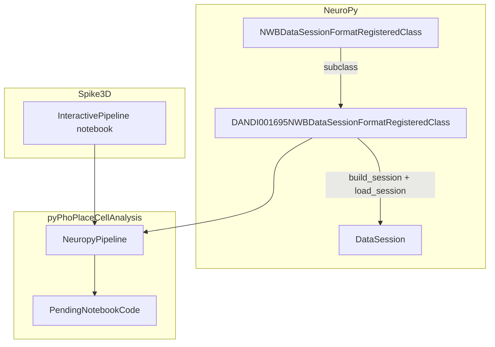

# DANDI 001695 HighDensityCrossBrain Session Type + Pipeline Notebook

## Reference implementation

Mirror the completed **DANDI 001754 / ThreeDimSpatial** work:

| Artifact | 001754 (done) | 001695 (this plan) |
|----------|---------------|---------------------|
| Format class | [`DANDI001754NWBDataSessionFormat.py`](h:\TEMP\Spike3DEnv_ExploreUpgrade\Spike3DWorkEnv\NeuroPy\neuropy\core\session\Formats\Specific\DANDI001754NWBDataSessionFormat.py) | `DANDI001695NWBDataSessionFormat.py` |
| Format key | `dandi_nwb_001754` | `dandi_nwb_001695` |
| Loader | `DataSessionLoader.dandi_nwb_001754_session` | `DataSessionLoader.dandi_nwb_001695_session` |
| Notebook | [`ThreeDimSpatial/InteractivePipelineLoadFromPickle_DANDI_ThreeDimSpatial_sub-Rat1.ipynb`](h:\TEMP\Spike3DEnv_ExploreUpgrade\Spike3DWorkEnv\Spike3D\ThreeDimSpatial\InteractivePipelineLoadFromPickle_DANDI_ThreeDimSpatial_sub-Rat1.ipynb) | `HighDensityCrossBrain/InteractivePipelineLoadFromPickle_DANDI_HighDensityCrossBrain_sub-M01.ipynb` |
| Plan | [dandi_001754_session_type_cb62bcfd.plan.md](h:\TEMP\Spike3DEnv_ExploreUpgrade\Spike3DWorkEnv\Spike3D\.cursor\plans\dandi_001754_session_type_cb62bcfd.plan.md) | this file |

## Why a new format (not extend `dandi_nwb` or `dandi_nwb_001754`)

The existing [`NWBDataSessionFormatRegisteredClass`](h:\TEMP\Spike3DEnv_ExploreUpgrade\Spike3DWorkEnv\NeuroPy\neuropy\core\session\Formats\Specific\NWBDataSessionFormat.py) (`dandi_nwb`) is coupled to DANDI **000978** W-maze data. [`DANDI001754NWBDataSessionFormatRegisteredClass`](h:\TEMP\Spike3DEnv_ExploreUpgrade\Spike3DWorkEnv\NeuroPy\neuropy\core\session\Formats\Specific\DANDI001754NWBDataSessionFormat.py) handles Neurolab task epochs (`ES`/`MC`/`BL`). DANDI **001695** is a third distinct layout:

| Aspect | 000978 (`dandi_nwb`) | 001754 (`dandi_nwb_001754`) | 001695 (`sub-M01`) |
|--------|----------------------|-----------------------------|---------------------|
| Position path | `behavior/Position/SpatialSeries` | `behavior/position/spatial_series` | `behavior/AnimalPosition/Position` |
| Epochs | `epoch intervals` + run/sleep heuristic | `intervals/epochs` + `session_type` | `intervals/SleepStates` (WAKE/NREM/REM/Ripple) or `Odor Stimulus` |
| Unit area filter | `electrodes.location` exact | `electrodes.location` substring | `cell_area` column (CA1, CA3, RSC) |
| Sessions per subject | 1 NWB / folder | 3 NWBs / folder | **5 NWBs / folder** |
| Linearization | W-maze `track_graph` | UMAP (video pixels) | UMAP / open-field (no track graph) |
| Ripples | computed on load | computed on load | **pre-labeled** in `SleepStates` as `Ripple` |

**Subclass** `NWBDataSessionFormatRegisteredClass` (same pattern as 001754), overriding only 001695-specific methods. Do not modify `dandi_nwb` or `dandi_nwb_001754`.

## Data layout (confirmed on disk)

```
H:\Data\DANDI\HighDensityCrossBrain\001695\sub-M01\
  sub-M01_ses-20240308T100000_ecephys.nwb              # spikes + odor trials; no position
  sub-M01_ses-20240312T100000_behavior+ecephys.nwb   # default demo
  sub-M01_ses-20240313T100000_behavior+ecephys.nwb
  sub-M01_ses-20240314T100000_behavior+ecephys.nwb
  sub-M01_ses-20240318T100000_behavior+ecephys.nwb
```

- **Position** (behavior sessions): 2D `(x, y)` at `processing/behavior/AnimalPosition/Position` (~35k–58k samples)
- **Speed**: `processing/behavior/Speed` (separate timestamps)
- **Units**: 212–541 units/session; filter via `cell_area`; types include Pyramidal Cell, Narrow/Wide Interneuron
- **Sleep states**: WAKE, NREM, REM, Ripple (145–1863 intervals/session)
- **LFP**: `Best_Ripple_channel_LFP_CA1` (out of scope for v1)

## Architecture



## 1. New session format class (NeuroPy)

**Create** [`NeuroPy/neuropy/core/session/Formats/Specific/DANDI001695NWBDataSessionFormat.py`](h:\TEMP\Spike3DEnv_ExploreUpgrade\Spike3DWorkEnv\NeuroPy\neuropy\core\session\Formats\Specific\DANDI001695NWBDataSessionFormat.py)

Subclass `NWBDataSessionFormatRegisteredClass`; copy structural patterns from [`DANDI001754NWBDataSessionFormat.py`](h:\TEMP\Spike3DEnv_ExploreUpgrade\Spike3DWorkEnv\NeuroPy\neuropy\core\session\Formats\Specific\DANDI001754NWBDataSessionFormat.py).

| Method / property | Change |
|-------------------|--------|
| `_session_class_name` | `"dandi_nwb_001695"` |
| `_session_default_relative_basedir` | `HighDensityCrossBrain/001695/sub-M01` |
| `_session_default_basedir` | `H:/Data/DANDI/HighDensityCrossBrain/001695/sub-M01` |
| `_dandiset_id` | `"001695"` |
| `_default_nwb_filename` | `sub-M01_ses-20240312T100000_behavior+ecephys.nwb` |
| `parse_session_basepath_to_context` | `animal=M01`, `exper_name=001695`, `session_name` from `ses-*` in selected NWB filename |
| `build_session` | Override to resolve `nwb_filename` before building context (same as 001754) |
| `get_session_name` / `_build_file_prefix` | Use `ses-YYYYMMDD` stem so caches don't collide across 5 NWBs: `export/001695/M01/ses-20240312/` |
| `find_nwb_file` | Require `nwb_filename` when multiple `.nwb` exist (error listing candidates) |
| `_get_position_spatial_series` | Read `processing["behavior"]["AnimalPosition"]["Position"]`; raise clear error for ecephys-only files |
| `_load_position_from_nwb` | If AnimalPosition uses non-standard interface, read `data` + `timestamps` directly via pynwb/h5py fallback |
| `_load_paradigm_from_nwb` | `epoch_label_mode="sleep_states"`: map `intervals["SleepStates"]` → indexed labels `WAKE0`, `NREM0`, … (count per state); `behavior` column (`wake`, `nrem`, `rem`, `ripple`); for ecephys-only use `intervals["Odor Stimulus"]` with odor identity labels |
| `_load_neurons_from_nwb` | Filter by `cell_area == unit_location_filter`; map `cell_type` → `pyr`/`int` via `NeuronType.from_any_string_series` |
| `load_session` | After core load, populate `session.ripple` from SleepStates rows where `state == "Ripple"` (before `_default_extended_postload` ripple computation fallback) |
| `_get_session_specific_parameters` | `non_global_activity_session_names` = WAKE epoch labels; `global_session_name` = `activity_GLOBAL`; `grid_bin_bounds` from typical position extent (computed or padded); `linearization_parameters` = `method='umap'` |
| `_get_activity_epoch_labels` | Return labels where `behavior == 'wake'` |
| `_ensure_standard_paradigm_epoch_labels` | No-op |
| `session_fixup_epochs` | Add `activity_GLOBAL` spanning first→last WAKE epoch (mirror 001754 `task_GLOBAL` logic) |
| `POSTLOAD_estimate_laps_and_replays` | Reuse 001754 pattern: laps on WAKE periods, PBE/replay on non-running complement; warn-and-continue on replay failures |
| `build_session_basedirs_dict` | Discover `HighDensityCrossBrain/001695/sub-*` with behavior+ecephys NWBs |

**Preprocessing defaults** (`build_default_preprocessing_parameters`):

```python
preprocessing_parameters.nwb = DynamicContainer(
    unit_location_filter='CA1',
    nwb_filename='sub-M01_ses-20240312T100000_behavior+ecephys.nwb',
    epoch_label_mode='sleep_states',
    export_root=None,
    force_recompute_linear_position=False,
)
```

**Register** via metaclass inheritance (import triggers registration; no registry edits).

## 2. Loader convenience (NeuroPy)

**Update** [`data_session_loader.py`](h:\TEMP\Spike3DEnv_ExploreUpgrade\Spike3DWorkEnv\NeuroPy\neuropy\core\session\data_session_loader.py):

```python
@staticmethod
def dandi_nwb_001695_session(basedir=r'H:/Data/DANDI/HighDensityCrossBrain/001695/sub-M01', override_parameters_flat_keypaths_dict=None):
    from neuropy.core.session.Formats.Specific.DANDI001695NWBDataSessionFormat import DANDI001695NWBDataSessionFormatRegisteredClass
    ...
```

## 3. Pipeline integration (pyPhoPlaceCellAnalysis)

Minimal hooks modeled on [`dandi_nwb_001754` branches](h:\TEMP\Spike3DEnv_ExploreUpgrade\Spike3DWorkEnv\pyPhoPlaceCellAnalysis\src\pyphoplacecellanalysis\General\Pipeline\NeuropyPipeline.py):

| File | Change |
|------|--------|
| [`NeuropyPipeline.py`](h:\TEMP\Spike3DEnv_ExploreUpgrade\Spike3DWorkEnv\pyPhoPlaceCellAnalysis\src\pyphoplacecellanalysis\General\Pipeline\NeuropyPipeline.py) | Treat `dandi_nwb_001695` like `dandi_nwb_001754` for `ensure_preprocessing_epoch_estimation_parameters` on pickle reload; add to `skip_save_on_initial_load` format set |
| [`NonInteractiveProcessing.py`](h:\TEMP\Spike3DEnv_ExploreUpgrade\Spike3DWorkEnv\pyPhoPlaceCellAnalysis\src\pyphoplacecellanalysis\General\Batch\NonInteractiveProcessing.py) | Import new class (`# noqa: F401` registers format for `batch_load_session`) |
| [`PendingNotebookCode.py`](h:\TEMP\Spike3DEnv_ExploreUpgrade\Spike3DWorkEnv\pyPhoPlaceCellAnalysis\src\pyphoplacecellanalysis\SpecificResults\PendingNotebookCode.py) | Add `build_DANDI001695_all_epochs_df` (color WAKE=Greens, NREM=Blues, REM=Purples, Ripple=Oranges); branch in `build_proper_epoch_intervals`; reject `track_graph` linearization for this format |
| [`batch_user_completion_helpers.py`](h:\TEMP\Spike3DEnv_ExploreUpgrade\Spike3DWorkEnv\pyPhoPlaceCellAnalysis\src\pyphoplacecellanalysis\General\Batch\BatchJobCompletion\UserCompletionHelpers\batch_user_completion_helpers.py) | Add `dandi_nwb_001695` to `_MULTI_CONTEXT_DECODER_SUPPORTED_FORMATS` and `_SPYGLASS_CLUSTERLESS_SUPPORTED_FORMATS` frozensets |

## 4. Sample notebook (Spike3D)

**Create** [`Spike3D/HighDensityCrossBrain/InteractivePipelineLoadFromPickle_DANDI_HighDensityCrossBrain_sub-M01.ipynb`](h:\TEMP\Spike3DEnv_ExploreUpgrade\Spike3DWorkEnv\Spike3D\HighDensityCrossBrain\InteractivePipelineLoadFromPickle_DANDI_HighDensityCrossBrain_sub-M01.ipynb)

Structure mirrors [`ThreeDimSpatial/InteractivePipelineLoadFromPickle_DANDI_ThreeDimSpatial_sub-Rat1.ipynb`](h:\TEMP\Spike3DEnv_ExploreUpgrade\Spike3DWorkEnv\Spike3D\ThreeDimSpatial\InteractivePipelineLoadFromPickle_DANDI_ThreeDimSpatial_sub-Rat1.ipynb):

1. **Setup** — `%autoreload`, `%gui qt5`, standard Pho imports, `NeuropyPipeline`, `PendingNotebookCode` helpers
2. **Config** — `REPO_ROOT = H:\Data\DANDI\HighDensityCrossBrain`, `DATA_ROOT = …/001695`, `SESSION_BASEDIR = …/sub-M01`, `NWB_FILENAME` selector, `UNIT_LOCATION_FILTER = 'CA1'`, `active_data_mode_name = 'dandi_nwb_001695'`
3. **NWB inventory** — list 5 files; note ecephys-only (2024-03-08) lacks position
4. **NWB probe** — direct `pynwb` read: SleepStates counts, `cell_area`/`cell_type` breakdown, position shape
5. **Load session** — `DataSessionLoader.dandi_nwb_001695_session(...)`; verify export cache under `export/001695/M01/ses-…/`
6. **POSTLOAD** — `DANDI001695NWBDataSessionFormatRegisteredClass.POSTLOAD_estimate_laps_and_replays(sess)`; show epochs + laps
7. **Load pipeline** — `NeuropyPipeline.try_init_from_saved_pickle_or_reload_if_needed(...)`; pickle at `basedir/loadedSessPickle.pkl`
8. **Session QC** — context, neuron count, position bounds, subsampled trajectory colored by WAKE epochs
9. **Pipeline processing** — epoch filters (`WAKE0`, `activity_GLOBAL`), `session_fixup_epochs`, `final_process_bapun_all_comps`, placefield/decoding computations (same `active_computation_functions_name_includelist` pattern as ThreeDimSpatial notebook)
10. **Visualization** — spike raster + `build_proper_epoch_intervals`, basic placefield / decode plots
11. **Save pickle** — confirm `loadedSessPickle.pkl` reload on second run

## 5. Unit tests (NeuroPy)

**Create** [`NeuroPy/tests/test_dandi_001695_nwb_data_session_format.py`](h:\TEMP\Spike3DEnv_ExploreUpgrade\Spike3DWorkEnv\NeuroPy\tests\test_dandi_001695_nwb_data_session_format.py)

Mirror [`test_nwb_data_session_format.py`](h:\TEMP\Spike3DEnv_ExploreUpgrade\Spike3DWorkEnv\NeuroPy\tests\test_nwb_data_session_format.py) + 001754 patterns:

- Format registers as `dandi_nwb_001695`
- `DataSessionLoader.dandi_nwb_001695_session` exists
- Context parsing from `sub-M01` + `nwb_filename`
- `find_nwb_file` raises when multiple files and no override
- `_load_paradigm_from_nwb` synthetic SleepStates → indexed WAKE/NREM labels
- `_load_neurons_from_nwb` filters by `cell_area`

Optional integration test gated on `H:\Data\DANDI\HighDensityCrossBrain\001695\sub-M01` (`pytest.mark.skipif`).

## 6. Verification

```powershell
cd NeuroPy && uv run pytest tests/test_dandi_001695_nwb_data_session_format.py -q
```

```powershell
uv run python -c "
from pathlib import Path
from neuropy.core.session.Formats.Specific.DANDI001695NWBDataSessionFormat import DANDI001695NWBDataSessionFormatRegisteredClass as F
basedir = Path(r'H:\Data\DANDI\HighDensityCrossBrain\001695\sub-M01')
sess = F.get_session(basedir, override_parameters_flat_keypaths_dict={'nwb.nwb_filename': 'sub-M01_ses-20240312T100000_behavior+ecephys.nwb'})
print(sess.get_context())
print('neurons:', len(sess.neurons), 'epochs:', sess.epochs.get_unique_labels())
"
```

Then execute the notebook through pipeline load + computation cells; confirm pickle reload on second run.

## Out of scope for v1

- LFP / `Signal` loading (`Best_Ripple_channel_LFP_CA1`)
- Ecephys-only odor session full pipeline (notebook documents it; pipeline requires position)
- Batch scripts across all subjects (M02, M03, …)
- Modifying existing `dandi_nwb` / `dandi_nwb_001754` behavior

## Key design choices

- **Format key**: `dandi_nwb_001695` (explicit dandiset ID; consistent with `dandi_nwb_001754`)
- **Default session**: `sub-M01_ses-20240312T100000_behavior+ecephys.nwb` (representative behavior+ecephys)
- **Cache layout**: `export/001695/M01/ses-20240312/*.npy` (one cache per NWB file)
- **Epoch naming**: `WAKE0`, `NREM0`, … indexed per state occurrence; `activity_GLOBAL` for multi-context decoders
- **Ripples**: load pre-labeled `Ripple` intervals from NWB into `session.ripple` (skip recomputation when present)

## Files touched (summary)

| File | Action |
|------|--------|
| `NeuroPy/.../DANDI001695NWBDataSessionFormat.py` | **Create** (~350–450 lines) |
| `NeuroPy/.../data_session_loader.py` | Add `dandi_nwb_001695_session` |
| `NeuroPy/tests/test_dandi_001695_nwb_data_session_format.py` | **Create** |
| `pyPhoPlaceCellAnalysis/.../NeuropyPipeline.py` | Add `dandi_nwb_001695` branches |
| `pyPhoPlaceCellAnalysis/.../NonInteractiveProcessing.py` | Import for registration |
| `pyPhoPlaceCellAnalysis/.../PendingNotebookCode.py` | `build_DANDI001695_all_epochs_df` + branches |
| `pyPhoPlaceCellAnalysis/.../batch_user_completion_helpers.py` | Add to format allowlists |
| `Spike3D/HighDensityCrossBrain/InteractivePipelineLoadFromPickle_DANDI_HighDensityCrossBrain_sub-M01.ipynb` | **Create** |
