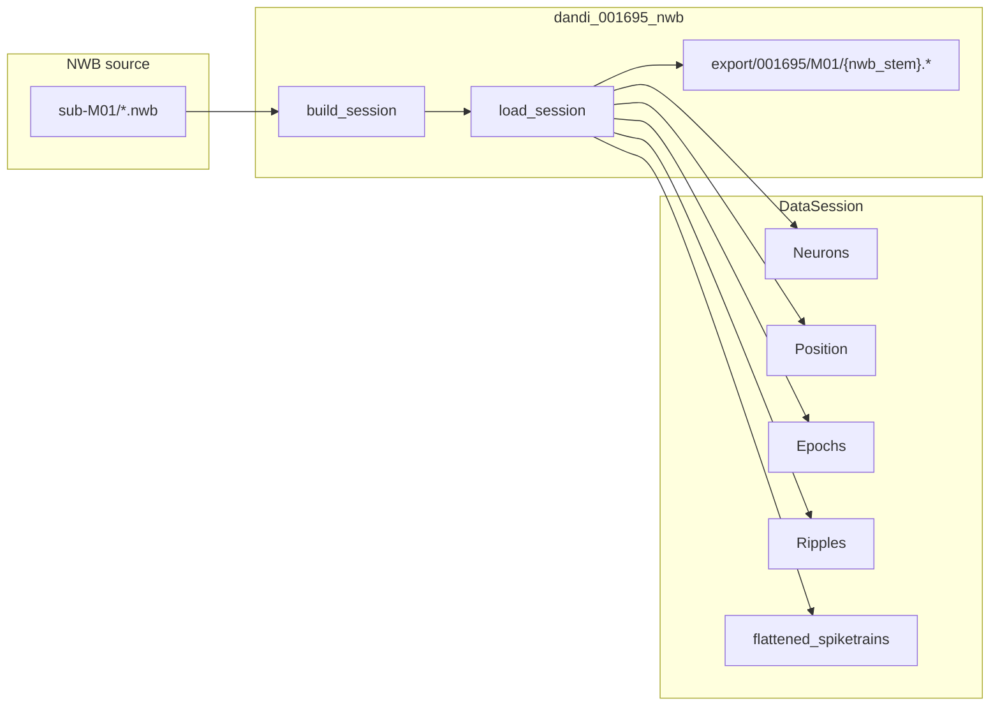

# DANDI 001695 HighDensityCrossBrain Session Format

## Context

DANDI [001695](https://dandiarchive.org/dandiset/001695) (`H:\Data\DANDI\HighDensityCrossBrain\001695\sub-M01`) differs materially from the existing `[dandi_nwb](h:\TEMP\Spike3DEnv_ExploreUpgrade\Spike3DWorkEnv\NeuroPy\neuropy\core\session\Formats\Specific\NWBDataSessionFormat.py)` format (DANDI 000978 W-maze):


| Aspect          | 000978 (`dandi_nwb`)                              | 001695 (`sub-M01`)                                                |
| --------------- | ------------------------------------------------- | ----------------------------------------------------------------- |
| Folder layout   | 1 NWB per subject folder                          | **5 NWB files** in one subject folder                             |
| Position path   | `processing/behavior/Position/SpatialSeries`      | `processing/behavior/AnimalPosition/Position`                     |
| Epochs          | `intervals/epoch intervals` (run/sleep heuristic) | `intervals/SleepStates` (WAKE/NREM/REM/Ripple) or `Odor Stimulus` |
| Unit brain area | `electrodes.location`                             | `cell_area` (CA1, CA3, RSC)                                       |
| Linearization   | W-track graph (`w_maze`)                          | Not applicable (no known track graph)                             |
| LFP             | Not loaded                                        | `Best_Ripple_channel_LFP_CA1` available (out of scope for v1)     |


The new format will be **fully independent**: new registered class extending only `[DataSessionFormatBaseRegisteredClass](h:\TEMP\Spike3DEnv_ExploreUpgrade\Spike3DWorkEnv\NeuroPy\neuropy\core\session\Formats\BaseDataSessionFormats.py)`, no changes to `NWBDataSessionFormat`, `pyPhoPlaceCellAnalysis`, or existing pipeline notebooks.




## 1. New format class (NeuroPy)

**New file:** `[neuropy/core/session/Formats/Specific/HighDensityCrossBrainNWBDataSessionFormat.py](h:\TEMP\Spike3DEnv_ExploreUpgrade\Spike3DWorkEnv\NeuroPy\neuropy\core\session\Formats\Specific\HighDensityCrossBrainNWBDataSessionFormat.py)`

**Class:** `HighDensityCrossBrainNWBDataSessionFormatRegisteredClass`

**Registration key:** `_session_class_name = "dandi_001695_nwb"`

### Identity and paths

- **Default basedir:** `H:\Data\DANDI\HighDensityCrossBrain\001695\sub-M01`
- **Context keys:** `format_name`, `animal`, `exper_name`, `session_name`
  - `animal` ← `sub-M01` → `M01`
  - `exper_name` ← parent folder → `001695`
  - `session_name` ← parsed from NWB stem, e.g. `ses-20240312` from `sub-M01_ses-20240312T100000_behavior+ecephys.nwb`
- `**get_session_name`:** `M01_ses-20240312` (subject + session date)
- **Export cache stem** (per-NWB-file, avoids collisions in multi-file folder):

```python
export_root / "001695" / "M01" / nwb_path.stem
# e.g. .../export/001695/M01/sub-M01_ses-20240312T100000_behavior+ecephys
```

### Preprocessing parameters (`preprocessing_parameters.nwb`)


| Parameter              | Default                                                       | Purpose                     |
| ---------------------- | ------------------------------------------------------------- | --------------------------- |
| `nwb_filename`         | **required** when `basedir` has multiple `.nwb`               | disambiguate among 5 files  |
| `unit_location_filter` | `"CA1"`                                                       | filter units by `cell_area` |
| `export_root`          | `None` → auto-derive as sibling `export/` under dandiset root | cache location              |


### `find_nwb_file` (stricter than 000978)

- Accept `basedir` as subject folder **or** direct `.nwb` path
- If multiple `.nwb` files and `nwb_filename` is unset → `**FileNotFoundError**` listing candidates (do not silently pick first)
- If `nwb_filename` set → use that file

### `load_session` flow

Mirror the proven NWB cache pattern from `NWBDataSessionFormat`, but with 001695-specific extraction:

1. `_fallback_recinfo` → set `filePrefix`, create export dir
2. If core cache exists → load `.neurons.npy`, `.position.npy` (if applicable), `.paradigm.npy`
3. Else → `_load_session_from_nwb` via `pynwb.NWBHDF5IO`, then `_save_core_cache_files`
4. `_load_or_compute_flattened_spikes` → `.flattened.spikes.npy`
5. **Skip** W-track / UMAP linearization (no `lin_pos` in v1)
6. If position exists → `_default_compute_spike_interpolated_positions_if_needed`
7. `_default_extended_postload` (MUA/PBE fallbacks from base; ripples loaded from NWB when available)

### NWB extraction details

**Neurons** (`_load_neurons_from_nwb`):

- Read `nwbf.units.to_dataframe()`
- Filter by `cell_area == unit_location_filter` (not `electrodes.location`)
- Map `cell_type` → NeuroPy neuron types: `Pyramidal Cell` → `pyr`, interneuron types → `int`
- Use `spike_times - t0` for relative timestamps; `t_stop` from last position timestamp or max spike time

**Position** (`_load_position_from_nwb`) — behavior+ecephys sessions only:

- `nwbf.processing["behavior"]["AnimalPosition"]["Position"]` → `x, y` from `data[:, 0:2]`, timestamps relative to `t0`
- Optionally merge speed from `processing["behavior"]["Speed"]` into position dataframe (interpolate to position timestamps if needed)

**Epochs / paradigm** (`_load_paradigm_from_nwb`):

- **Behavior sessions:** `intervals["SleepStates"]` → `Epoch` with `label = state` (WAKE, NREM, REM, Ripple), columns `start`/`stop` relative to `t0`
- **Ecephys-only session (2024-03-08):** `intervals["Odor Stimulus"]` → epoch rows labeled from odor identity column

**Ripples** (during load, not computed):

- Extract `SleepStates` rows where `state == "Ripple"` → `session.ripple` as `Epoch` object
- Skip for ecephys-only / odor sessions (no SleepStates)

**Ecephys-only handling:**

- Core cache requires only `neurons` + `paradigm` (position optional)
- Skip position-dependent steps (interpolation, speed QC) gracefully

### What we deliberately omit (v1)

- W-maze lap estimation, PBE/replay POSTLOAD hooks (not needed for load/QC notebook)
- LFP / `Signal` loading
- Changes to `pyPhoPlaceCellAnalysis` pipeline format guards
- Inheritance from or edits to `NWBDataSessionFormat`

### `HardcodedProcessingParameters`

Minimal defaults keyed by `IdentifyingContext(format_name='dandi_001695_nwb', ...)`:

- `non_global_activity_session_names = ['WAKE']` (for any epoch-filter helpers)
- `grid_bin_bounds` left `None` initially; notebook can compute from loaded position extrema

### `build_session_basedirs_dict`

Scan `HighDensityCrossBrain/001695/sub-*` folders; register one context per `(subject, nwb_file)` pair that exists on disk.

## 2. DataSessionLoader entry point

**Edit:** `[neuropy/core/session/data_session_loader.py](h:\TEMP\Spike3DEnv_ExploreUpgrade\Spike3DWorkEnv\NeuroPy\neuropy\core\session\data_session_loader.py)`

Add:

```python
@staticmethod
def dandi_001695_nwb_session(basedir=r'H:\Data\DANDI\HighDensityCrossBrain\001695\sub-M01', override_parameters_flat_keypaths_dict=None):
    from neuropy.core.session.Formats.Specific.HighDensityCrossBrainNWBDataSessionFormat import HighDensityCrossBrainNWBDataSessionFormatRegisteredClass
    ...
```

## 3. Unit tests (NeuroPy)

**New file:** `[NeuroPy/tests/test_hdcb_nwb_data_session_format.py](h:\TEMP\Spike3DEnv_ExploreUpgrade\Spike3DWorkEnv\NeuroPy\tests\test_hdcb_nwb_data_session_format.py)`

Mirror `[test_nwb_data_session_format.py](h:\TEMP\Spike3DEnv_ExploreUpgrade\Spike3DWorkEnv\NeuroPy\tests\test_nwb_data_session_format.py)` patterns (no live NWB required):

- Format registers as `dandi_001695_nwb`
- `DataSessionLoader.dandi_001695_nwb_session` exists
- Context parsing from `sub-M01` path + `nwb_filename`
- `find_nwb_file` raises when multiple files and no override
- Session name parsing from NWB stem (`M01_ses-20240312`)
- Synthetic SleepStates → paradigm DataFrame conversion

Optional integration test gated on `H:\Data\DANDI\HighDensityCrossBrain\001695\sub-M01` existing (`pytest.mark.skipif`).

## 4. Sample notebook (Spike3D)

**New file:** `[Spike3D/nwb_001695_hdcb_neuropy_pipeline.ipynb](h:\TEMP\Spike3DEnv_ExploreUpgrade\Spike3DWorkEnv\Spike3D\nwb_001695_hdcb_neuropy_pipeline.ipynb)`

Modeled on `[nwb_000978_neuropy_pipeline.ipynb](h:\TEMP\Spike3DEnv_ExploreUpgrade\Spike3DWorkEnv\Spike3D\nwb_000978_neuropy_pipeline.ipynb)` (load + QC only):


| Section   | Content                                                                                                                                                   |
| --------- | --------------------------------------------------------------------------------------------------------------------------------------------------------- |
| Setup     | `%autoreload`, imports, path constants                                                                                                                    |
| Config    | `DATA_ROOT`, `SESSION_BASEDIR`, `NWB_FILENAME` (default: `sub-M01_ses-20240312T100000_behavior+ecephys.nwb`), `UNIT_LOCATION_FILTER='CA1'`, `EXPORT_ROOT` |
| Discovery | List all 5 `.nwb` files; select via `find_nwb_file`                                                                                                       |
| NWB probe | Direct `pynwb` read: intervals, units by `cell_area`/`cell_type`, position shape                                                                          |
| Load      | `DataSessionLoader.dandi_001695_nwb_session(...)` with `override_parameters_flat_keypaths_dict`                                                           |
| QC        | Neuron counts, position duration, speed via `position.compute_speed_info()`, subsampled trajectory plot                                                   |
| Epochs    | Sleep-state duration table; ripple interval count from `sess.ripple`                                                                                      |
| Cache     | List export `.npy` artifacts under `sess.filePrefix`                                                                                                      |


Notebook will document how to switch `NWB_FILENAME` for other sessions (including the ecephys-only odor session).

## 5. Verification

After implementation:

```bash
cd NeuroPy && uv run pytest tests/test_hdcb_nwb_data_session_format.py -q
```

Manual: run the new notebook against `sub-M01` with default behavior+ecephys file; confirm cache write under `export/001695/M01/` and reload from cache on second run.

## Files touched (summary)


| File                                                       | Action                         |
| ---------------------------------------------------------- | ------------------------------ |
| `NeuroPy/.../HighDensityCrossBrainNWBDataSessionFormat.py` | **Create** (~400–500 lines)    |
| `NeuroPy/.../data_session_loader.py`                       | Add `dandi_001695_nwb_session` |
| `NeuroPy/tests/test_hdcb_nwb_data_session_format.py`       | **Create**                     |
| `Spike3D/nwb_001695_hdcb_neuropy_pipeline.ipynb`           | **Create**                     |


No edits to existing session format classes or pipeline format guards.