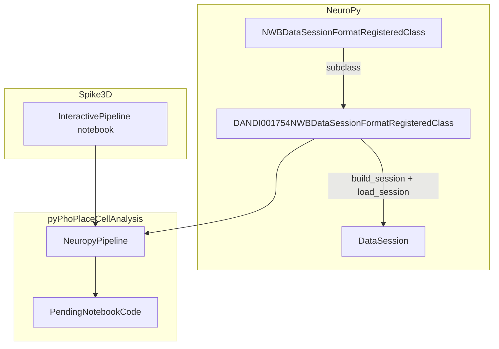

# DANDI 001754 NWB Session Type + Pipeline Notebook

## Why a new format (not extend `dandi_nwb`)

The existing [`NWBDataSessionFormatRegisteredClass`](h:\TEMP\Spike3DEnv_ExploreUpgrade\Spike3DWorkEnv\NeuroPy\neuropy\core\session\Formats\Specific\NWBDataSessionFormat.py) (`dandi_nwb`) is tightly coupled to DANDI **000978** W-maze data:

| Aspect | 000978 (`dandi_nwb`) | 001754 (`sub-Rat1`) |
|--------|----------------------|---------------------|
| Position path | `behavior/Position/SpatialSeries` | `behavior/position/spatial_series` (lowercase) |
| Epochs | `intervals["epoch intervals"]` + alternating run/sleep heuristic | `intervals["epochs"]` with `session_type` (`ES`, `MC`, `BL`) |
| Unit location filter | `"CA1"` | `"hippocampal area CA1"` |
| Sessions per subject | 1 NWB / folder | 3 NWBs / folder (must select by filename) |
| Linearization | W-maze `track_graph` | Open-field / task tracks in **video pixels** (no W-maze graph) |
| Pipeline assumptions | `maze0`…`maze7`, W-maze PBE/replay helpers | Task epochs (`ES*`, `MC*`, `BL*`) |

Extending `dandi_nwb` would risk breaking 000978 behavior and scatter W-maze logic across conditionals. **Subclass** the existing NWB loader (same pattern as [`RachelDataSessionFormat`](h:\TEMP\Spike3DEnv_ExploreUpgrade\Spike3DWorkEnv\NeuroPy\neuropy\core\session\Formats\Specific\RachelDataSessionFormat.py) extending Bapun).

## Data layout (confirmed on disk)

```
H:\Data\DANDI\ThreeDimSpatial\001754\sub-Rat1\
  sub-Rat1_ses-19980414T125300_ecephys.nwb              # spikes only, no position
  sub-Rat1_ses-19980420T095700_behavior+ecephys.nwb   # Flight Day 4
  sub-Rat1_ses-19980425T124500_behavior+ecephys.nwb   # Flight Day 9 (default demo)
```

- Position: 2D video pixels `(n, 2)`, ~0–255 range
- Units: 35–47 CA1 units per session; columns `tetrode`, `cluster_id`, `spike_times`, `electrodes`
- Pre-computed rate maps available at `processing/ecephys/rate_maps` (notebook can visualize)

## Architecture



## 1. New session format class (NeuroPy)

**Create** [`NeuroPy/neuropy/core/session/Formats/Specific/DANDI001754NWBDataSessionFormat.py`](h:\TEMP\Spike3DEnv_ExploreUpgrade\Spike3DWorkEnv\NeuroPy\neuropy\core\session\Formats\Specific\DANDI001754NWBDataSessionFormat.py)

Subclass `NWBDataSessionFormatRegisteredClass` and override only 001754-specific behavior:

| Method / property | Change |
|-------------------|--------|
| `_session_class_name` | `"dandi_nwb_001754"` |
| `_session_default_relative_basedir` | `ThreeDimSpatial/001754/sub-Rat1` |
| `_session_basepath_to_context_parsing_keys` | `["format_name", "animal", "exper_name", "session_name"]` |
| `parse_session_basepath_to_context` | `animal=Rat1`, `exper_name=001754`, `session_name` from `ses-*` in selected NWB filename |
| `get_session_name` / `_build_file_prefix` | Include `ses-…` so caches don’t collide across the 3 NWBs per rat |
| `find_nwb_file` | Require `nwb_filename` when multiple `.nwb` exist (clear error listing candidates) |
| `_get_position_spatial_series` | Read `processing["behavior"]["position"].spatial_series["spatial_series"]`; raise if missing (ecephys-only files) |
| `_load_paradigm_from_nwb` | Map `intervals["epochs"]` → NeuroPy `Epoch` with labels `ES0`, `MC0`, `BL0`, … (index per `session_type`) and `behavior` column (`escher`, `magic_carpet`, `baseline`) |
| `_load_neurons_from_nwb` | Match CA1 via substring (`"CA1" in location`) instead of exact equality |
| `_get_session_specific_parameters` | Task-focused defaults: `non_global_activity_session_names` = ES+MC epoch labels; `global_session_name` = `task_GLOBAL`; `grid_bin_bounds` from position extent (with padding); `linearization_parameters` = `method='umap'` (no W-maze graph) |
| `_get_activity_epoch_labels` | Return labels where `behavior` in `escher`, `magic_carpet` |
| `_ensure_standard_paradigm_epoch_labels` | No-op (epochs already canonical) |
| `session_fixup_epochs` | Add `task_GLOBAL` spanning first→last ES/MC epoch (mirror W-maze `maze_GLOBAL` logic) |
| `POSTLOAD_estimate_laps_and_replays` | Reuse parent flow but with open-field lap params (`use_full_2D_lap_estimation=True`, no direction-dependent laps) |
| `build_session_basedirs_dict` | Discover `ThreeDimSpatial/001754/sub-Rat*` folders with behavior+ecephys NWBs |

**Preprocessing defaults** (`build_default_preprocessing_parameters`):

```python
preprocessing_parameters.nwb = DynamicContainer(
    unit_location_filter='CA1',  # substring match
    nwb_filename='sub-Rat1_ses-19980425T124500_behavior+ecephys.nwb',
    epoch_label_mode='session_type',
    export_root=None,
    force_recompute_linear_position=False,
)
```

**Register** via metaclass inheritance (no registry edits needed).

## 2. Loader convenience (NeuroPy)

**Update** [`data_session_loader.py`](h:\TEMP\Spike3DEnv_ExploreUpgrade\Spike3DWorkEnv\NeuroPy\neuropy\core\session\data_session_loader.py):

```python
@staticmethod
def dandi_nwb_001754_session(basedir, override_parameters_flat_keypaths_dict=None):
    ...
```

## 3. Pipeline integration (pyPhoPlaceCellAnalysis)

Minimal hooks so full `NeuropyPipeline` works (modeled on [`dandi_nwb` branches](h:\TEMP\Spike3DEnv_ExploreUpgrade\Spike3DWorkEnv\pyPhoPlaceCellAnalysis\src\pyphoplacecellanalysis\General\Pipeline\NeuropyPipeline.py)):

| File | Change |
|------|--------|
| [`NeuropyPipeline.py`](h:\TEMP\Spike3DEnv_ExploreUpgrade\Spike3DWorkEnv\pyPhoPlaceCellAnalysis\src\pyphoplacecellanalysis\General\Pipeline\NeuropyPipeline.py) | Treat `dandi_nwb_001754` like `dandi_nwb` for `ensure_preprocessing_epoch_estimation_parameters` on pickle reload |
| [`NonInteractiveProcessing.py`](h:\TEMP\Spike3DEnv_ExploreUpgrade\Spike3DWorkEnv\pyPhoPlaceCellAnalysis\src\pyphoplacecellanalysis\General\Batch\NonInteractiveProcessing.py) | Import new class (registers format for `batch_load_session`) |
| [`PendingNotebookCode.py`](h:\TEMP\Spike3DEnv_ExploreUpgrade\Spike3DWorkEnv\pyPhoPlaceCellAnalysis\src\pyphoplacecellanalysis\SpecificResults\PendingNotebookCode.py) | Add `build_DANDI001754_all_epochs_df` (color ES=red tones, MC=blue, BL=gray); branch in `build_proper_epoch_intervals`; branch linearization path to skip W-maze `track_graph` for this format |
| [`batch_user_completion_helpers.py`](h:\TEMP\Spike3DEnv_ExploreUpgrade\Spike3DWorkEnv\pyPhoPlaceCellAnalysis\src\pyphoplacecellanalysis\General\Batch\BatchJobCompletion\UserCompletionHelpers\batch_user_completion_helpers.py) | Add `dandi_nwb_001754` to `_MULTI_CONTEXT_DECODER_SUPPORTED_FORMATS` |

## 4. Sample notebook (Spike3D)

**Create** [`Spike3D/ThreeDimSpatial/InteractivePipelineLoadFromPickle_DANDI_ThreeDimSpatial_sub-Rat1.ipynb`](h:\TEMP\Spike3DEnv_ExploreUpgrade\Spike3DWorkEnv\Spike3D\ThreeDimSpatial\InteractivePipelineLoadFromPickle_DANDI_ThreeDimSpatial_sub-Rat1.ipynb)

Structure mirrors [`InteractivePipelineLoadFromPickle_DANDI_SingleDayWTrackLearning_sub-JDS-SingleDay-ER1.ipynb`](h:\TEMP\Spike3DEnv_ExploreUpgrade\Spike3DWorkEnv\Spike3D\SingleDayWTrackLearning\InteractivePipelineLoadFromPickle_DANDI_SingleDayWTrackLearning_sub-JDS-SingleDay-ER1.ipynb):

1. **Setup** — paths, `%autoreload`, imports
2. **Config** — `REPO_ROOT = H:\Data\DANDI\ThreeDimSpatial`, `DATA_ROOT = …/001754`, `SESSION_BASEDIR = …/sub-Rat1`, `NWB_FILENAME` selector, `UNIT_LOCATION_FILTER = 'CA1'`
3. **NWB inventory** — list 3 files; note ecephys-only file lacks position
4. **Load pipeline** — `active_data_mode_name = 'dandi_nwb_001754'`, `NeuropyPipeline.try_init_from_saved_pickle_or_reload_if_needed(...)`, pickle at `basedir/loadedSessPickle.pkl`
5. **Session QC** — context, neuron count, epoch table, position bounds, subsampled trajectory colored by epoch
6. **Rate maps** (optional) — read `processing/ecephys/rate_maps` from source NWB
7. **Pipeline processing** — epoch filters (`ES0`, `MC0`, `task_GLOBAL`), `pf_computation`, `pfdt_computation`, `position_decoding` (same `active_computation_functions_name_includelist` pattern as ER1 notebook)
8. **Visualization** — spike raster + `build_proper_epoch_intervals`, basic placefield / decode plots

Reference: DANDI’s official demo notebook `CatalystNeuro/001754_demo.ipynb` (linked from [DANDI example notebooks](https://dandi.github.io/example-notebooks/)) for NWB field names.

## 5. Verification

After implementation, run from Spike3D repo:

```powershell
uv run python -c "
from pathlib import Path
from neuropy.core.session.Formats.Specific.DANDI001754NWBDataSessionFormat import DANDI001754NWBDataSessionFormatRegisteredClass as F
basedir = Path(r'H:\Data\DANDI\ThreeDimSpatial\001754\sub-Rat1')
sess = F.get_session(basedir, override_parameters_flat_keypaths_dict={'nwb.nwb_filename': 'sub-Rat1_ses-19980425T124500_behavior+ecephys.nwb'})
print(sess.get_context())
print('neurons:', len(sess.neurons), 'epochs:', sess.epochs.get_unique_labels())
"
```

Then open the notebook and execute load + computation cells through placefield/decoding (confirm pickle reload works on second run).

## Out of scope for v1

- 3D track graph linearization for Escher Staircase (position is 2D video; true 3D reconstruction is future work)
- Batch scripts across all rats / all flight days
- Spyglass DataJoint ingestion (separate stack)
- Modifying existing `dandi_nwb` / 000978 behavior

## Key design choices

- **Format key**: `dandi_nwb_001754` (explicit dandiset ID; avoids overloading W-maze format)
- **Default session**: Flight Day 9 behavior+ecephys NWB (richest epoch set + longest recording)
- **Cache layout**: `export/001754/Rat1/ses-19980425T124500/*.npy` (one cache per NWB file)
- **Epoch naming**: `ES0`, `MC0`, `BL0`, … preserves NWB semantics and supports multi-context decoders
