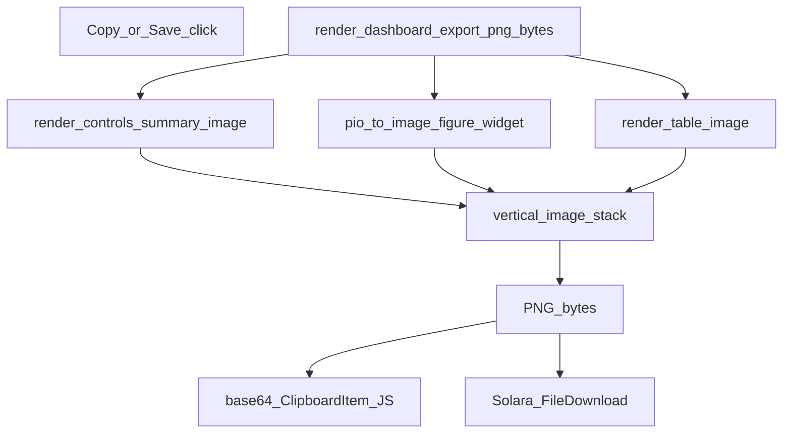

# Dashboard composite Copy/Save export

## Goal

Update `DataFrameFilter` so **Copy to Clipboard** and **Save Figure** export a single PNG that includes:

1. Top filter controls (current selections)
2. Central Plotly figure
3. Bottom filter-stats table (`table_widget.data`)

Exclude: hover-posterior preview and debug `output_widget`.

Approach: **Python composite** (reliable in Cursor/VS Code notebooks), reusing existing `pio.to_image` + clipboard JS + Solara download plumbing.

## Where

Primary file: [`pyPhoPlaceCellAnalysis/src/pyphoplacecellanalysis/SpecificResults/PhoDiba2023Paper.py`](h:/TEMP/Spike3DEnv_ExploreUpgrade/Spike3DWorkEnv/pyPhoPlaceCellAnalysis/src/pyphoplacecellanalysis/SpecificResults/PhoDiba2023Paper.py)

Leverage: [`vertical_image_stack`](h:/TEMP/Spike3DEnv_ExploreUpgrade/Spike3DWorkEnv/pyPhoCoreHelpers/src/pyphocorehelpers/plotting/media_output_helpers.py) in pyPhoCoreHelpers.

Do **not** change standalone [`add_copy_save_action_buttons`](h:/TEMP/Spike3DEnv_ExploreUpgrade/Spike3DWorkEnv/pyPhoPlaceCellAnalysis/src/pyphoplacecellanalysis/Pho2D/plotly/Extensions/plotly_helpers.py) (figure-only helper; no filter UI).

## Implementation

### 1. Collect current control state

Add `_collect_export_control_rows(self) -> List[Tuple[str, str]]` that reads live widget values:

- `replay_name_widget`, `time_bin_size_widget`
- `active_filter_predicate_selector_widget.value` (checked predicates)
- each widget in `custom_dynamic_filter_widgets_list` (description/value)
- `active_plot_df_name_selector_widget`, `active_plot_variable_name_widget`

Format multi-select values as comma-separated strings.

### 2. Render control + table panels as images

Add small helpers on `DataFrameFilter` (matplotlib Agg, no new deps):

- `_render_controls_summary_image()` — white panel of labeled key/value rows matching the control panel content
- `_render_dataframe_table_image(df)` — matplotlib table from `self.table_widget.data` when present (predicate impact table with `n_predicate_true_rows` etc.), else fall back to `filtered_size_info_df`

Convert figures to PIL via buffer/`savefig`.

### 3. Single export entry point

Add `_render_dashboard_export_png_bytes(self) -> bytes`:

1. Build controls image
2. `pio.to_image(self.figure_widget, format='png', ...)` (keep existing width/height kwargs)
3. Build table image from `self.table_widget.data`
4. `vertical_image_stack([controls, figure, table], padding=...)`
5. Return PNG bytes (`BytesIO`)

### 4. Wire Copy and Save

In `_setup_widgets_buttons` / `_subfn_on_copy_button_click` (~L3228): replace `pio.to_image(self.figure_widget, ...)` with `_render_dashboard_export_png_bytes()`; keep the existing base64 → canvas → `ClipboardItem` JS path.

Update `_build_solera_file_download_widget` (~L2620) to accept a callable `get_png_bytes` (default can remain figure-only for any other callers). Pass `get_png_bytes=self._render_dashboard_export_png_bytes` from `_setup_widgets_buttons` so Save Figure downloads the same composite. Filename sync via `on_widget_update_filename` stays unchanged.

## Out of scope

- DOM/`html2canvas` capture
- Hover posterior / `output_widget`
- Pixel-perfect widget chrome (dropdowns look like a text summary panel, not live HTML widgets)
- Changes to `add_copy_save_action_buttons`
