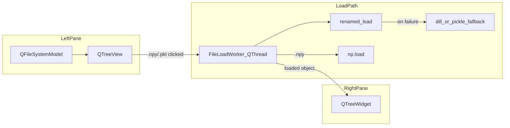

# Data File Inspector GUI

## Goal

Create one self-contained module at [`pyphocorehelpers/gui/Qt/data_file_inspector.py`](h:\TEMP\Spike3DEnv_ExploreUpgrade\Spike3DWorkEnv\pyPhoCoreHelpers\src\pyphocorehelpers\gui\Qt\data_file_inspector.py) with:

- **Left pane**: native filesystem tree (`QFileSystemModel` + `QTreeView`)
- **Right pane**: structure preview tree (`QTreeWidget`, 2 columns: Name / Info)
- **On `.npy` / `.pkl` selection**: attempt load in a `QThread`, then populate the preview tree
- **Runnable standalone** via `python -m pyphocorehelpers.gui.Qt.data_file_inspector [root_path]`

No new dependencies — Qt is already available via the `viz` optional group (`qtpy` + PyQt5).

## Architecture



## UI layout (single `QMainWindow`)

Mirror the split-pane pattern used elsewhere (e.g. [`testLogFileViewer.py`](h:\TEMP\Spike3DEnv_ExploreUpgrade\Spike3DWorkEnv\pyPhoCoreHelpers\src\pyphocorehelpers\gui\Qt\testLogFileViewer.py)):

| Region | Widget | Notes |
|--------|--------|-------|
| Toolbar | `QLineEdit` root path + **Browse** + **Refresh** | Sets `QFileSystemModel.setRootPath()` |
| Center | `QSplitter` (horizontal) | ~35% / 65% default split |
| Left | `QTreeView` | `QFileSystemModel`; hide Size/Type/Date columns; single-click activates load |
| Right | `QTreeWidget` | Headers: `Name`, `Info`; expandable hierarchy |
| Bottom | `QStatusBar` | Shows loading / success / error text |

**Selection behavior**: only act when the selected index is a **file** with suffix `.npy` or `.pkl` (case-insensitive). Directories and other extensions clear or leave the preview unchanged with a status message.

**Concurrency**: use a small `QObject` worker moved to `QThread` (pattern: emit `finished(object, str)` / `failed(str)` signals). Disable re-entrant loads while a thread is running; cancel/replace if user selects another file before prior load completes.

## File loading

### `.pkl` (user preference: try-all chain)

1. `renamed_load` from [`pickling_helpers.py`](h:\TEMP\Spike3DEnv_ExploreUpgrade\Spike3DWorkEnv\pyPhoCoreHelpers\src\pyphocorehelpers\Filesystem\pickling_helpers.py) with `default_global_move_modules_list`
2. On failure: `dill.load` (already used in pickling_helpers)
3. On failure: stdlib `pickle.load`

Capture the loader used in status text for debugging (e.g. `"Loaded via renamed_load"`).

### `.npy`

`np.load(path, allow_pickle=True)` — handles plain arrays and object arrays.

Wrap all loaders in broad `try/except`; on failure show the exception message in status bar and a single error root item in the preview tree.

## Structure preview tree

Implement a recursive `populate_preview_tree(parent_item, obj, path_label, depth)` helper (all in the same file). Rules:

| Python value | Tree behavior |
|--------------|---------------|
| `None`, `bool`, `int`, `float`, `str`, `bytes` | Leaf: `Info` = `repr()` truncated (~120 chars) |
| `np.ndarray` | Leaf: `Info` = `shape=..., dtype=...` |
| `pd.DataFrame` | Node: `Info` = `shape`; children = column names → Series preview |
| `pd.Series` | Leaf or shallow node: `len`, `dtype`, first few index labels |
| `dict` | Node per key (sorted keys for stability) |
| `list` / `tuple` | Node per index `[0]`, `[1]`, ... |
| Object with `__dict__` | Node per attribute |
| `attrs` classes | Also traverse `attrs.fields` if `__dict__` is empty |
| Anything else | Leaf: `type(obj).__name__` + `str(obj)` truncated |

**Safety caps** (prevent UI hang on huge pickles):

- `MAX_DEPTH = 8`
- `MAX_CHILDREN = 200` per container — if exceeded, add a `"... (N more)"` placeholder child
- Skip dunder-only keys unless they hold meaningful data

Prior art: Jupyter [`ObjectBrowser`](h:\TEMP\Spike3DEnv_ExploreUpgrade\Spike3DWorkEnv\pyPhoCoreHelpers\src\pyphocorehelpers\gui\Jupyter\PhoObjectBrowser_JupyterWidget.py) (shallow `__dict__` walk) and SCRATCH [`PhoObjectBrowser.py`](h:\TEMP\Spike3DEnv_ExploreUpgrade\Spike3DWorkEnv\Spike3D\SCRATCH\PhoObjectBrowser.py) (Qt tree, but flat/incomplete — not reused as-is).

## Code conventions (match repo)

- Imports: `from qtpy import QtCore, QtWidgets` (not raw PyQt5)
- App bootstrap: `QtWidgets.QApplication([])` + `app.exec()` in `main()` — same as [`silx_hdf5_viewer.py`](h:\TEMP\Spike3DEnv_ExploreUpgrade\Spike3DWorkEnv\pyPhoCoreHelpers\src\pyphocorehelpers\Filesystem\HDF5\silx_hdf5_viewer.py)
- Single-line signatures/calls per user rules where line length allows
- Two blank lines between class methods
- No `.ui` file, no new package `__init__.py` exports required

## Entry point

```python
def main():
    root = Path(sys.argv[1]) if len(sys.argv) > 1 else Path.cwd()
    app = QtWidgets.QApplication([])
    win = DataFileInspectorWindow(initial_root=root)
    win.show()
    sys.exit(app.exec())
```

Run from pyPhoCoreHelpers repo (with `viz` deps):

```bash
uv run python -m pyphocorehelpers.gui.Qt.data_file_inspector W:\Data\Bapun
```

## Out of scope (keep it simple)

- No console_script entry in `pyproject.toml` unless requested later
- No `.npz`, `.h5`, or raw array value preview / plotting
- No lazy on-expand loading (depth/child caps are sufficient for v1)
- No integration into Spike3D launcher widgets

## Verification

1. Launch with a known data root (e.g. `W:\Data\Bapun\RatS`)
2. Select a small `.npy` — preview shows shape/dtype
3. Select a session `.pkl` — loads via `renamed_load`, preview shows top-level pipeline/result structure
4. Select a broken or non-pickle file — error shown in status bar, UI stays responsive
5. Rapidly click two files — second load replaces first without crash
