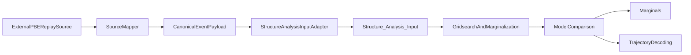

# Apply Drift-Diffusion Models to External PBE/Replay Events

## Goal
Enable `HippocampalSWRDynamics` to consume external PBE/replay events directly (instead of only repo-native ripple/HSE preprocessing), then run full-parity outputs: gridsearch, model comparison, marginals, trajectory inference, and downstream summary products.

## Current constraints found
- Core model input contract is centralized in [`H:/TEMP/Spike3DEnv_ExploreUpgrade/Spike3DWorkEnv/HippocampalSWRDynamics/replay_structure/structure_analysis_input.py`](H:/TEMP/Spike3DEnv_ExploreUpgrade/Spike3DWorkEnv/HippocampalSWRDynamics/replay_structure/structure_analysis_input.py): `pf_matrix (Ncells,Ngrid)`, `spikemats` dict of per-event `(T,Ncells)`, and timing/bin metadata.
- External sources (NeuroPy/pyPho) typically provide per-event spike counts as `(Ncells,T)` plus epoch containers.
- ReplaySwitchingHMM is 1D and often uses different spatial/time bin conventions; model input must be normalized (orientation, units, grid geometry).

## Implementation approach

### 1) Add a source-agnostic external adapter at the model-input boundary
- Extend [`H:/TEMP/Spike3DEnv_ExploreUpgrade/Spike3DWorkEnv/HippocampalSWRDynamics/replay_structure/structure_analysis_input.py`](H:/TEMP/Spike3DEnv_ExploreUpgrade/Spike3DWorkEnv/HippocampalSWRDynamics/replay_structure/structure_analysis_input.py) with one new classmethod that constructs `Structure_Analysis_Input` from external payloads.
- Adapter responsibilities:
  - Accept external event intervals and per-event spike matrices/lists.
  - Normalize orientation to `(T,Ncells)`.
  - Normalize place fields to `pf_matrix (Ncells,Ngrid)`.
  - Normalize timing/advance to `time_window_ms` and `time_window_advance_ms`.
  - Normalize spatial units into `bin_size_cm`, `n_bins_x`, `n_bins_y`.
  - Validate with strict shape/unit assertions.
- Keep core model/evidence code unchanged (minimal invasive change).

### 2) Add explicit source mappers for the two most useful upstream formats
- Add thin source mappers (new module under `replay_structure`, e.g. `external_event_adapters.py`) for:
  - NeuroPy Epoch + `epochs_spkcount` outputs.
  - pyPho `DecodedFilterEpochsResult` outputs.
- Keep ReplaySwitchingHMM mapping as optional adapter path using loaded NPZ arrays.
- Purpose: isolate source-specific semantics while emitting one internal canonical payload.

### 3) Wire adapter into pipeline entrypoints (local + cluster)
- Update local runner(s) to choose either existing native path or external-adapter path via config/CLI flag:
  - [`H:/TEMP/Spike3DEnv_ExploreUpgrade/Spike3DWorkEnv/HippocampalSWRDynamics/scripts/local/reformat_data_for_structure_analysis.py`](H:/TEMP/Spike3DEnv_ExploreUpgrade/Spike3DWorkEnv/HippocampalSWRDynamics/scripts/local/reformat_data_for_structure_analysis.py)
  - [`H:/TEMP/Spike3DEnv_ExploreUpgrade/Spike3DWorkEnv/HippocampalSWRDynamics/scripts/local/run_model.py`](H:/TEMP/Spike3DEnv_ExploreUpgrade/Spike3DWorkEnv/HippocampalSWRDynamics/scripts/local/run_model.py)
- Update O2 submission helpers to support the same input mode:
  - [`H:/TEMP/Spike3DEnv_ExploreUpgrade/Spike3DWorkEnv/HippocampalSWRDynamics/scripts/o2/o2_lib.py`](H:/TEMP/Spike3DEnv_ExploreUpgrade/Spike3DWorkEnv/HippocampalSWRDynamics/scripts/o2/o2_lib.py)

### 4) Ensure full-parity downstream compatibility
- Verify and patch hard-coded assumptions about model/event dimensions in:
  - [`H:/TEMP/Spike3DEnv_ExploreUpgrade/Spike3DWorkEnv/HippocampalSWRDynamics/replay_structure/model_comparison.py`](H:/TEMP/Spike3DEnv_ExploreUpgrade/Spike3DWorkEnv/HippocampalSWRDynamics/replay_structure/model_comparison.py)
  - [`H:/TEMP/Spike3DEnv_ExploreUpgrade/Spike3DWorkEnv/HippocampalSWRDynamics/replay_structure/marginals.py`](H:/TEMP/Spike3DEnv_ExploreUpgrade/Spike3DWorkEnv/HippocampalSWRDynamics/replay_structure/marginals.py)
  - [`H:/TEMP/Spike3DEnv_ExploreUpgrade/Spike3DWorkEnv/HippocampalSWRDynamics/scripts/local/get_marginals.py`](H:/TEMP/Spike3DEnv_ExploreUpgrade/Spike3DWorkEnv/HippocampalSWRDynamics/scripts/local/get_marginals.py)
  - [`H:/TEMP/Spike3DEnv_ExploreUpgrade/Spike3DWorkEnv/HippocampalSWRDynamics/scripts/local/get_trajectories.py`](H:/TEMP/Spike3DEnv_ExploreUpgrade/Spike3DWorkEnv/HippocampalSWRDynamics/scripts/local/get_trajectories.py)
- Confirm no hidden reliance on native ripple preprocessing artifacts when external mode is used.

### 5) Add robust validation + diagnostics
- Add a reusable preflight validator (shapes, units, dt consistency, event lengths) in `replay_structure` (same module as adapter or `utils.py`).
- Emit diagnostics summary at ingest:
  - number of events,
  - cells retained,
  - min/median/max event duration and bins,
  - bin size/unit checks,
  - overlap vs non-overlap binning.

### 6) Add regression tests for external-direct mode
- Add focused tests under repo test location (new test module if needed) for:
  - orientation conversion correctness,
  - place field flattening/transposition correctness,
  - unit conversions (`m`/`cm`, `s`/`ms`),
  - successful end-to-end run through at least one DDM model and model comparison with small synthetic payload.

## Data-flow target after change

## Acceptance criteria
- External PBE/replay payloads run through diffusion/momentum fitting without modifying core transition/emission math.
- Full-parity artifacts are produced in external mode: model evidences, model comparison outputs, marginals, trajectories.
- Validation fails fast on orientation/unit mismatches with informative errors.
- Existing native ripple/HSE workflow remains unchanged and still passes.

## Risks to handle explicitly
- 1D external replay into 2D-assuming code paths (especially momentum indexing).
- Silent unit drift (cm vs m; ms vs s).
- Variable-length event binning and sliding-window semantics mismatch.