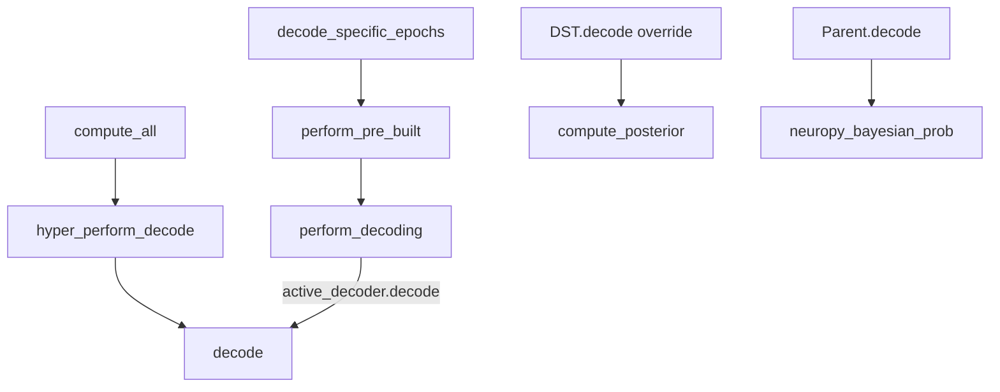

# Wire DST into Parent Decode Paths

## Why one override is enough

Parent call chain all goes through instance `decode()`:



[`_perform_decoding_specific_epochs`](h:\TEMP\Spike3DEnv_ExploreUpgrade\Spike3DWorkEnv\pyPhoPlaceCellAnalysis\src\pyphoplacecellanalysis\Analysis\Decoder\reconstruction.py) line ~2851 calls `active_decoder.decode(...)`. [`hyper_perform_decode`](h:\TEMP\Spike3DEnv_ExploreUpgrade\Spike3DWorkEnv\pyPhoPlaceCellAnalysis\src\pyphoplacecellanalysis\Analysis\Decoder\reconstruction.py) / [`compute_all`](h:\TEMP\Spike3DEnv_ExploreUpgrade\Spike3DWorkEnv\pyPhoPlaceCellAnalysis\src\pyphoplacecellanalysis\Analysis\Decoder\reconstruction.py) also call `self.decode(...)`.

**Decision:** Override only `decode()` on DST. Do not duplicate `hyper_perform_decode` / `compute_all` / epoch helpers.

## File to change

Only [`reconstruction_dst.py`](h:\TEMP\Spike3DEnv_ExploreUpgrade\Spike3DWorkEnv\pyPhoPlaceCellAnalysis\src\pyphoplacecellanalysis\Analysis\Decoder\reconstruction_dst.py).

## 1. Override `decode()` to match parent contract

Mirror parent signature and return tuple from [`BayesianPlacemapPositionDecoder.decode`](h:\TEMP\Spike3DEnv_ExploreUpgrade\Spike3DWorkEnv\pyPhoPlaceCellAnalysis\src\pyphoplacecellanalysis\Analysis\Decoder\reconstruction.py) (~2534–2599):

```python
def decode(self, unit_specific_time_binned_spike_counts, time_bin_size: float, output_flat_versions=False, debug_print=True):
    # returns: most_likely_positions, p_x_given_n, most_likely_position_indicies, flat_outputs_container
```

Implementation steps inside DST `decode`:

1. Resolve `time_bin_size` (fallback to `self.time_bin_size` if None).
2. Temporarily set `self.time_bin_size = time_bin_size` so `compute_posterior` uses the caller's tau (restore in `finally`).
3. Call `p_x_given_n = self.compute_posterior(unit_specific_time_binned_spike_counts)` → shape `(*original_position_data_shape, T)`.
4. Flatten: `curr_flat_p_x_given_n = p_x_given_n.reshape(-1, num_time_windows)`.
5. Reuse parent helpers unchanged:
   - `perform_compute_most_likely_positions(curr_flat_p_x_given_n, self.original_position_data_shape)`
   - Map indices via `xbin_centers` / `ybin_centers` (same 1D/2D branch as parent).
6. If `output_flat_versions`, wrap `flat_p_x_given_n` + `most_likely_position_flat_indicies` in `DynamicContainer` (same as parent; import from wherever parent gets it if not already imported).

Do **not** call `ZhangReconstructionImplementation.neuropy_bayesian_prob`.

## 2. Make reliability work for decode-without-`compute_reliability_new`

Today `_compute_reliability_metrics` asserts `per_tbin_aclu_spike_counts_sparse is not None`, but DSNR is unused and Skaggs/sparsity only need `pf`.

Change `_compute_reliability_metrics` to:

- Require only `self.pf` (and use `self.time_bin_size` if ever needed later).
- Remove the sparse-matrix assert.
- Keep current static `R_base = clip(alpha_skaggs * alpha_sparsity)` and `reliability_silent` / `discount_silence` logic.

Then `compute_posterior` → lazy `_compute_reliability_metrics()` works on first `decode()` / `compute_all()` without a prior `compute_reliability_new` call. `compute_reliability_new` remains available for confusion-matrix / sparse spike products, not required for DST decode.

## 3. Keep occupancy prior as currently written

`compute_posterior` already uses `self.pf.occupancy` then normalizes — leave that path as-is (no further occupancy API change in this task).

## 4. Smoke verification (manual / notebook)

After change, on a DST instance:

```python
most_likely_positions, p_x_given_n, inds, _ = a_dst_decoder2D.decode(spkcount, time_bin_size=time_bin_size_seconds, debug_print=False)
# or
a_dst_decoder2D.compute_all(debug_print=False)
```

Confirm:

- `p_x_given_n` shape matches `(*spatial, T)`.
- `reliability_active` is non-None after first decode.
- Epoch path `a_dst_decoder2D.decode_specific_epochs(...)` produces DST posteriors (polymorphic via overridden `decode`).

## Out of scope

- Overriding `hyper_perform_decode` / `compute_all` / epoch methods individually.
- Wiring dynamic `alpha_dsnr` into the posterior time loop.
- Exposing conflict factor \(\mathcal{K}\).
