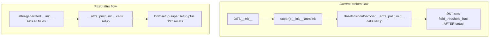

# Fix BayesianPlacemapPositionDecoderDST Class Initialization

## Problem Summary

[`reconstruction_dst.py`](h:\TEMP\Spike3DEnv_ExploreUpgrade\Spike3DWorkEnv\pyPhoPlaceCellAnalysis\src\pyphoplacecellanalysis\Analysis\Decoder\reconstruction_dst.py) subclasses [`BayesianPlacemapPositionDecoder`](h:\TEMP\Spike3DEnv_ExploreUpgrade\Spike3DWorkEnv\pyPhoPlaceCellAnalysis\src\pyphoplacecellanalysis\Analysis\Decoder\reconstruction.py) (which itself extends attrs-based `BasePositionDecoder`), but the DST class currently:

1. **Overrides `__init__` manually** — bypasses attrs field initialization; `field_threshold_frac`, `discount_silence`, `reliability_active`, `reliability_silent` are set ad hoc and are not serialized attrs fields.
2. **Duplicates `setup()` / `post_load()`** — copy-pasted from parent (~30 lines) instead of calling `super()`.
3. **Never resets DST-specific fields in `setup()`** — `t_bin_aclus_reliability_df`, `per_tbin_aclu_spike_counts_df`, `time_bin_info_df`, `per_tbin_aclu_spike_counts_sparse` are declared but not nulled on rebuild.
4. **Leaves factory methods commented out** — `init_from_stateful_decoder` / `init_from_placefields` exist on parent but DST versions are stubbed/commented.
5. **Missing serialization hooks** — parent defines `serialized_key_allowlist()` and `from_dict()`; DST does not extend them for its config params.



## Target File

Only edit [`reconstruction_dst.py`](h:\TEMP\Spike3DEnv_ExploreUpgrade\Spike3DWorkEnv\pyPhoPlaceCellAnalysis\src\pyphoplacecellanalysis\Analysis\Decoder\reconstruction_dst.py) lines 20–151. Do **not** touch `compute_posterior` / `_compute_reliability_metrics` (lines 154–266).

## Changes

### 1. Declare DST config/computed fields as attrs fields

Add after existing DST serialized fields (keep the four reliability-matrix fields already declared):

```python
field_threshold_frac: float = serialized_field(default=0.20)
discount_silence: bool = non_serialized_field(default=False)
reliability_active: Optional[np.ndarray] = non_serialized_field(default=None, is_computable=True, metadata={'shape': ('n_neurons',)})
reliability_silent: Optional[np.ndarray] = non_serialized_field(default=None, is_computable=True, metadata={'shape': ('n_neurons',)})
```

- Fix `t_bin_aclus_reliability_df` metadata shape comment to `('n_neurons',)` (matches [`reliability.py`](h:\TEMP\Spike3DEnv_ExploreUpgrade\Spike3DWorkEnv\pyPhoPlaceCellAnalysis\src\pyphoplacecellanalysis\Analysis\reliability.py) — indexed by aclu, not a wide matrix).

### 2. Remove custom `__init__`

Delete the manual `__init__` (lines 61–84). attrs `@custom_define` will auto-generate a constructor matching parent signature plus DST kwargs:

```python
BayesianPlacemapPositionDecoderDST(
    time_bin_size=..., pf=..., spikes_df=...,
    field_threshold_frac=0.20, discount_silence=False,
    setup_on_init=True, post_load_on_init=False, debug_print=False,
)
```

Move parameter documentation into the class docstring (replace the stale `ratemaps` param note — ratemaps come from `pf.ratemap.tuning_curves`).

Do **not** add a custom `__attrs_post_init__` — inherit `BasePositionDecoder.__attrs_post_init__` unchanged so `setup_on_init` / `post_load_on_init` behavior stays identical to parent.

### 3. Replace duplicated `setup()` / `post_load()` with super delegation

```python
def setup(self):
    super().setup()
    self.t_bin_aclus_reliability_df = None
    self.per_tbin_aclu_spike_counts_df = None
    self.time_bin_info_df = None
    self.per_tbin_aclu_spike_counts_sparse = None
    self.reliability_active = None
    self.reliability_silent = None


def post_load(self):
    super().post_load()
    self.reliability_active = None
    self.reliability_silent = None
```

This preserves all parent behavior (`_setup_computation_variables`, `_setup_time_bin_spike_counts_N_i`, posterior reshape, etc.) while ensuring DST caches are invalidated on rebuild/load.

### 4. Implement factory classmethods (uncomment + fix)

Add import: `from neuropy.analyses.placefields import PfND`

```python
@classmethod
def init_from_stateful_decoder(cls, stateful_decoder: "BayesianPlacemapPositionDecoder", field_threshold_frac: float = 0.20, discount_silence: bool = False, **kwargs):
    return cls(
        time_bin_size=stateful_decoder.time_bin_size,
        pf=deepcopy(stateful_decoder.pf),
        spikes_df=deepcopy(stateful_decoder.spikes_df),
        field_threshold_frac=field_threshold_frac,
        discount_silence=discount_silence,
        debug_print=stateful_decoder.debug_print,
        **kwargs,
    )


@classmethod
def init_from_placefields(cls, pf: PfND, time_bin_size: float, spikes_df: pd.DataFrame, field_threshold_frac: float = 0.20, discount_silence: bool = False, debug_print: bool = False, **kwargs):
    return cls(
        time_bin_size=time_bin_size,
        pf=deepcopy(pf),
        spikes_df=deepcopy(spikes_df),
        field_threshold_frac=field_threshold_frac,
        discount_silence=discount_silence,
        debug_print=debug_print,
        **kwargs,
    )
```

Note: parent `init_from_placefields` only passes `pf` (incomplete for `BayesianPlacemapPositionDecoder`); DST version should require `time_bin_size` and `spikes_df` explicitly since they are required decoder inputs.

### 5. Extend serialization hooks

```python
@classmethod
def serialized_key_allowlist(cls):
    return BayesianPlacemapPositionDecoder.serialized_key_allowlist() + ['field_threshold_frac']


@classmethod
def from_dict(cls, val_dict):
    return cls(
        time_bin_size=val_dict.get('time_bin_size', 0.25),
        pf=val_dict.get('pf', None),
        spikes_df=val_dict.get('spikes_df', None),
        field_threshold_frac=val_dict.get('field_threshold_frac', 0.20),
        discount_silence=val_dict.get('discount_silence', False),
        setup_on_init=val_dict.get('setup_on_init', True),
        post_load_on_init=val_dict.get('post_load_on_init', False),
        debug_print=val_dict.get('debug_print', False),
    )
```

### 6. Cleanup commented dead code

Remove:
- Commented `# class BayesianPlacemapPositionDecoderDST(BasePositionDecoder):`
- Commented duplicate BasePositionDecoder field declarations (lines 38–43)
- Commented `__attrs_post_init__` block (parent handles this)
- Old commented factory method stubs (replaced by real implementations)

Keep `expected_n_spikes` property as-is.

### 7. Optional small helper (recommended, still within lines 20–151 scope)

Add a read-only alias used by downstream DST logic:

```python
@property
def ratemaps(self):
    return self.ratemap.tuning_curves
```

This avoids a latent bug in `compute_posterior` (which references `self.ratemaps`) without editing that method now.

## Out of Scope (follow-ups)

- **`get_by_id`** on parent hardcodes `BayesianPlacemapPositionDecoder(...)` — slicing a DST decoder would downgrade type. Fix separately if needed.
- **Wiring reliability matrix fields** from `CellIndividualReliabilityMatrix.compute_reliability_matrix` into setup/decode — future work.
- **`compute_posterior` / `_compute_reliability_metrics`** — explicitly deferred per user request.

## Verification

After edits, smoke-test in Python (no notebook changes):

```python
from copy import deepcopy
from pyphoplacecellanalysis.Analysis.Decoder.reconstruction_dst import BayesianPlacemapPositionDecoderDST

# Assuming an existing pf2D_Decoder instance:
dst = BayesianPlacemapPositionDecoderDST(
    time_bin_size=pf2D_Decoder.time_bin_size,
    pf=pf2D_Decoder.pf,
    spikes_df=deepcopy(pf2D_Decoder.spikes_df),
)
assert dst.field_threshold_frac == 0.20
assert dst.neuron_IDs is not None  # setup ran via __attrs_post_init__
assert dst.reliability_active is None  # lazy until decode
```

Also verify `init_from_stateful_decoder(pf2D_Decoder)` produces a fully initialized DST instance with matching `time_bin_size` / `spikes_df`.
