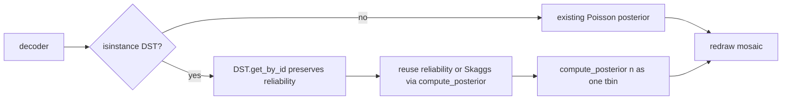

# DST-aware Bayesian eqn viewer

## Problem

[`build_interactive_bayesian_2d_eqn_viewer`](h:/TEMP/Spike3DEnv_ExploreUpgrade/Spike3DWorkEnv/pyPhoPlaceCellAnalysis/src/pyphoplacecellanalysis/SpecificResults/PendingNotebookCode.py) always:

1. Slices via `decoder.get_by_id(...)` — parent [`BayesianPlacemapPositionDecoder.get_by_id`](h:/TEMP/Spike3DEnv_ExploreUpgrade/Spike3DWorkEnv/pyPhoPlaceCellAnalysis/src/pyphoplacecellanalysis/Analysis/Decoder/reconstruction.py) **always constructs a plain Bayesian decoder**, so DST type + cached `reliability_active` / `reliability_silent` are dropped.
2. Builds the main “decoded posterior” from local `_subfn_poisson_factor_maps` (uniform-prior Bayesian product), never calling DST `compute_posterior`.

## Chosen UX (your option 2)

- Same mosaic / sliders.
- **Keep** Poisson factor panels (`power`, `exp`, per-cell `L`) as Bayesian educational maps.
- **Replace only** the decoded-posterior panel with DST `Bel({v})` from `sliced.compute_posterior`.
- Annotate per-cell α on PF titles (and note DST in figure title/suptitle).

## 1. Override `get_by_id` on DST

In [`reconstruction_dst.py`](h:/TEMP/Spike3DEnv_ExploreUpgrade/Spike3DWorkEnv/pyPhoPlaceCellAnalysis/src/pyphoplacecellanalysis/Analysis/Decoder/reconstruction_dst.py):

- Override `get_by_id(ids, defer_compute_all=False)` mirroring parent logic but constructing `BayesianPlacemapPositionDecoderDST(...)` with the same DST config fields (`field_threshold_frac`, `discount_silence`, `n_top_peaks`, `slice_level_multiplier`, `fn_tn_mode`).
- Copy parent-sliced state the same way (`F`, `P_x`, spike counts, etc.).
- **Reuse reliability when present:** if `self.reliability_active is not None`, set `sliced.reliability_active = self.reliability_active[keep]` (and same for `reliability_silent`).
- Slice `in_field_masks` by selected neuron ids if present (`{nid: mask for nid, mask in self.in_field_masks.items() if nid in ids}`).
- Leave time-bin reliability DataFrames / sparse matrices `None` on the slice (not needed for the interactive single-bin viewer; avoid partial-slice bugs).
- Honor `defer_compute_all` like the parent.

## 2. Update the viewer for DST posterior + α

In [`PendingNotebookCode.py`](h:/TEMP/Spike3DEnv_ExploreUpgrade/Spike3DWorkEnv/pyPhoPlaceCellAnalysis/src/pyphoplacecellanalysis/SpecificResults/PendingNotebookCode.py) `build_interactive_bayesian_2d_eqn_viewer`:

- Import / detect DST: `isinstance(decoder, BayesianPlacemapPositionDecoderDST)` (widen the type hint to accept DST).
- After `sliced = decoder.get_by_id(...)`, if DST and reliability still `None`, do nothing special — first `compute_posterior` already calls `_compute_reliability_metrics()`; for α labels before decode, call that once (or `compute_posterior` once) so titles have α.
- In `_subfn_redraw`:
  - Still compute `parts = _subfn_poisson_factor_maps(...)` for factor / per-cell L panels.
  - If DST: `spk = state['n'][:, None]`; `p = sliced.compute_posterior(spk)` → squeeze last axis → use as posterior map for `ax_post` (title like `DST Bel({v})` / `P_DST(x|n)`).
  - Else: keep `parts['posterior']` as today.
- PF titles: append `α={reliability_active[i]:.2f}` (and if `discount_silence`, also silent α, else omit silent or show `α_silent=1`).
- Suptitle / main title: prefix `DST` vs `Bayesian` so mode is obvious.
- Store `is_dst` / reliability refs on `fig._bayes_eqn_ui`.

## 3. Docstring / usage touch-up

- Note that DST decoders are supported; posterior panel uses Shafer-discounted Bel; factor panels remain Bayesian Poisson decomposition; α comes from cached reliability or Skaggs on first use.

## Out of scope

- No full DST mass / ignorance-mass factor panels.
- No changes to Bayesian-only call sites beyond type acceptance.