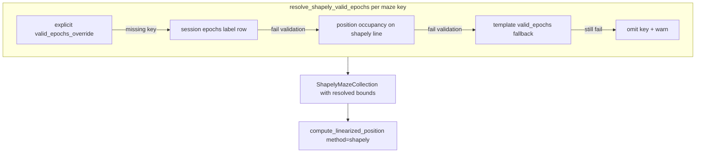

# Dynamic Shapely `valid_epochs` with Robust Fallbacks

## Problem

[`ShapelyMazeCollection.valid_epochs`](h:/TEMP/Spike3DEnv_ExploreUpgrade/Spike3DWorkEnv/NeuroPy/neuropy/utils/position_util.py) time-masks position samples during shapely linearization. Today it is baked into module-level templates in [`BapunDataSessionFormat.py`](h:/TEMP/Spike3DEnv_ExploreUpgrade/Spike3DWorkEnv/NeuroPy/neuropy/core/session/Formats/Specific/BapunDataSessionFormat.py) (lines 33–72), which breaks when RatJ/RatU reuse RatS/RatK geometry.

RatS Day5TwoNovel is the canonical hard case: paradigm has **5 overlapping epochs** (`pre`, `maze1`, `maze2`, `post1`, `post2`) — see [`ratS_day5_tn.ipynb`](h:/TEMP/Spike3DEnv_ExploreUpgrade/Spike3DWorkEnv/sleep_loss_hippocampal_replay/misc_code/BasicGens/ratS_day5_tn.ipynb). Hardcoded values match `maze1` exactly but `maze2` start was manually pulled back (~420 s) from paradigm `21176` to `20756` because paradigm bounds do not fully cover on-track occupancy.



## Architecture

### 1. Core resolver in `position_util.py`

Add next to `ShapelyMazeCollection`:

**`resolve_shapely_valid_epochs(...)`** — returns `(valid_epochs: Dict[str, Tuple[float,float]], provenance: Dict[str, str])`.

Per maze key in `shapely_maze_collection.shapelyMazes` (intersected with `maze_epoch_keys` from `non_global_activity_session_names`):

| Priority | Source | When used |
|----------|--------|-----------|
| 1 | `valid_epochs_override[key]` | Explicit per-session override in `linearization_parameters` |
| 2 | `epochs_df` / `sess.epochs` row for label | Label exists; passes validation |
| 2b | Refinement of (2) | Label exists but validation fails (too few samples, low on-track fraction) |
| 3 | Position occupancy | No usable epoch row, or (2) failed entirely |
| 4 | `shapely_maze_collection.valid_epochs[key]` | Template fallback (current RatS/RatK hardcoded values) |
| 5 | Omit key | All tiers fail — linearization skips that maze (existing behavior when bounds missing) |

**Validation helper** `_validate_shapely_epoch_bounds(pos_df, shapely_maze, t0, t1, ...)`:
- `min_position_samples` (default ~100)
- `min_epoch_duration_sec` (default ~60)
- `min_on_track_fraction` (default ~0.3): fraction of in-window samples with distance-to-`LineString` ≤ `max_track_distance_cm` (default ~25 cm)

**Position occupancy helper** `_infer_epoch_bounds_from_track_occupancy(pos_df, shapely_maze, search_t0, search_t1, ...)`:
- Compute per-sample distance to maze skeleton (`Point.distance` to `LineString`)
- Threshold → boolean mask → [`contiguous_regions`](h:/TEMP/Spike3DEnv_ExploreUpgrade/Spike3DWorkEnv/NeuroPy/neuropy/utils/mathutil.py) → pick largest segment
- **Temporal constraint for TwoNovel**: when resolving `maze2`, set `search_t0 = max(search_t0, maze1_resolved_stop)` so segments stay ordered
- Search window defaults: paradigm/epoch bounds if available, else `(pos_df.t.min(), pos_df.t.max())`

**Epoch extraction helper** `_extract_epoch_bounds_from_epochs_df(epochs_df, label)`:
- Filter to requested labels only (ignore `pre`/`post1`/`post2` noise)
- Handle duplicate labels (take row with longest duration, log warning)
- Optionally run [`get_non_overlapping_df`](h:/TEMP/Spike3DEnv_ExploreUpgrade/Spike3DWorkEnv/NeuroPy/neuropy/core/epoch.py) on the maze-label subset if overlapping detected among maze keys

Add factory:

```python
def build_shapely_maze_collection_for_session(pos_df, geometry_template, maze_epoch_keys, epochs_df=None, valid_epochs_override=None, ...) -> ShapelyMazeCollection
```

Copies `geometry_template.shapelyMazes`, fills `valid_epochs` via resolver. Logs provenance per key (`'override'`, `'epochs'`, `'epochs_refined'`, `'occupancy'`, `'template_fallback'`, `'missing'`).

### 2. Keep template `valid_epochs` as fallback tier

Do **not** remove hardcoded values from [`Day5TwoNovel_all_session_mazes`](h:/TEMP/Spike3DEnv_ExploreUpgrade/Spike3DWorkEnv/NeuroPy/neuropy/core/session/Formats/Specific/BapunDataSessionFormat.py) and [`RatK_Day3TwoNovel_all_session_mazes`](h:/TEMP/Spike3DEnv_ExploreUpgrade/Spike3DWorkEnv/NeuroPy/neuropy/core/session/Formats/Specific/BapunDataSessionFormat.py). Add a short comment that they serve as **geometry + fallback bounds**, not authoritative session times.

Optional per-session escape hatch (only if needed after validation):

```python
linearization_parameters=dict(
    method='shapely',
    all_session_mazes=Day5TwoNovel_all_session_mazes,
    valid_epochs_override={'maze2': (20756.0, 24004.0)},  # only if occupancy tier is insufficient
)
```

No new entries required initially — occupancy refinement should recover RatS `maze2` start.

### 3. Wire into preprocessing pipeline

In [`final_process_non_kdiba_all_comps`](h:/TEMP/Spike3DEnv_ExploreUpgrade/Spike3DWorkEnv/pyPhoPlaceCellAnalysis/src/pyphoplacecellanalysis/SpecificResults/PendingNotebookCode.py) (~lines 5218–5243):

**After** `session_fixup_epochs` (line 5222) and **before** both `compute_linearized_position` calls (lines 5243 and 5377):

```python
linearization_kwargs = dict(hardcoded_params.linearization_parameters)
if linearization_kwargs.get('method') == 'shapely' and linearization_kwargs.get('all_session_mazes') is not None:
    linearization_kwargs['all_session_mazes'] = build_shapely_maze_collection_for_session(
        pos_df=curr_active_pipeline.sess.position.to_dataframe(),
        geometry_template=linearization_kwargs['all_session_mazes'],
        maze_epoch_keys=hardcoded_params.non_global_activity_session_names,
        epochs_df=curr_active_pipeline.sess.epochs.to_dataframe(),  # post-fixup
        valid_epochs_override=linearization_kwargs.pop('valid_epochs_override', None),
    )
```

Use **`sess.epochs`** (post-fixup), not raw `sess.paradigm`, as the epoch source — fixup already ran on line 5222.

Also fix [`active_maze_epochs_df`](h:/TEMP/Spike3DEnv_ExploreUpgrade/Spike3DWorkEnv/pyPhoPlaceCellAnalysis/src/pyphoplacecellanalysis/SpecificResults/PendingNotebookCode.py) (line 5231) to filter from `sess.epochs.to_dataframe()` instead of `sess.paradigm` so lap `maze_id` assignment matches resolved bounds (minimal one-line change).

### 4. Thin Bapun wrapper (optional but useful)

Add `@classmethod build_shapely_maze_collection_for_session(cls, sess, hardcoded_params)` on `BapunDataSessionFormatRegisteredClass` that delegates to `position_util.build_shapely_maze_collection_for_session` — enables notebook/debug usage without importing PendingNotebookCode.

### 5. Unit tests

New file [`NeuroPy/tests/test_shapely_valid_epochs.py`](h:/TEMP/Spike3DEnv_ExploreUpgrade/Spike3DWorkEnv/NeuroPy/tests/test_shapely_valid_epochs.py) with synthetic data (no W: drive dependency):

- Epoch labels match keys → resolves from epochs
- Overlapping 5-epoch TwoNovel-style dataframe → still extracts `maze1`/`maze2`
- Epoch bounds with sparse/wrong samples → occupancy tier recovers contiguous on-track segment
- Missing `maze2` label → template fallback
- `valid_epochs_override` wins over all tiers
- Empty/failed resolution → key omitted, no exception

### 6. Manual validation (post-implementation)

Load RatS Day5TwoNovel, RatK/RatJ/RatU Day3TwoNovel; print resolved bounds + provenance; confirm:
- RatS `maze1` ≈ `(11070, 13970)` from epochs
- RatS `maze2` start ≤ paradigm start (occupancy may extend backward to ~20756)
- RatJ/RatU get **their own** session times, not RatS/RatK template times

## Files to change

| File | Change |
|------|--------|
| [`neuropy/utils/position_util.py`](h:/TEMP/Spike3DEnv_ExploreUpgrade/Spike3DWorkEnv/NeuroPy/neuropy/utils/position_util.py) | Resolver + factory + helpers |
| [`neuropy/core/session/Formats/Specific/BapunDataSessionFormat.py`](h:/TEMP/Spike3DEnv_ExploreUpgrade/Spike3DWorkEnv/NeuroPy/neuropy/core/session/Formats/Specific/BapunDataSessionFormat.py) | Comments on templates; optional classmethod wrapper |
| [`pyphoplacecellanalysis/.../PendingNotebookCode.py`](h:/TEMP/Spike3DEnv_ExploreUpgrade/Spike3DWorkEnv/pyPhoPlaceCellAnalysis/src/pyphoplacecellanalysis/SpecificResults/PendingNotebookCode.py) | Wire resolver before linearization; fix `active_maze_epochs_df` source |
| [`NeuroPy/tests/test_shapely_valid_epochs.py`](h:/TEMP/Spike3DEnv_ExploreUpgrade/Spike3DWorkEnv/NeuroPy/tests/test_shapely_valid_epochs.py) | New unit tests |

## Out of scope

- Changing maze **geometry** (node coordinates) — still per template
- TwoNovel epoch fixup in `_bapun_session_fixup_epochs_to_be_non_overlapping` (separate refactor)
- Notebook edits (`.ipynb`) unless you explicitly request them
