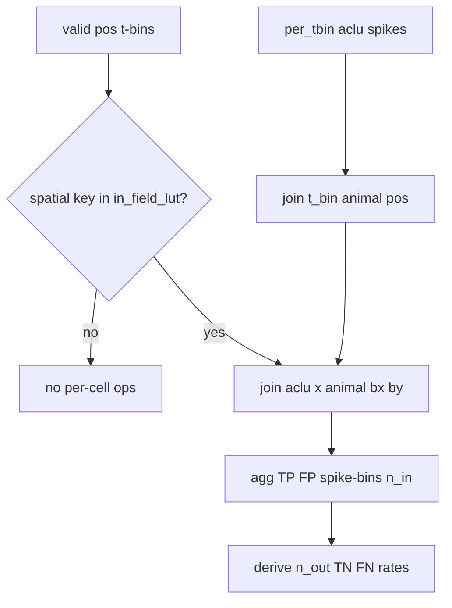

# Efficient Polars Confusion Matrix Rewrite

> **For agentic workers:** Implement task-by-task in [`reliability.py`](h:\TEMP\Spike3DEnv_ExploreUpgrade\Spike3DWorkEnv\pyPhoPlaceCellAnalysis\src\pyphoplacecellanalysis\Analysis\reliability.py). Keep output schema and rate definitions identical.

**Goal:** Replace the O(n_tbins) Python/pandas loop in `perform_compute_confusion_matrix` with set-based Polars joins/aggs while keeping correctness.

**Architecture:** Classify each valid animal-position t-bin as a *known* spatial bin (present in `in_field_lut`) or not. For known bins, every cell is either in-field or out-of-field. Compute opportunity counts and spike aggregates via joins, then derive silent TN/FN as `opportunities − spiked_bins` (no full neuron×time cross product).

**Tech Stack:** Polars (already imported), NumPy/pandas only for final DataFrame assembly matching current return type.

## Correctness invariants (do not change)

From current definitions in `perform_compute_confusion_matrix`:

- **TP / FP**: sum of `n_spikes` in t-bins where animal is in / out of that cell’s field (only when animal `(binned_x,binned_y)` is a key in the field LUT).
- **TN / FN**: +1 per *silent* t-bin when animal is out / in field (same known-bin restriction).
- **Opportunities**: `n_in_field_tbins` / `n_out_of_field_tbins` count every known visit (silent or not).
- **Rates**: `true_pos/false_pos = TP/FP / (TP+FP)`; `true_neg = TN / n_out`; `false_neg = FN / n_in`; zero denoms → NaN.
- Animal position at a spatial bin **absent** from the field LUT: no TP/FP/TN/FN/opportunity for anyone (matches empty `dict.get(..., [])`), but still counts toward `n_computed_bins`.

Identity used for efficiency (known bins only):

```text
n_out[aclu] = n_known_tbins - n_in[aclu]
FN[aclu]    = n_in[aclu]  - n_infield_tbins_with_spikes[aclu]
TN[aclu]    = n_out[aclu] - n_outfield_tbins_with_spikes[aclu]
```



## Bottleneck being removed

Current loop (≈`n_tbins` iterations, often ~1e6) does `per_tbin[per_tbin['t_bin_idx'] == t_idx]` each time plus Python list/dict work. Upstream already builds Polars `in_field_lut` and `per_tbin` but then discards that advantage.

## File / API changes

Single file: [`pyphoplacecellanalysis/Analysis/reliability.py`](h:\TEMP\Spike3DEnv_ExploreUpgrade\Spike3DWorkEnv\pyPhoPlaceCellAnalysis\src\pyphoplacecellanalysis\Analysis\reliability.py)

1. **`perform_compute_confusion_matrix` signature**
   - Prefer `in_field_lut: pl.DataFrame` with columns `aclu, binned_x, binned_y` (and optional `is_in_field`).
   - Drop required `binned_xy_idxs_to_field_aclus_dict` / `binned_xy_idxs_to_outoffield_aclus_dict` (caller already has `in_field_lut`; outfield dict is pure complement and expensive to build).
   - Keep `per_tbin`, `time_bin_info_df`, `neuron_ids`, `max_t_idx`.

2. **Caller `compute_reliability_matrix`**
   - Pass `in_field_lut=in_field_lut` instead of the two dicts.
   - Stop building `binned_xy_idxs_to_*` dicts if unused elsewhere after the change (they only feed this function today).

## Implementation sketch (new body)

```python
# 1) valid animal-position bins
pos = pl.from_pandas(time_bin_info_df[...]).filter(binned_x/y not null)
if max_t_idx is not None:
    pos = pos.filter(pl.col('t_bin_idx') < max_t_idx)
n_computed_bins = pos.height

# 2) known spatial keys from LUT
lut = in_field_lut.select(['aclu','binned_x','binned_y']).unique()
known_keys = lut.select(['binned_x','binned_y']).unique()
known_pos = pos.join(known_keys, on=['binned_x','binned_y'], how='inner')
n_known_tbins = known_pos.height

# 3) n_in_field per aclu = # known visits whose animal bin is in that cell's field
n_in = (known_pos.join(lut, on=['binned_x','binned_y'], how='inner')
              .group_by('aclu').len().rename({'len': 'n_in_field_tbins'}))
# left-join onto all neuron_ids; fill 0; n_out = n_known_tbins - n_in

# 4) spikes at known animal bins
spikes = pl.from_pandas(per_tbin[['aclu','t_bin_idx','n_spikes']])
sp = (spikes.join(known_pos.select(['t_bin_idx','binned_x','binned_y']), on='t_bin_idx', how='inner')
            .join(lut.with_columns(pl.lit(True).alias('is_in_field')),
                  on=['aclu','binned_x','binned_y'], how='left')
            .with_columns(pl.col('is_in_field').fill_null(False)))

spike_aggs = sp.group_by('aclu').agg(
    pl.col('n_spikes').filter(pl.col('is_in_field')).sum().alias('true_pos_n_spikes'),
    pl.col('n_spikes').filter(~pl.col('is_in_field')).sum().alias('false_pos_n_spikes'),
    pl.col('t_bin_idx').filter(pl.col('is_in_field')).n_unique().alias('n_infield_spike_tbins'),
    pl.col('t_bin_idx').filter(~pl.col('is_in_field')).n_unique().alias('n_outfield_spike_tbins'),
)

# 5) TN/FN from identities; rates as today; return pandas indexed by aclu
```

Ensure dtypes Int64 for join keys; fill null spike aggs with 0; include all `neuron_ids` even if never spiked / never in field.

## Verification

- Tiny synthetic fixture: 2–3 aclus, few t-bins covering (a) in-field spike, (b) out-field spike, (c) in-field silence, (d) out-field silence, (e) unknown spatial bin with a spike → assert raw counts and rates match the old loop on the same inputs (keep old function temporarily as `_perform_compute_confusion_matrix_ref` for one comparison run, then delete).
- Confirm `true_pos + false_pos == 1` when `n_total_spikes > 0`, and `0 <= true_neg,false_neg <= 1` when opportunities > 0.
- Smoke on real notebook path only if already loaded; no notebook edits.

## Out of scope

- Fixing unrelated caller bug `active_pos_df['t_bin_idx'] = spikes_df['t_bin_idx']` (line ~913).
- Rewriting `_partial_compute_reliability_matrix`.
- Changing rate definitions.