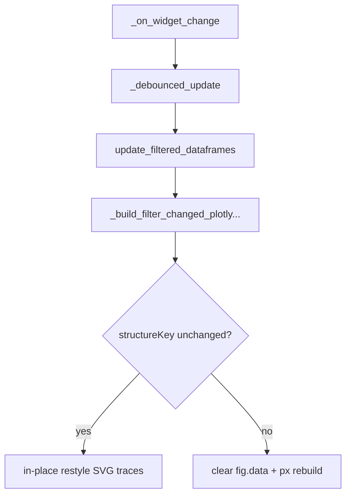

# Efficient SVG Restyle for DataFrameFilter

## Problem

Filter updates already reuse `figure_widget`, but [`plotly_pre_post_delta_scatter`](h:\TEMP\Spike3DEnv_ExploreUpgrade\Spike3DWorkEnv\pyPhoPlaceCellAnalysis\src\pyphoplacecellanalysis\Pho2D\plotly\Extensions\plotly_helpers.py) still does `fig.data = []` and rebuilds histograms + scatter via `px.*` every time. The filter callback also `deepcopy`s the plot DF and re-attaches click handlers.



## Chosen approach

- **Fast path**: when plot structure is unchanged, update existing SVG scatter/histogram arrays with `FigureWidget.batch_update()` / per-trace assignment. Keep `px.scatter` (SVG), not Scattergl.
- **Full rebuild**: when structure identity changes (`active_plot_df_name`, `replay_name`, selected `time_bin_size` set, or the resulting legend-group set / y-axis semantics that require new traces).
- **Handlers**: attach click/selection once on rebuild only; never on restyle.

Structure fingerprint (store on `DataFrameFilter`):

```python
(active_plot_df_name, replay_name, tuple(sorted(time_bin_size)), plot_variable_name_for_hist_axis_only_if_needed, frozenset(legend_group_keys))
```

Note: changing `active_plot_variable_name` does **not** require new traces if color grouping is still `time_bin_size` — only `y` + hist bin data change. Include variable name in the fingerprint only if it would force different trace layout; otherwise restyle `y` and hist values.

## Implementation

### 1. In-place update helper in plotly_helpers

File: [`plotly_helpers.py`](h:\TEMP\Spike3DEnv_ExploreUpgrade\Spike3DWorkEnv\pyPhoPlaceCellAnalysis\src\pyphoplacecellanalysis\Pho2D\plotly\Extensions\plotly_helpers.py)

Add something like `PlotlyFigureContainer.restyle_pre_post_delta_scatter_from_df(...)` that:

- Splits DF into pre/post delta the same way as `plotly_pre_post_delta_scatter`
- Finds existing traces by stable names already used today (`''` / `trace_scatter` / `trace_post_delta_hist` prefixes + legend group name from `add_trace_with_legend_handling`)
- For each legend group present in both figure and new data:
  - Update scatter: `x`, `y`, `customdata`, `marker.size` as needed
  - Recompute histogram counts for pre/post and assign to the corresponding hist traces (`x`/`y` depending on orientation — match current `px.histogram(..., y=variable)` layout)
- Hide (`visible='legendonly'` or empty arrays) groups that disappear; if a **new** group appears that has no trace, return `False` so caller falls back to full rebuild
- Wrap mutations in `with fig.batch_update():` when `fig` is a `FigureWidget`
- Update subplot title / axis range / legend visibility (`legend_groups_to_hide`) without clearing shapes unless needed; re-apply baseline hline only if missing

Do **not** call `fig.data = []` on this path.

Also fix/avoid the incomplete stub `add_or_update_trace_with_legend_handling` (it currently both `update_traces` and `add_trace`); the new restyle helper should be the supported update API.

### 2. Gate inside `plotly_pre_post_delta_scatter`

Same file: when `extant_figure` is provided and has traces, attempt restyle if caller passes `prefer_in_place_update=True` (default `False` to preserve non-widget callers). If restyle succeeds, return early with the same `(fig, context)` shape. If it fails (mismatched groups / empty figure / missing traces), fall through to existing clear+rebuild.

Keep existing rebuild behavior unchanged for publication / save / non-widget use.

### 3. Wire DataFrameFilter callback

File: [`PhoDiba2023Paper.py`](h:\TEMP\Spike3DEnv_ExploreUpgrade\Spike3DWorkEnv\pyPhoPlaceCellAnalysis\src\pyphoplacecellanalysis\SpecificResults\PhoDiba2023Paper.py) — `DataFrameFilter._build_plot_callback` inner `_build_filter_changed_plotly_plotting_callback_fn` (~3710)

- Add instance fields: `_plot_structure_key`, `_plotly_handlers_attached` (non-serialized)
- Before plotting, compute structure key from filter widgets + unique color/legend groups in `active_plot_df`
- Pass `prefer_in_place_update=(key == self._plot_structure_key)` into `_perform_plot_pre_post_delta_scatter` / `plotly_pre_post_delta_scatter`
- Stop `deepcopy(active_plot_df)` for the widget update path; pass the filtered frame (or a shallow copy only if plot code mutates columns — today it adds `dummy_column_for_size`; prefer mutating a single shallow copy once, not a full deep copy)
- Attach `on_click` / `on_selection` only when rebuild happened or handlers not yet attached; skip on successful restyle
- After successful update, store the new structure key

Leave `update_filtered_dataframes` filtering logic as-is (still updates all filtered DF dicts + table); efficiency gain is in the plot callback / Plotly layer.

### 4. Out of scope

- No Scattergl / WebGL
- Do not force `get_sampled_plot_data()` into the live path in this change (can be a follow-up)
- No notebook edits

## Verification

- Toggle predicate checkboxes: figure updates without clearing traces (structure key stable); scatter + both hist panels refresh
- Change Y variable: restyle path; axes/labels update; no handler rebind spam
- Change `time_bin_size` or `replay_name` or plot DF selector: full rebuild still works and looks like today
- Click/select still works after both restyle and rebuild
- Non-widget / `should_save=True` callers of `_perform_plot_pre_post_delta_scatter` unchanged (`prefer_in_place_update` default off)
