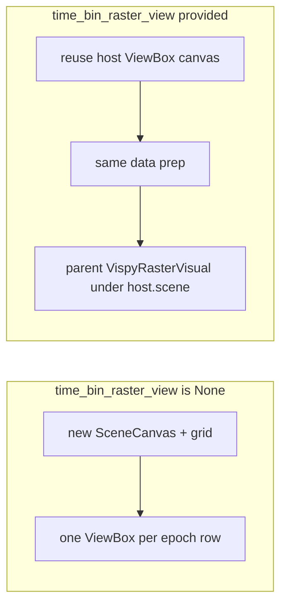

# Embed multi-raster VisPy plot in `time_bin_raster_view`

## Context

- `[vispy_raster.py](h:\TEMP\Spike3DEnv_ExploreUpgrade\Spike3DWorkEnv\pyPhoPlaceCellAnalysis\src\pyphoplacecellanalysis\Pho2D\vispy\vispy_raster.py)` `plot_multiple_raster_plot_vispy` always builds a new `scene.SceneCanvas`, grid, and one `ViewBox` per `filter_epochs_df` row ([lines 208–241](h:\TEMP\Spike3DEnv_ExploreUpgrade\Spike3DWorkEnv\pyPhoPlaceCellAnalysis\src\pyphoplacecellanalysis\Pho2D\vispy\vispy_raster.py)).
- Predictive decoding already creates a dedicated strip view: `self.time_bin_raster` / per-epoch `a_time_bin_raster` via `grid.add_view(...)` in `[predicitive_decoding_vispy.py](h:\TEMP\Spike3DEnv_ExploreUpgrade\Spike3DWorkEnv\pyPhoPlaceCellAnalysis\src\pyphoplacecellanalysis\Pho2D\vispy\predicitive_decoding_vispy.py)` (~363–364, ~475–476).
- `[predictive_decoding_central_view.py](h:\TEMP\Spike3DEnv_ExploreUpgrade\Spike3DWorkEnv\pyPhoPlaceCellAnalysis\src\pyphoplacecellanalysis\Pho2D\vispy\predictive_decoding_central_view.py)` loads `time_bin_raster` from `_update_dict` but does **not** pass it into `plot_multiple_raster_plot_vispy` ([~358–377](h:\TEMP\Spike3DEnv_ExploreUpgrade\Spike3DWorkEnv\pyPhoPlaceCellAnalysis\src\pyphoplacecellanalysis\Pho2D\vispy\predictive_decoding_central_view.py)), so a standalone canvas/window is still created.

## Behavior design

- **When `time_bin_raster_view` is `None` (default):** keep today’s behavior unchanged (new canvas, `show=(not defer_show)`, per-row views).
- **When provided:** skip `SceneCanvas` / `grid.add_view` creation. Use `host = time_bin_raster_view`:
  - Configure camera once on the host: `PanZoomCamera(aspect=None)`, `interactive = False`, and `camera.rect` using the same horizontal span as today: `x0 = min(filter_epochs_df['start'])`, `x1 = max(filter_epochs_df['stop'])`, height `max(n_cells - 1, 1.0)` — i.e. one shared time axis for all epoch rows (identical to stacking multiple epochs in one scene with absolute spike times on x).
  - For each `filter_epochs_df` row, create `VispyRasterVisual(parent=host.scene, ...)` and optional `_unit_grid_line_visual(..., parent=host.scene)` with that row’s `x0, x1` (unchanged per-epoch logic).
  - `**plots` namespace:** `canvas = host.canvas`, `grid = None`, `views = {epoch_id: host}` for every key (shared host view), dictionaries for `raster_visuals` / `grid_lines` unchanged.
  - `**defer_show`:** still use `False` on `SceneCanvas` only when creating a new canvas; host canvas is never “shown” by this function.
  - **Scene lifecycle:** on embedded redraw, avoid accumulating visuals. Add a keyword-only flag, e.g. `clear_host_scene: bool = True`, that when `time_bin_raster_view` is set removes existing children from `host.scene` before attaching new raster/grid visuals (same detach pattern as `time_bin_views` in `render_central_view`: `child.parent = None`). Callers that composite other content into the same scene can pass `clear_host_scene=False` and manage cleanup themselves.

## Files to touch

1. `**[vispy_raster.py](h:\TEMP\Spike3DEnv_ExploreUpgrade\Spike3DWorkEnv\pyPhoPlaceCellAnalysis\src\pyphoplacecellanalysis\Pho2D\vispy\vispy_raster.py)`**
  - Extend signature with keyword-only `time_bin_raster_view: Optional[scene.ViewBox] = None` and `clear_host_scene: bool = True` (place next to `draw_unit_grid` / `bgcolor` to avoid breaking positional callers).  
  - Factor the loop body so it runs with either `view = grid.add_view(...)` or `view = time_bin_raster_view` (single branch around canvas/grid setup).  
  - Document return shape when embedded (`grid` is `None`, shared `views`).  
  - Optional: gate or remove the two `print(...)` debug lines when `time_bin_raster_view is not None` (keeps main window quiet); only if you want zero extra noise — otherwise leave as-is for minimal diff.
2. `**[predictive_decoding_central_view.py](h:\TEMP\Spike3DEnv_ExploreUpgrade\Spike3DWorkEnv\pyPhoPlaceCellAnalysis\src\pyphoplacecellanalysis\Pho2D\vispy\predictive_decoding_central_view.py)`**
  - Pass `time_bin_raster_view=time_bin_raster` and `defer_show=True` into `plot_multiple_raster_plot_vispy` so the existing Qt/VisPy window is not opened twice.  
  - Align `clear_host_scene` with `needs_clear_owned_views` if you want raster strip cleared only when other views are cleared (recommended: `clear_host_scene=needs_clear_owned_views`).

## Verification

- Run the predictive decoding UI path that hits `render_central_view` with raster args: confirm spikes appear in the bottom `time_bin_raster` strip and no extra `SceneCanvas` pops up.  
- Smoke-test standalone `plot_multiple_raster_plot_vispy(...)` without the new argument to ensure default behavior is unchanged.

