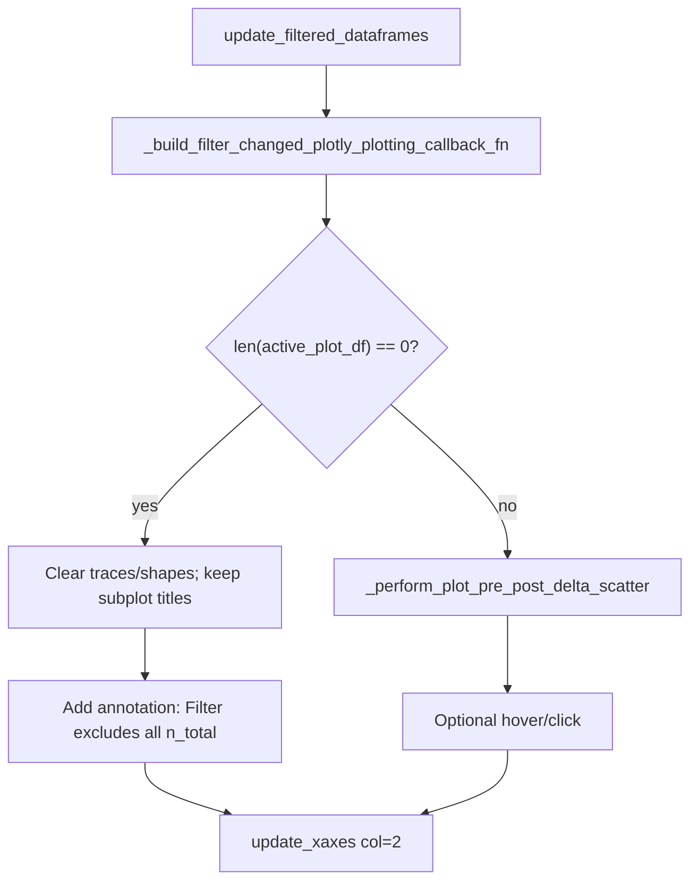

# Empty-filter plot label for DataFrameFilter

## Problem

In [`DataFrameFilter._build_plot_callback`](h:\TEMP\Spike3DEnv_ExploreUpgrade\Spike3DWorkEnv\pyPhoPlaceCellAnalysis\src\pyphoplacecellanalysis\SpecificResults\PhoDiba2023Paper.py) (~3726–3837), every filter change always calls `_perform_plot_pre_post_delta_scatter` with `active_plot_df`. That path has no zero-row guard; with publication mode on, empty frames become blank/inconsistent `FigureWidget` state (stale traces, failed hover/`customdata`, etc.).

## Approach

Handle the empty case **inside** `_build_filter_changed_plotly_plotting_callback_fn` (always on; this is the empty-filter display mode), **before** the scatter call. Do not change `plotly_pre_post_delta_scatter` itself (`n_total` only exists in the filter context).



## Concrete changes

File: [`PhoDiba2023Paper.py`](h:\TEMP\Spike3DEnv_ExploreUpgrade\Spike3DWorkEnv\pyPhoPlaceCellAnalysis\src\pyphoplacecellanalysis\SpecificResults\PhoDiba2023Paper.py) — only `_build_filter_changed_plotly_plotting_callback_fn` (~3726–3837).

1. **Empty check first** (before the `plot_variable_name in columns` assert), so a zero-row frame never enters the scatter path:

```python
active_plot_df_name: str = df_filter.active_plot_df_name
active_plot_df: pd.DataFrame = df_filter.active_plot_df
n_filtered: int = len(active_plot_df)

if df_filter.is_figure_widget_mode and (n_filtered == 0):
    original_name: str = active_plot_df_name.removeprefix('filtered_')
    n_total: int = len(df_filter.original_df_dict.get(original_name, active_plot_df))
    fig = df_filter.figure_widget
    # Mirror plotly_pre_post_delta_scatter reuse clear (plotly_helpers.py ~635-641):
    fig.layout.annotations = fig.layout.annotations[:3]  # keep subplot titles
    fig.layout.shapes = []
    fig.data = []
    fig.add_annotation(
        text=f"<Filter excludes all {n_total}>",
        xref="x2", yref="y2", x=0.5, y=0.5,
        xanchor="center", yanchor="middle",
        showarrow=False,
        name="empty_filter_excludes_all_annotation",
    )
    df_filter.figure_widget = fig
    # fall through to the existing update_xaxes at function end
    return  # or skip scatter/hover via a flag so update_xaxes still runs once
```

2. **`n_total`**: length of the matching **original** dataframe (`original_df_dict[active_plot_df_name without 'filtered_']`), i.e. how many rows existed before filters excluded them all.

3. **Non-empty path unchanged**: existing `plotly_pre_post_delta_scatter` reuse already resets annotations to the first 3 subplot titles, so a prior empty-filter annotation is removed automatically on the next successful plot.

4. **Skip hover/click setup** when empty (no traces / no `customdata` rows).

5. **Keep** the trailing `df_filter.figure_widget.update_xaxes(col=2, range=[...])` so the empty figure stays on the same time axis as normal plots (structure the early branch so that line still executes, or duplicate it in the empty branch then return).

## Out of scope

- No changes to `plotly_pre_post_delta_scatter` / `plotly_helpers.py`
- No notebook edits
- No new UI toggle (empty-label mode is always active when `len(active_plot_df) == 0`)
