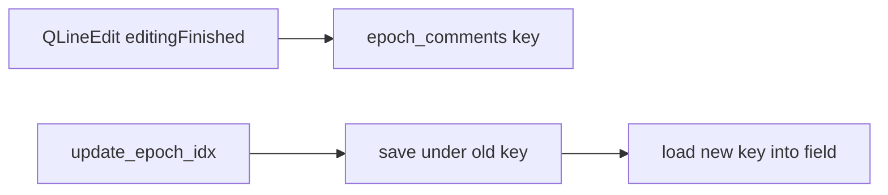

# Add epoch comment field to RadonTransformDebugger

Single-file change in [`RadonTransformDebuggerWidget.py`](h:\TEMP\Spike3DEnv_ExploreUpgrade\Spike3DWorkEnv\pyPhoPlaceCellAnalysis\src\pyphoplacecellanalysis\GUI\Silx\RadonTransformDebuggerWidget.py). No notebook edits.

## Behavior

- Bottom bar: `Comment:` label + single-line `QLineEdit` (silx `qt`) docked under the existing stats dock on `_RoiStatsDisplayExWindow`.
- Store text in `epoch_comments: Dict[Tuple[str, float], str]` on `RadonTransformDebugger`, keyed by `(active_decoder_name, active_epoch_start_t)`.
- `active_epoch_start_t` = `float(self.active_filter_epochs['start'].iloc[self.active_epoch_idx])`.
- On epoch/decoder change: save current field text under the previous key, then load the new key (empty string if missing).
- On `editingFinished`: write the field into `epoch_comments` for the current key.
- Session-only memory (no disk / `UserAnnotationsManager`).

## Implementation

1. **Fields / helpers on `RadonTransformDebugger`**
   - `epoch_comments: Dict[Tuple[str, float], str] = field(factory=dict)`
   - `_comment_line_edit` / `_comment_dock` widget refs (default `None`) so `build_GUI` does not recreate them when the window already exists
   - `_comment_key_for_current_epoch() -> Tuple[str, float]`
   - `_save_comment_from_field()` / `_load_comment_into_field()` with a short re-entrancy guard while programmatic `setText` runs

2. **UI in `build_GUI`**
   - After `self.window` exists, if `_comment_dock is None`: create a bottom `QDockWidget` with a horizontal layout (`QLabel` + `QLineEdit`), `addDockWidget(BottomDockWidgetArea, ...)`, connect `editingFinished` to `_save_comment_from_field`.
   - Always call `_load_comment_into_field()` at end of `build_GUI` / after overlay refresh paths that change the active epoch.

3. **Sync points**
   - Start of `update_epoch_idx`: `_save_comment_from_field()` (old key still current).
   - End of `update_epoch_idx` and `refresh_overlays`: `_load_comment_into_field()`.
   - Same save-before-change if `active_decoder_name` is assigned while the GUI is open (hook or explicit call from any existing decoder-change path).

## Out of scope

- Persistence across sessions
- Multiline editor
- Changes to [`silx_helpers.py`](h:\TEMP\Spike3DEnv_ExploreUpgrade\Spike3DWorkEnv\pyPhoPlaceCellAnalysis\src\pyphoplacecellanalysis\GUI\Silx\silx_helpers.py)